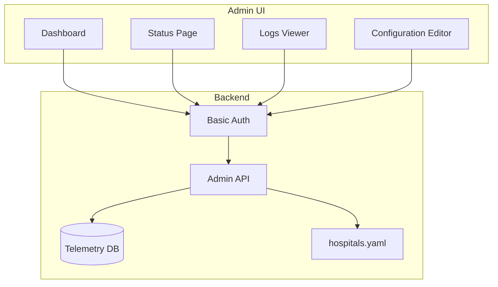

# Admin Dashboard

The VTC-Link Admin Dashboard provides a web-based interface for monitoring, configuration, and log management. It enables operators to oversee pipeline operations without direct server access.

## Overview



## Access

### URL Endpoints

| Page | URL | Description |
|------|-----|-------------|
| Dashboard | `/admin/dashboard` | System overview |
| Status | `/admin/status` | Hospital pipeline status |
| Logs | `/admin/logs` | Event log viewer |
| Configuration | `/admin/config` | Hospital settings editor |

### Authentication

All admin pages require HTTP Basic Authentication.

```
Username: admin (default)
Password: admin (default)
```

!!! danger "Change Default Credentials"
    Always change the default credentials in production:
    ```bash
    # .env
    ADMIN_ID=your_secure_username
    ADMIN_PASSWORD=your_secure_password
    ```

---

## Dashboard

The dashboard provides a high-level overview of system health and recent activity.

### Features

```
┌─────────────────────────────────────────────────────────────────┐
│                    VTC-Link Dashboard                            │
├─────────────────────────────────────────────────────────────────┤
│                                                                  │
│  ┌──────────────┐  ┌──────────────┐  ┌──────────────┐           │
│  │ Hospitals    │  │ Records      │  │ Success Rate │           │
│  │     1        │  │   Today: 156 │  │    98.5%     │           │
│  └──────────────┘  └──────────────┘  └──────────────┘           │
│                                                                  │
│  ┌─────────────────────────────────────────────────────────────┐│
│  │ Recent Status                                                ││
│  ├─────────────┬────────────────┬──────────┬──────────────────┤│
│  │ Hospital    │ Last Run       │ Status   │ Error            ││
│  ├─────────────┼────────────────┼──────────┼──────────────────┤│
│  │ HOSP_A      │ 2024-01-15...  │ Success  │ -                ││
│  │ HOSP_B      │ 2024-01-15...  │ Failed   │ CONN_DB_001      ││
│  └─────────────┴────────────────┴──────────┴──────────────────┘│
│                                                                  │
│  ┌─────────────────────────────────────────────────────────────┐│
│  │ Recent Logs                                                  ││
│  ├─────────────┬───────┬─────────────┬────────────────────────┤│
│  │ Time        │ Level │ Event       │ Message                ││
│  ├─────────────┼───────┼─────────────┼────────────────────────┤│
│  │ 10:30:00    │ INFO  │ pipeline_ok │ Pipeline completed     ││
│  │ 10:25:00    │ ERROR │ fetch_fail  │ Connection timeout     ││
│  └─────────────┴───────┴─────────────┴────────────────────────┘│
│                                                                  │
└─────────────────────────────────────────────────────────────────┘
```

### Statistics Cards

| Card | Description | Data Source |
|------|-------------|-------------|
| **Hospitals** | Total configured hospitals | `hospitals.yaml` |
| **Records Today** | Records processed in last 24h | Telemetry DB |
| **Success Rate** | Successful pipelines percentage | Telemetry DB |
| **Error Count** | Errors in last 24h | Telemetry DB |

### Implementation

```python
@router.get("/dashboard", response_class=HTMLResponse)
def admin_dashboard(
    request: Request,
    admin: None = Depends(require_admin)
) -> HTMLResponse:
    """Render the admin dashboard."""

    # Get status data
    rows = TelemetryStore().query_status()
    status_list = [
        {
            "hospital_id": row[0],
            "last_run_at": row[1],
            "last_success_at": row[2],
            "last_status": row[3],
            "last_error_code": row[4],
            "postprocess_fail_count": row[5],
        }
        for row in rows
    ]

    # Get recent logs
    log_rows = TelemetryStore().query_logs("", [])
    recent_logs = [format_log(row) for row in log_rows]

    # Calculate statistics
    stats = {
        "total_hospitals": count_hospitals(),
        "today_records": count_today_records(),
        "success_rate": calculate_success_rate(),
        "error_count": count_today_errors(),
    }

    return templates.TemplateResponse(
        "admin/dashboard.html",
        {
            "request": request,
            "stats": stats,
            "recent_status": status_list,
            "recent_logs": recent_logs,
        },
    )
```

---

## Status Page

The status page displays detailed pipeline execution status for each hospital.

### Features

```
┌─────────────────────────────────────────────────────────────────┐
│                    Pipeline Status                               │
├─────────────────────────────────────────────────────────────────┤
│                                                                  │
│  ┌─────────────────────────────────────────────────────────────┐│
│  │ Hospital Status                                              ││
│  ├────────────┬──────────────────┬──────────────────┬─────────┤│
│  │ Hospital   │ Last Run         │ Last Success     │ Status  ││
│  ├────────────┼──────────────────┼──────────────────┼─────────┤│
│  │ HOSP_A     │ 2024-01-15       │ 2024-01-15       │ ✓ OK    ││
│  │            │ 10:30:00Z        │ 10:30:00Z        │         ││
│  ├────────────┼──────────────────┼──────────────────┼─────────┤│
│  │ HOSP_B     │ 2024-01-15       │ 2024-01-15       │ ✗ FAIL  ││
│  │            │ 10:25:00Z        │ 10:20:00Z        │ DB_001  ││
│  └────────────┴──────────────────┴──────────────────┴─────────┘│
│                                                                  │
│  PostProcess Failures: HOSP_B (3 consecutive failures)          │
│                                                                  │
└─────────────────────────────────────────────────────────────────┘
```

### Status Fields

| Field | Description |
|-------|-------------|
| **Hospital ID** | Unique hospital identifier |
| **Last Run** | Timestamp of last pipeline execution |
| **Last Success** | Timestamp of last successful execution |
| **Status** | Current status (Success/Failed) |
| **Error Code** | Error code if status is Failed |
| **PostProcess Failures** | Count of consecutive postprocess failures |

### Status Indicators

| Indicator | Meaning |
|-----------|---------|
| :white_check_mark: OK | Pipeline completed successfully |
| :x: FAIL | Pipeline failed with error |
| :warning: WARN | PostProcess failures > 0 |

### Implementation

```python
@router.get("/status", response_class=HTMLResponse)
def admin_status(
    request: Request,
    admin: None = Depends(require_admin)
) -> HTMLResponse:
    """Render pipeline status page."""

    rows = TelemetryStore().query_status()
    status_list = [
        {
            "hospital_id": row[0],
            "last_run_at": row[1],
            "last_success_at": row[2],
            "last_status": row[3],
            "last_error_code": row[4],
            "postprocess_fail_count": row[5],
        }
        for row in rows
    ]

    return templates.TemplateResponse(
        "admin/status.html",
        {"request": request, "status_list": status_list},
    )
```

---

## Logs Viewer

The logs viewer displays pipeline events with filtering capabilities.

### Features

```
┌─────────────────────────────────────────────────────────────────┐
│                    Pipeline Logs                                 │
├─────────────────────────────────────────────────────────────────┤
│                                                                  │
│  Filters: [Level: ALL ▼] [Hospital: ALL ▼] [Stage: ALL ▼]      │
│                                                                  │
│  ┌─────────────────────────────────────────────────────────────┐│
│  │ Event Log                                                    ││
│  ├──────────────────┬───────┬─────────┬────────┬──────────────┤│
│  │ Timestamp        │ Level │ Event   │ Stage  │ Message      ││
│  ├──────────────────┼───────┼─────────┼────────┼──────────────┤│
│  │ 2024-01-15       │ INFO  │ start   │ fetch  │ Collection   ││
│  │ 10:30:00.123Z    │       │         │        │ started      ││
│  ├──────────────────┼───────┼─────────┼────────┼──────────────┤│
│  │ 2024-01-15       │ INFO  │ done    │ post   │ Completed    ││
│  │ 10:30:05.456Z    │       │         │ process│ (156 rec)    ││
│  ├──────────────────┼───────┼─────────┼────────┼──────────────┤│
│  │ 2024-01-15       │ ERROR │ failed  │ fetch  │ Connection   ││
│  │ 10:25:00.789Z    │       │         │        │ timeout      ││
│  └──────────────────┴───────┴─────────┴────────┴──────────────┘│
│                                                                  │
│  Showing 50 of 1,234 entries                    [Load More]     │
│                                                                  │
└─────────────────────────────────────────────────────────────────┘
```

### Log Fields

| Field | Description |
|-------|-------------|
| **Timestamp** | Event timestamp (ISO 8601) |
| **Level** | Log level (INFO, WARN, ERROR) |
| **Event** | Event type (pipeline_start, etc.) |
| **Hospital** | Hospital ID |
| **Stage** | Pipeline stage (fetch, transform, etc.) |
| **Error Code** | Error code (if applicable) |
| **Message** | Human-readable message |
| **Duration** | Operation duration in ms |
| **Record Count** | Records processed |

### Log Levels

| Level | Color | Description |
|-------|-------|-------------|
| `INFO` | Blue | Normal operations |
| `WARN` | Yellow | Non-critical issues |
| `ERROR` | Red | Pipeline failures |

### Implementation

```python
@router.get("/logs", response_class=HTMLResponse)
def admin_logs(
    request: Request,
    admin: None = Depends(require_admin)
) -> HTMLResponse:
    """Render logs viewer page."""

    rows = TelemetryStore().query_logs("", [])
    logs = [
        {
            "timestamp": row[0],
            "level": row[1],
            "event": row[2],
            "hospital_id": row[3],
            "stage": row[4],
            "error_code": row[5],
            "message": row[6],
            "duration_ms": row[7],
            "record_count": row[8],
        }
        for row in rows
    ]

    return templates.TemplateResponse(
        "admin/logs.html",
        {"request": request, "logs": logs},
    )
```

---

## Configuration Editor

The configuration editor allows modifying hospital settings without server access.

### Features

```
┌─────────────────────────────────────────────────────────────────┐
│                    Hospital Configuration                        │
├─────────────────────────────────────────────────────────────────┤
│                                                                  │
│  ┌─────────────────────────────────────────────────────────────┐│
│  │ Basic Settings                                               ││
│  ├─────────────────────────────────────────────────────────────┤│
│  │ Hospital ID:      [HOSP_A________________]                   ││
│  │ Connector Type:   [pull_db_view ▼]                          ││
│  │ Enabled:          [✓]                                       ││
│  │ Schedule (min):   [5__]                                     ││
│  │ Transform Profile:[HOSP_A________________]                   ││
│  └─────────────────────────────────────────────────────────────┘│
│                                                                  │
│  ┌─────────────────────────────────────────────────────────────┐│
│  │ Database Settings                                            ││
│  ├─────────────────────────────────────────────────────────────┤│
│  │ Type:            [oracle ▼]                                  ││
│  │ Host:            [192.168.1.100__________]                   ││
│  │ Port:            [1521]                                      ││
│  │ Service:         [ORCLCDB_______________]                    ││
│  │ Username:        [vtc_reader_____________]                   ││
│  │ Password:        [••••••••••••••________]                    ││
│  │ View Name:       [VW_VITAL_SIGNS_________]                   ││
│  │ Query:           [SELECT * FROM VW_VITAL_]                   ││
│  └─────────────────────────────────────────────────────────────┘│
│                                                                  │
│  ┌─────────────────────────────────────────────────────────────┐│
│  │ PostProcess Settings                                         ││
│  ├─────────────────────────────────────────────────────────────┤│
│  │ Mode:            [update_flag ▼]                             ││
│  │ Table:           [VW_VITAL_SIGNS_________]                   ││
│  │ Key Column:      [MSR_ID_________________]                   ││
│  │ Key Value Source:[vital_id_______________]                   ││
│  │ Flag Column:     [SENT_FLAG______________]                   ││
│  │ Flag Value:      [Y______________________]                   ││
│  │ Retry:           [3__]                                       ││
│  └─────────────────────────────────────────────────────────────┘│
│                                                                  │
│  [Save Configuration]                                           │
│                                                                  │
│  ✓ Configuration saved successfully. Scheduler restarted.      │
│                                                                  │
└─────────────────────────────────────────────────────────────────┘
```

### Validation Rules

The configuration editor validates input before saving:

| Field | Validation |
|-------|------------|
| `hospital_id` | Required, non-empty |
| `connector_type` | Must be valid type |
| `schedule_minutes` | Positive integer (for pull types) |
| `transform_profile` | Required, non-empty |
| `db.type` | `oracle` or `mssql` |
| `db.host` | Required for DB connectors |
| `db.service` | Required for Oracle |
| `api.url` | Required for REST connectors |
| `postprocess.mode` | `update_flag` or `insert_log` |
| `postprocess.table` | Required if mode set |
| `postprocess.key_column` | Required for `update_flag` |
| `postprocess.flag_column` | Required for `update_flag` |
| `postprocess.columns` | Required for `insert_log` |

### Error Display

```
┌─────────────────────────────────────────────────────────────────┐
│  ✗ Validation Errors:                                           │
│    • hospital_id required                                       │
│    • db.type value error                                        │
│    • postprocess.table required                                 │
└─────────────────────────────────────────────────────────────────┘
```

### Implementation

=== "GET /config"

    ```python
    @router.get("/config", response_class=HTMLResponse)
    def admin_config(
        request: Request,
        admin: None = Depends(require_admin)
    ) -> HTMLResponse:
        """Render configuration editor."""

        config = load_app_config().model_dump()

        return templates.TemplateResponse(
            "admin/config.html",
            {"request": request, "config": config, "errors": []},
        )
    ```

=== "POST /config"

    ```python
    @router.post("/config", response_class=HTMLResponse)
    async def save_config(
        request: Request,
        admin: None = Depends(require_admin)
    ) -> HTMLResponse:
        """Save configuration changes."""

        settings = get_settings()
        config = load_app_config().model_dump()
        form_data = await request.form()

        # Update config from form data
        hospital = update_hospital_from_form(config["hospital"], form_data)
        config["hospital"] = hospital

        # Validate
        errors = _validate_hospital(hospital)
        if errors:
            return templates.TemplateResponse(
                "admin/config.html",
                {"request": request, "config": config, "errors": errors},
            )

        # Save to YAML
        with open(settings.config_path, "w", encoding="utf-8") as f:
            yaml.safe_dump(config, f, allow_unicode=True)

        # Restart scheduler with new config
        if settings.scheduler_enabled:
            start_scheduler(reload_app_config())

        return templates.TemplateResponse(
            "admin/config.html",
            {"request": request, "config": config, "saved": True, "errors": []},
        )
    ```

---

## Authentication

### Basic Auth Implementation

```python
def require_admin(request: Request) -> None:
    """Verify admin authentication."""

    settings = get_settings()
    credentials = request.headers.get("Authorization", "")

    if not credentials.startswith("Basic "):
        raise HTTPException(
            status_code=status.HTTP_401_UNAUTHORIZED,
            detail="Authentication required",
            headers={"WWW-Authenticate": "Basic"},
        )

    # Decode Base64 credentials
    encoded = credentials.replace("Basic ", "", 1).strip()
    try:
        decoded = base64.b64decode(encoded).decode("utf-8")
    except ValueError:
        raise HTTPException(
            status_code=status.HTTP_401_UNAUTHORIZED,
            detail="Invalid credentials format",
            headers={"WWW-Authenticate": "Basic"},
        )

    # Verify username:password
    if ":" not in decoded:
        raise HTTPException(
            status_code=status.HTTP_401_UNAUTHORIZED,
            detail="Invalid credentials format",
            headers={"WWW-Authenticate": "Basic"},
        )

    admin_id, admin_password = decoded.split(":", 1)
    if admin_id != settings.admin_id or admin_password != settings.admin_password:
        raise HTTPException(
            status_code=status.HTTP_401_UNAUTHORIZED,
            detail="Authentication failed",
            headers={"WWW-Authenticate": "Basic"},
        )
```

### Configuration

```bash
# .env
ADMIN_ID=admin
ADMIN_PASSWORD=secure_password_here
```

---

## Security Considerations

### Authentication

!!! danger "Production Security"
    - **Change default credentials** immediately
    - **Use HTTPS** in production (terminate at load balancer)
    - **Implement rate limiting** for login attempts
    - Consider **IP allowlisting** for admin access

### Session Management

!!! warning "Stateless Authentication"
    The admin UI uses HTTP Basic Auth on every request. For enhanced security, consider implementing:
    - Session-based authentication
    - JWT tokens with expiration
    - Two-factor authentication

### Configuration Protection

```yaml
# Sensitive fields should use environment variables
db:
  password: "${ORACLE_PASSWORD}"  # Not plaintext
api:
  api_key: "${HOSPITAL_API_KEY}"  # Not plaintext
```

### Access Control

| Role | Dashboard | Status | Logs | Config |
|------|-----------|--------|------|--------|
| Admin | :white_check_mark: | :white_check_mark: | :white_check_mark: | :white_check_mark: |
| Operator | :white_check_mark: | :white_check_mark: | :white_check_mark: | :x: |
| Viewer | :white_check_mark: | :white_check_mark: | :x: | :x: |

!!! info "Future Enhancement"
    Role-based access control (RBAC) is planned for a future release.

---

## Templates

### Template Location

```
templates/
└── admin/
    ├── dashboard.html
    ├── status.html
    ├── logs.html
    └── config.html
```

### Jinja2 Integration

```python
from fastapi.templating import Jinja2Templates

templates = Jinja2Templates(directory="templates")
```

### Base Template Structure

```html
<!DOCTYPE html>
<html>
<head>
    <title>VTC-Link Admin - {{ page_title }}</title>
    <link rel="stylesheet" href="/static/admin.css">
</head>
<body>
    <nav>
        <a href="/admin/dashboard">Dashboard</a>
        <a href="/admin/status">Status</a>
        <a href="/admin/logs">Logs</a>
        <a href="/admin/config">Config</a>
    </nav>

    <main>
        
    </main>
</body>
</html>
```

---

## API Reference

### Admin Endpoints

| Method | Endpoint | Description |
|--------|----------|-------------|
| GET | `/admin/dashboard` | Dashboard page |
| GET | `/admin/status` | Status page |
| GET | `/admin/logs` | Logs viewer |
| GET | `/admin/config` | Configuration editor |
| POST | `/admin/config` | Save configuration |

### Response Codes

| Code | Description |
|------|-------------|
| `200` | Success |
| `401` | Authentication required/failed |
| `422` | Validation error |
| `500` | Internal server error |
