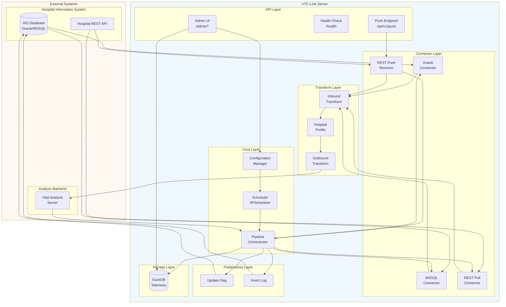
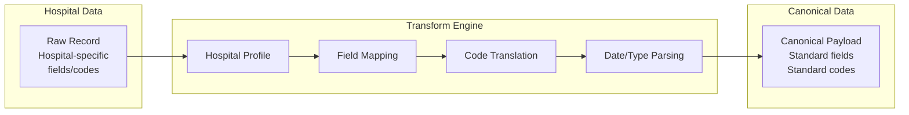
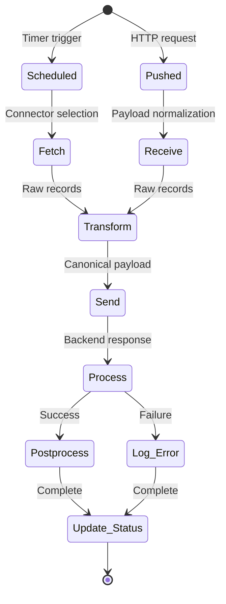
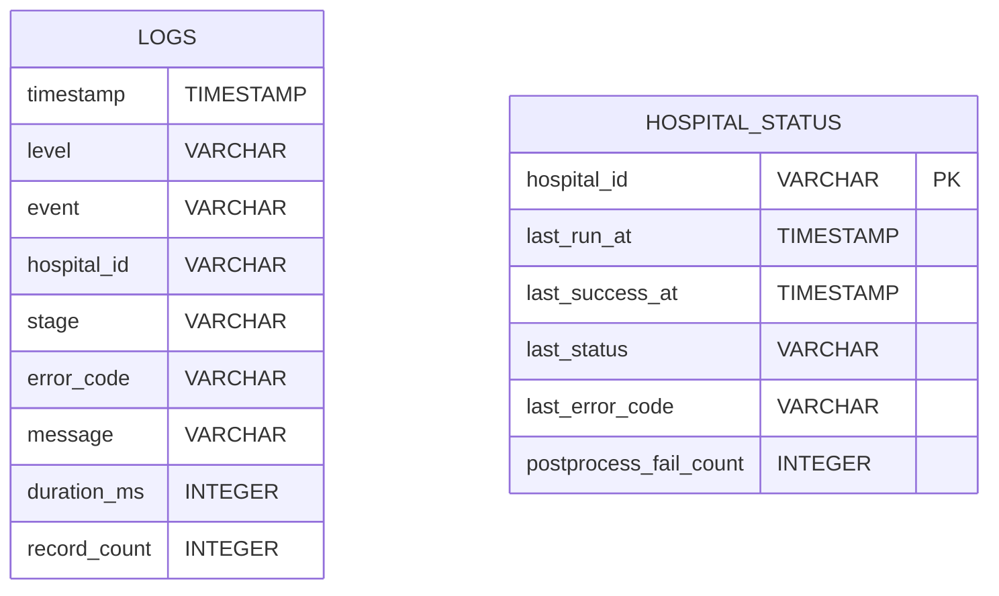
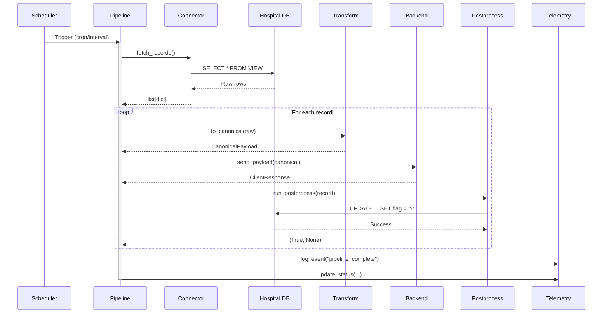
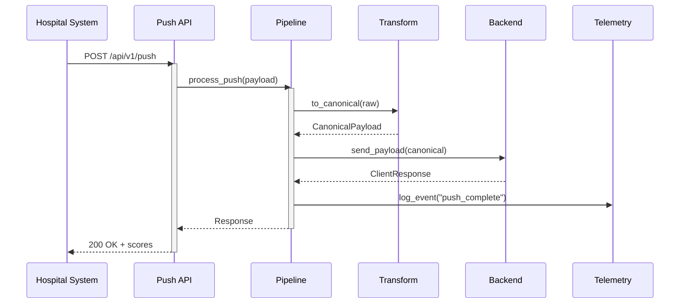

# Architecture

## High-Level Architecture

VTC-Link is designed as a middleware proxy that bridges hospital information systems with vital signs analysis backends. The architecture follows a pipeline pattern with clear separation between data acquisition, transformation, and delivery.



---

## Component Descriptions

### API Layer

The API layer exposes HTTP endpoints for external interactions.

| Component | Path | Purpose |
|-----------|------|---------|
| **Push Endpoint** | `/api/v1/push` | Receive pushed vital signs from hospitals |
| **Health Check** | `/health` | Kubernetes/load balancer health probes |
| **Admin UI** | `/admin/*` | Web-based administration interface |
| **API Docs** | `/docs` | OpenAPI/Swagger documentation |

```python
# Push endpoint signature
@router.post("/push")
async def receive_vitals(payload: dict) -> dict:
    """Receive and process pushed vital signs data."""
    ...
```

### Connector Layer

Connectors abstract the complexity of different data sources into a unified interface.

#### Connector Interface

```python
# Common interface for all connectors
def fetch_records(config: HospitalConfig) -> list[dict]:
    """Fetch raw records from the data source."""
    ...

def receive_payload(config: HospitalConfig, payload: dict) -> list[dict]:
    """Receive pushed payload and normalize to record list."""
    ...
```

#### Connector Types

=== "Oracle View Fetch"

    ```python
    # app/connectors/oracle_view_fetch.py
    def fetch_records(config: HospitalConfig) -> list[dict]:
        """Query Oracle database view for vital signs records."""
        query = config.db.get("query") or f"SELECT * FROM {config.db.get('view_name')}"
        with oracle_connection(config.db) as conn:
            cursor = conn.cursor()
            cursor.execute(query)
            columns = [col[0] for col in cursor.description]
            rows = cursor.fetchall()
        return [dict(zip(columns, row)) for row in rows]
    ```

    **Configuration:**
    ```yaml
    connector_type: "pull_db_view"
    db:
      type: "oracle"
      host: "192.168.1.100"
      port: 1521
      service: "ORCLCDB"
      username: "vtc_readonly"
      password: "secure_password"
      view_name: "V_VITAL_SIGNS"
    ```

=== "MSSQL View Fetch"

    ```python
    # app/connectors/mssql_view_fetch.py
    def fetch_records(config: HospitalConfig) -> list[dict]:
        """Query MSSQL database view for vital signs records."""
        # Similar implementation using pyodbc
        ...
    ```

    **Configuration:**
    ```yaml
    connector_type: "pull_db_view"
    db:
      type: "mssql"
      host: "192.168.1.101"
      port: 1433
      database: "HIS_DB"
      username: "vtc_reader"
      password: "secure_password"
      view_name: "VitalSignsView"
    ```

=== "REST Pull Fetch"

    ```python
    # app/connectors/rest_pull_fetch.py
    def fetch_records(config: HospitalConfig) -> list[dict]:
        """Pull records from hospital REST API."""
        response = httpx.get(config.api.get("url"), headers=headers)
        return response.json()
    ```

    **Configuration:**
    ```yaml
    connector_type: "pull_rest_api"
    api:
      url: "https://hospital.example.com/api/vitals"
      auth_type: "bearer"
      token: "jwt_token_here"
    ```

=== "REST Push Receive"

    ```python
    # app/connectors/rest_push_receive.py
    def receive_payload(config: HospitalConfig, payload: dict) -> list[dict]:
        """Normalize pushed payload to record list."""
        if isinstance(payload, list):
            return payload
        return [payload]
    ```

    **Configuration:**
    ```yaml
    connector_type: "push_rest_api"
    # No additional config needed - uses /api/v1/push endpoint
    ```

### Transform Layer

The transform layer converts hospital-specific data formats into the canonical schema.



#### Hospital Profile Structure

```
app/transforms/hospital_profiles/
└── HOSP_A/
    ├── __init__.py
    ├── inbound.py      # Hospital → Canonical transformation
    ├── outbound.py     # Canonical → Backend format
    └── mapping.py      # Code mappings and constants
```

#### Inbound Transform Example

```python
# app/transforms/hospital_profiles/HOSP_A/inbound.py
def to_canonical(raw: dict) -> CanonicalPayload:
    """Transform hospital payload to canonical model."""
    patient = Patient(
        patient_id=str(raw.get("patient_id", "")).strip(),
        patient_name=raw.get("patient_name"),
        birthdate=parse_birthdate(raw.get("birthdate"), BIRTHDATE_FORMATS),
        age=parse_int_optional(raw.get("age")),
        sex=_map_sex(raw.get("sex")),  # "1" → "M", "2" → "F"
        ward=_trim_text(raw.get("ward"), 30),
        department=_trim_text(raw.get("department"), 30),
    )
    vitals = Vitals(
        SBP=parse_int(raw.get("SBP"), "SBP"),
        DBP=parse_int(raw.get("DBP"), "DBP"),
        PR=parse_int(raw.get("PR"), "PR"),
        RR=parse_int(raw.get("RR"), "RR"),
        BT=parse_float(raw.get("BT"), "BT"),
        SpO2=parse_float(raw.get("SpO2"), "SpO2"),
    )
    timestamps = Timestamps(
        created_at=parse_timestamp(raw.get("created_at"), TIMESTAMP_FORMATS),
        updated_at=parse_timestamp(raw.get("updated_at"), TIMESTAMP_FORMATS),
    )
    return CanonicalPayload(patient=patient, vitals=vitals, timestamps=timestamps)
```

#### Code Mapping Example

```python
# app/transforms/hospital_profiles/HOSP_A/mapping.py
SEX_MAPPING = {
    "M": "M",
    "F": "F",
    "1": "M",
    "2": "F",
    "male": "M",
    "female": "F",
    "남": "M",
    "여": "F",
}
```

### Pipeline Layer

The pipeline orchestrates the complete data flow from fetch to postprocess.



#### Pipeline Implementation

```python
# app/core/pipeline.py
def run_pull_pipeline(hospital: HospitalConfig) -> None:
    """Execute the pull pipeline for a hospital."""
    start = datetime.now(timezone.utc)
    log_event("pipeline_start", "INFO", hospital.hospital_id, "fetch", "Collection started")

    try:
        # 1. Fetch raw records
        if hospital.connector_type == "pull_db_view":
            if hospital.db.get("type") == "oracle":
                raw_records = fetch_oracle(hospital)
            elif hospital.db.get("type") == "mssql":
                raw_records = fetch_mssql(hospital)
        elif hospital.connector_type == "pull_rest_api":
            raw_records = fetch_rest(hospital)

        # 2. Transform to canonical
        canonical_records = [to_canonical(raw).model_dump() for raw in raw_records]

        # 3. Send to backend and postprocess
        for record in canonical_records:
            backend_payload = to_backend(CanonicalPayload(**record))
            response = send_payload(backend_payload)
            _ = from_backend(response)

            # 4. Run postprocess
            postprocess_ok, postprocess_code = run_postprocess(hospital, record)
            if not postprocess_ok:
                log_event("postprocess_failed", "ERROR", ...)
                break

        # 5. Update telemetry
        log_event("pipeline_complete", "INFO", hospital.hospital_id, ...)
        TelemetryStore().update_status({...})

    except Exception as exc:
        log_event("pipeline_failed", "ERROR", hospital.hospital_id, ...)
        TelemetryStore().update_status({...})
```

### Postprocess Layer

The postprocess layer handles operations after successful backend processing.

#### Postprocess Modes

=== "Update Flag"

    Mark records as processed in the hospital database.

    ```yaml
    postprocess:
      mode: "update_flag"
      table: "VITAL_VIEW"
      key_column: "ID"
      key_value_source: "vital_id"  # From canonical record
      flag_column: "SENT_YN"
      flag_value: "Y"
      retry: 3
    ```

    **Generated SQL:**
    ```sql
    UPDATE VITAL_VIEW SET SENT_YN = 'Y' WHERE ID = ?
    ```

=== "Insert Log"

    Insert a processing log record into the hospital database.

    ```yaml
    postprocess:
      mode: "insert_log"
      table: "VITAL_PROCESS_LOG"
      columns: ["VITAL_ID", "PROCESS_DATE", "STATUS"]
      sources:
        VITAL_ID: "vital_id"
      values:
        PROCESS_DATE: "NOW()"
        STATUS: "COMPLETED"
      retry: 3
    ```

    **Generated SQL:**
    ```sql
    INSERT INTO VITAL_PROCESS_LOG (VITAL_ID, PROCESS_DATE, STATUS)
    VALUES (?, NOW(), 'COMPLETED')
    ```

### Telemetry Layer

DuckDB-based telemetry provides operational visibility.



#### Telemetry Store

```python
# app/core/telemetry.py
class TelemetryStore:
    """DuckDB-based telemetry storage singleton."""

    def insert_log(self, record: dict) -> None:
        """Store a log record."""
        ...

    def update_status(self, status: dict) -> None:
        """Upsert hospital status record."""
        ...

    def query_logs(self, where: str, params: list) -> list[tuple]:
        """Query logs with WHERE clause."""
        ...

    def query_status(self) -> list[tuple]:
        """Query all hospital status entries."""
        ...
```

---

## Data Flow Diagrams

### Pull-Based Pipeline



### Push-Based Pipeline



---

## Design Principles

### 1. Single Hospital Per Instance

!!! info "Principle"

    Each VTC-Link instance serves exactly one hospital.

**Rationale:**

- **Isolation**: Failures in one hospital's configuration don't affect others
- **Scaling**: Each hospital can be scaled independently
- **Security**: Clear data boundaries between hospitals
- **Simplicity**: Configuration and debugging are straightforward

**Deployment Pattern:**

```
Hospital A → VTC-Link Instance 1 → Backend
Hospital B → VTC-Link Instance 2 → Backend
Hospital C → VTC-Link Instance 3 → Backend
```

### 2. Profile-Based Configuration

!!! info "Principle"

    Data transformation is configured via hospital profiles, not code changes.

**Rationale:**

- Adding new hospitals requires only new profile files
- Transform logic is tested and shared across profiles
- Operations team can modify mappings without developer involvement

### 3. Idempotent Postprocessing

!!! info "Principle"

    Postprocess operations should be safe to retry.

**Rationale:**

- Network failures may cause uncertainty about completion
- Retry logic requires idempotent operations
- `UPDATE flag WHERE id = ?` is naturally idempotent

### 4. Fail-Fast Validation

!!! info "Principle"

    Validate early, fail early with clear error messages.

**Rationale:**

- Pydantic models validate at transform time
- Invalid data never reaches the backend
- Clear error codes for troubleshooting

---

## Technology Choices

| Component | Choice | Rationale |
|-----------|--------|-----------|
| **Web Framework** | FastAPI | Async support, automatic OpenAPI docs, Pydantic integration |
| **Validation** | Pydantic v2 | Fast, type-safe, excellent error messages |
| **Database Drivers** | oracledb, pyodbc | Official/recommended drivers for respective databases |
| **Telemetry Store** | DuckDB | Embedded, SQL-compatible, excellent for analytics |
| **Scheduler** | APScheduler | Mature, flexible scheduling with multiple backends |
| **HTTP Client** | httpx | Modern async/sync client with connection pooling |
| **Configuration** | PyYAML | Human-readable, widely supported format |
| **Templating** | Jinja2 | Standard Python templating, secure defaults |
