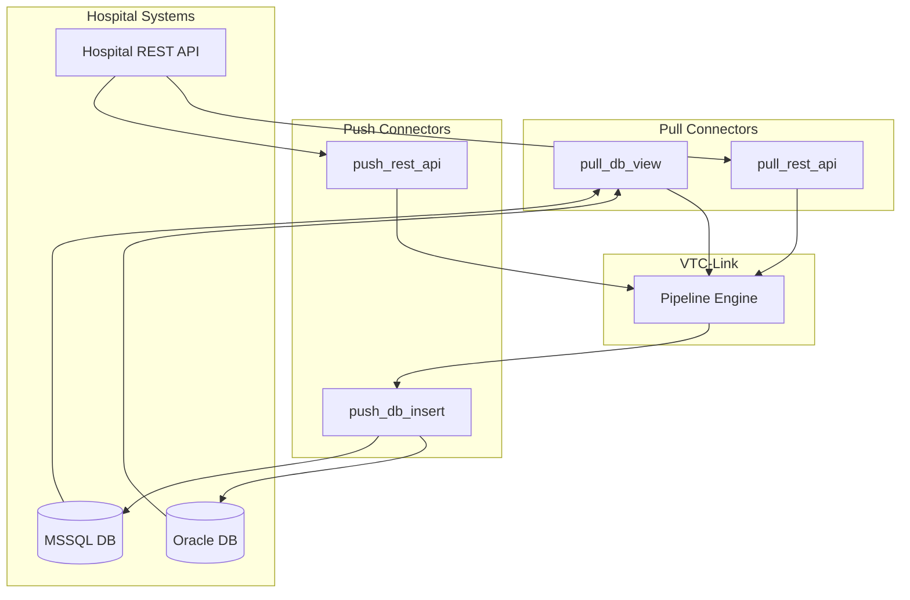

# Connectors

Connectors are the data acquisition layer of VTC-Link, responsible for interfacing with hospital information systems. Each connector type handles a specific integration pattern, from database polling to REST API interactions.

## Connector Architecture



## Connector Types Overview

| Type | Direction | Protocol | Use Case |
|------|-----------|----------|----------|
| `pull_db_view` | Inbound | Oracle/MSSQL | Hospital provides database view access |
| `pull_rest_api` | Inbound | HTTP GET | Hospital exposes REST endpoint |
| `push_rest_api` | Inbound | HTTP POST | Hospital actively pushes data |
| `push_db_insert` | Outbound | Oracle/MSSQL | Write analysis results back to hospital DB |

---

## Pull DB View Connector

The `pull_db_view` connector polls a hospital database view on a scheduled interval. It supports both Oracle and Microsoft SQL Server databases.

### How It Works

1. **Scheduler triggers** the pipeline at configured intervals
2. **Connector establishes** a database connection using provided credentials
3. **Query executes** against the specified view or custom SQL
4. **Results are transformed** into dictionaries with column names as keys
5. **Connection closes** automatically via context manager

### Oracle Configuration

```yaml
hospital:
  hospital_id: "HOSP_A"
  connector_type: "pull_db_view"
  enabled: true
  schedule_minutes: 5
  transform_profile: "HOSP_A"
  db:
    type: "oracle"
    host: "192.168.1.100"
    port: 1521
    service: "ORCLCDB"
    username: "vtc_reader"
    password: "${ORACLE_PASSWORD}"
    view_name: "VW_VITAL_SIGNS"
```

!!! info "Oracle DSN Format"
    The connector constructs the Oracle DSN as `host:port/service`. You can also provide a custom DSN directly via the `dsn` field.

#### Custom Query Example

```yaml
  db:
    type: "oracle"
    host: "192.168.1.100"
    port: 1521
    service: "ORCLCDB"
    username: "vtc_reader"
    password: "${ORACLE_PASSWORD}"
    query: |
      SELECT
        PATIENT_ID, PATIENT_NAME, WARD_CODE,
        SBP, DBP, PULSE_RATE, RESP_RATE, BODY_TEMP, SPO2,
        MEASURE_TIME, SENT_FLAG
      FROM VW_VITAL_SIGNS
      WHERE SENT_FLAG = 'N'
        AND MEASURE_TIME >= SYSDATE - INTERVAL '1' HOUR
```

### MSSQL Configuration

```yaml
hospital:
  hospital_id: "HOSP_B"
  connector_type: "pull_db_view"
  enabled: true
  schedule_minutes: 10
  transform_profile: "HOSP_B"
  db:
    type: "mssql"
    host: "sqlserver.hospital.local"
    port: 1433
    database: "HIS_DB"
    username: "vtc_service"
    password: "${MSSQL_PASSWORD}"
    view_name: "dbo.VitalSignsView"
```

!!! tip "MSSQL Driver"
    The default ODBC driver is `ODBC Driver 18 for SQL Server`. Override it with the `driver` field if needed.

#### Connection String Override

For complex MSSQL configurations, provide a complete connection string:

```yaml
  db:
    type: "mssql"
    connection_string: "DRIVER={ODBC Driver 17 for SQL Server};SERVER=myserver;DATABASE=mydb;UID=user;PWD=pass;Encrypt=yes"
```

### Code Implementation

=== "Oracle Fetch"

    ```python
    from app.core.db import oracle_connection

    def fetch_records(config: HospitalConfig) -> list[dict]:
        """Fetch records from Oracle database view."""
        if not config.db:
            return []

        query = config.db.get("query") or \
                f"SELECT * FROM {config.db.get('view_name')}"

        with oracle_connection(config.db) as conn:
            cursor = conn.cursor()
            cursor.execute(query)
            columns = [col[0] for col in cursor.description]
            rows = cursor.fetchall()

        return [dict(zip(columns, row)) for row in rows]
    ```

=== "MSSQL Fetch"

    ```python
    from app.core.db import mssql_connection

    def fetch_records(config: HospitalConfig) -> list[dict]:
        """Fetch records from MSSQL database view."""
        if not config.db:
            return []

        query = config.db.get("query") or \
                f"SELECT * FROM {config.db.get('view_name')}"

        with mssql_connection(config.db) as conn:
            cursor = conn.cursor()
            cursor.execute(query)
            columns = [col[0] for col in cursor.description]
            rows = cursor.fetchall()

        return [dict(zip(columns, row)) for row in rows]
    ```

---

## Pull REST API Connector

The `pull_rest_api` connector polls a hospital's REST API endpoint on a scheduled interval.

### How It Works

1. **Scheduler triggers** at configured intervals
2. **HTTP GET request** sent to the configured URL
3. **Bearer token authentication** applied if API key is configured
4. **JSON response parsed** and returned as a list of records

### Configuration

```yaml
hospital:
  hospital_id: "HOSP_C"
  connector_type: "pull_rest_api"
  enabled: true
  schedule_minutes: 3
  transform_profile: "HOSP_C"
  api:
    url: "https://api.hospital.com/vitals/pending"
    api_key: "${HOSPITAL_API_KEY}"
```

### Response Formats

The connector handles two JSON response formats:

=== "Array Response"

    ```json
    [
      {"patient_id": "P001", "sbp": 120, "dbp": 80},
      {"patient_id": "P002", "sbp": 135, "dbp": 85}
    ]
    ```

=== "Object Response"

    ```json
    {
      "status": "success",
      "records": [
        {"patient_id": "P001", "sbp": 120, "dbp": 80},
        {"patient_id": "P002", "sbp": 135, "dbp": 85}
      ]
    }
    ```

### Code Implementation

```python
import httpx
from app.core.config import HospitalConfig

def fetch_records(config: HospitalConfig) -> list[dict]:
    """Fetch records from hospital REST API."""
    if not config.api:
        return []

    url = str(config.api.get("url", "")).strip()
    if not url:
        return []

    headers = {}
    api_key = str(config.api.get("api_key", "")).strip()
    if api_key:
        headers["Authorization"] = f"Bearer {api_key}"

    with httpx.Client(timeout=10.0) as client:
        response = client.get(url, headers=headers)
        response.raise_for_status()
        data = response.json()

    # Handle both array and object responses
    if isinstance(data, list):
        return data
    if isinstance(data, dict):
        return data.get("records", [])
    return []
```

!!! warning "Timeout Configuration"
    The default timeout is 10 seconds. For slow hospital APIs, ensure the endpoint responds within this window or handle timeout errors in your transform profile.

---

## Push REST API Connector

The `push_rest_api` connector receives data pushed by hospital systems via HTTP POST to VTC-Link's `/push` endpoint.

### How It Works

1. **Hospital system sends** POST request to `/push` endpoint
2. **VTC-Link validates** the payload structure
3. **Payload is normalized** using the configured transform profile
4. **Data flows through** the standard pipeline

### Endpoint

```
POST /push
Content-Type: application/json
```

### Request Format

=== "Single Record"

    ```json
    {
      "patient_id": "P001",
      "patient_name": "John Doe",
      "sbp": 120,
      "dbp": 80,
      "pulse": 72,
      "measure_time": "2024-01-15T10:30:00"
    }
    ```

=== "Multiple Records"

    ```json
    [
      {"patient_id": "P001", "sbp": 120, "dbp": 80},
      {"patient_id": "P002", "sbp": 135, "dbp": 85}
    ]
    ```

### Response Format

```json
{
  "vital_id": "V67890",
  "patient_id": "P001",
  "screened_type": "NORMAL",
  "screened_date": "20240115 10:30:00",
  "SEPS": 0,
  "MAES": 1,
  "MORS": 0,
  "NEWS": 2,
  "MEWS": 1
}
```

### Code Implementation

```python
def receive_payload(config: HospitalConfig, payload: dict) -> list[dict]:
    """Receive pushed payload from hospital system."""
    _ = config  # Config available for future use

    if isinstance(payload, list):
        return payload
    return [payload]
```

### Configuration

```yaml
hospital:
  hospital_id: "HOSP_D"
  connector_type: "push_rest_api"
  enabled: true
  transform_profile: "HOSP_D"
  # schedule_minutes not required for push connectors
```

!!! note "No Scheduling Required"
    Push connectors are event-driven. The `schedule_minutes` field is not required and will be ignored.

---

## Push DB Insert Connector

The `push_db_insert` connector writes analysis results back to the hospital's database after processing.

### How It Works

1. **Pipeline processes** the incoming vital signs data
2. **Backend returns** analysis results (scores, alerts)
3. **Connector inserts** results into specified hospital table
4. **Hospital system** can query results from their database

### Configuration

```yaml
hospital:
  hospital_id: "HOSP_E"
  connector_type: "push_db_insert"
  enabled: true
  transform_profile: "HOSP_E"
  db:
    type: "oracle"
    host: "192.168.1.100"
    port: 1521
    service: "ORCLCDB"
    username: "vtc_writer"
    password: "${ORACLE_WRITE_PASSWORD}"
    insert_table: "VTC_RESULTS"
    insert_columns:
      - VITAL_ID
      - PATIENT_ID
      - SCREENED_TYPE
      - SEPS_SCORE
      - NEWS_SCORE
      - PROCESSED_AT
```

### Code Implementation

```python
from app.core.db import oracle_connection, mssql_connection

def insert_records(config: HospitalConfig, payload: dict) -> dict:
    """Insert analysis results into hospital database."""
    if not config.db:
        return {"inserted": 0}

    table = config.db.get("insert_table")
    columns = config.db.get("insert_columns", [])

    if not table or not columns:
        return {"inserted": 0}

    values = [payload.get(col) for col in columns]
    placeholders = ", ".join(["?"] * len(columns))
    column_sql = ", ".join(columns)
    query = f"INSERT INTO {table} ({column_sql}) VALUES ({placeholders})"

    if config.db.get("type") == "oracle":
        with oracle_connection(config.db) as conn:
            cursor = conn.cursor()
            cursor.execute(query, values)
            conn.commit()
        return {"inserted": 1}

    if config.db.get("type") == "mssql":
        with mssql_connection(config.db) as conn:
            cursor = conn.cursor()
            cursor.execute(query, values)
            conn.commit()
        return {"inserted": 1}

    return {"inserted": 0}
```

---

## Connection Management

### Context Managers

All database connections use Python context managers for automatic cleanup:

```python
@contextmanager
def oracle_connection(db: dict) -> Iterator[oracledb.Connection]:
    """Oracle connection with automatic cleanup."""
    dsn = _oracle_dsn(db)
    conn = oracledb.connect(
        user=db.get("username"),
        password=db.get("password"),
        dsn=dsn,
    )
    try:
        yield conn
    finally:
        conn.close()
```

### Connection Pooling

!!! tip "Future Enhancement"
    For high-throughput scenarios, consider implementing connection pooling using `oracledb.SessionPool` or `pyodbc` connection pooling.

---

## Error Handling

### Database Errors

| Error | Cause | Resolution |
|-------|-------|------------|
| `ORA-12541` | TNS listener not available | Check Oracle host/port configuration |
| `ORA-01017` | Invalid credentials | Verify username/password |
| `ORA-00942` | Table/view does not exist | Check view_name configuration |
| `28000` (MSSQL) | Login failed | Verify MSSQL credentials |
| `08001` (MSSQL) | Connection failed | Check host/port, firewall rules |

### HTTP Errors

| Status | Cause | Resolution |
|--------|-------|------------|
| `401` | Authentication failed | Check API key configuration |
| `403` | Access denied | Verify API permissions |
| `404` | Endpoint not found | Check URL configuration |
| `408` | Request timeout | Increase timeout or optimize API |
| `500` | Server error | Contact hospital IT team |

### Error Logging

All connector errors are logged to the telemetry system:

```python
log_event(
    event="connector_error",
    level="ERROR",
    hospital_id=config.hospital_id,
    stage="fetch",
    message=str(error),
    error_code="CONN_DB_001"
)
```

---

## Configuration Schema Reference

### Database Configuration

| Field | Type | Required | Description |
|-------|------|----------|-------------|
| `type` | string | Yes | `oracle` or `mssql` |
| `host` | string | Yes | Database server hostname |
| `port` | integer | No | Default: 1521 (Oracle), 1433 (MSSQL) |
| `service` | string | Oracle | Oracle service name |
| `database` | string | MSSQL | MSSQL database name |
| `username` | string | Yes | Database username |
| `password` | string | Yes | Database password |
| `view_name` | string | Pull | View to query |
| `query` | string | No | Custom SQL query (overrides view_name) |
| `insert_table` | string | Insert | Target table for inserts |
| `insert_columns` | list | Insert | Columns to insert |
| `dsn` | string | No | Complete Oracle DSN (overrides host/port/service) |
| `connection_string` | string | No | Complete MSSQL connection string |
| `driver` | string | No | MSSQL ODBC driver name |

### API Configuration

| Field | Type | Required | Description |
|-------|------|----------|-------------|
| `url` | string | Yes | REST API endpoint URL |
| `api_key` | string | No | Bearer token for authentication |

---

## Best Practices

### Security

!!! danger "Never Commit Credentials"
    Always use environment variables for sensitive data:
    ```yaml
    password: "${ORACLE_PASSWORD}"
    api_key: "${HOSPITAL_API_KEY}"
    ```

### Performance

1. **Optimize queries**: Use `WHERE` clauses to fetch only unprocessed records
2. **Limit result sets**: Avoid fetching entire tables
3. **Index key columns**: Ensure `SENT_FLAG` and `MEASURE_TIME` columns are indexed

### Monitoring

1. **Track fetch counts**: Monitor records fetched per interval
2. **Alert on failures**: Set up alerts for connection errors
3. **Log slow queries**: Identify and optimize slow database operations
