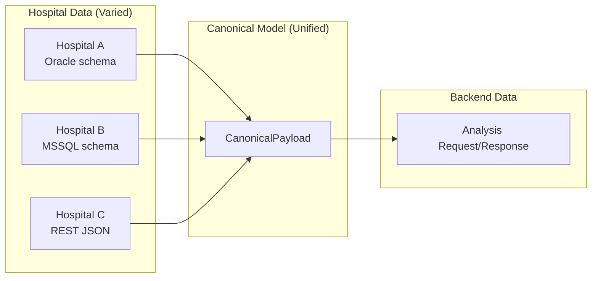

# Data Model

## Overview

VTC-Link uses a canonical data model to normalize diverse hospital data formats into a unified structure. This ensures consistent data exchange regardless of the source hospital's internal schema.



---

## Canonical Payload Schema

The canonical payload is the core data structure that flows through VTC-Link. It consists of three main sections: patient information, vital signs, and timestamps.

### Complete Schema

```python
from pydantic import BaseModel, Field

class Patient(BaseModel):
    """Patient identification information."""
    patient_id: str = Field(..., description="Patient identifier")
    patient_name: str | None = Field(default=None, description="Patient name")
    birthdate: str = Field(..., description="Date of birth (YYYYMMDD)")
    age: int | None = Field(default=None, description="Patient age")
    sex: str = Field(..., description="Sex code (M/F)")
    ward: str | None = Field(default=None, max_length=30, description="Ward name")
    department: str | None = Field(default=None, max_length=30, description="Department name")


class Vitals(BaseModel):
    """Vital signs measurements."""
    SBP: int = Field(..., description="Systolic Blood Pressure (mmHg)")
    DBP: int = Field(..., description="Diastolic Blood Pressure (mmHg)")
    PR: int = Field(..., description="Pulse Rate (beats/min)")
    RR: int = Field(..., description="Respiratory Rate (breaths/min)")
    BT: float = Field(..., description="Body Temperature (Celsius)")
    SpO2: float = Field(..., description="Oxygen Saturation (%)")


class Timestamps(BaseModel):
    """Record timestamp metadata."""
    created_at: str = Field(..., description="Creation time (UTC ISO8601)")
    updated_at: str = Field(..., description="Update time (UTC ISO8601)")


class CanonicalPayload(BaseModel):
    """Canonical payload sent to backend for analysis."""
    patient: Patient
    vitals: Vitals
    timestamps: Timestamps
```

---

## Patient Data Fields

### Field Reference

| Field | Type | Required | Constraints | Description |
|-------|------|----------|-------------|-------------|
| `patient_id` | `string` | **Yes** | Non-empty | Unique patient identifier within the hospital |
| `patient_name` | `string` | No | - | Patient's full name |
| `birthdate` | `string` | **Yes** | `YYYYMMDD` format | Date of birth |
| `age` | `integer` | No | `>= 0` | Patient's age in years |
| `sex` | `string` | **Yes** | `M` or `F` | Biological sex |
| `ward` | `string` | No | Max 30 chars | Hospital ward/unit name |
| `department` | `string` | No | Max 30 chars | Clinical department name |

### Patient ID Guidelines

!!! warning "Patient ID Requirements"

    The `patient_id` field must be:

    - Unique within the hospital system
    - Consistent across multiple vital sign records for the same patient
    - Trimmed of leading/trailing whitespace
    - Non-empty after trimming

### Sex Code Normalization

VTC-Link transforms various hospital sex representations into a standard format:

```python
# Supported input formats → Canonical output
SEX_MAPPING = {
    # English codes
    "M": "M",
    "F": "F",
    "male": "M",
    "female": "F",

    # Numeric codes
    "1": "M",
    "2": "F",

    # Korean codes
    "남": "M",
    "여": "F",
}
```

### Birthdate Format

The birthdate is stored in `YYYYMMDD` format for consistency:

=== "Input Formats Supported"

    ```python
    BIRTHDATE_FORMATS = [
        "%Y%m%d",      # 19900115
        "%Y-%m-%d",    # 1990-01-15
    ]
    ```

=== "Output Format"

    ```
    19900115  # Always YYYYMMDD
    ```

---

## Vital Signs Fields

### Field Reference

| Field | Type | Unit | Normal Range | Description |
|-------|------|------|--------------|-------------|
| `SBP` | `integer` | mmHg | 90-140 | Systolic Blood Pressure |
| `DBP` | `integer` | mmHg | 60-90 | Diastolic Blood Pressure |
| `PR` | `integer` | beats/min | 60-100 | Pulse Rate (Heart Rate) |
| `RR` | `integer` | breaths/min | 12-20 | Respiratory Rate |
| `BT` | `float` | °C | 36.1-37.2 | Body Temperature |
| `SpO2` | `float` | % | 95-100 | Oxygen Saturation |

### Vital Signs Detail

#### SBP - Systolic Blood Pressure

!!! info "Systolic Blood Pressure"

    The maximum arterial pressure during heart contraction (systole).

    | Range | Classification |
    |-------|---------------|
    | < 90 | Hypotension |
    | 90-119 | Normal |
    | 120-129 | Elevated |
    | 130-139 | Stage 1 Hypertension |
    | ≥ 140 | Stage 2 Hypertension |

#### DBP - Diastolic Blood Pressure

!!! info "Diastolic Blood Pressure"

    The minimum arterial pressure during heart relaxation (diastole).

    | Range | Classification |
    |-------|---------------|
    | < 60 | Low |
    | 60-79 | Normal |
    | 80-89 | Elevated |
    | ≥ 90 | Hypertension |

#### PR - Pulse Rate

!!! info "Pulse Rate (Heart Rate)"

    The number of heartbeats per minute.

    | Range | Classification |
    |-------|---------------|
    | < 60 | Bradycardia |
    | 60-100 | Normal |
    | > 100 | Tachycardia |

#### RR - Respiratory Rate

!!! info "Respiratory Rate"

    The number of breaths per minute.

    | Range | Classification |
    |-------|---------------|
    | < 12 | Bradypnea |
    | 12-20 | Normal |
    | > 20 | Tachypnea |

#### BT - Body Temperature

!!! info "Body Temperature"

    Core body temperature in Celsius.

    | Range | Classification |
    |-------|---------------|
    | < 35.0 | Hypothermia |
    | 35.0-36.0 | Low |
    | 36.1-37.2 | Normal |
    | 37.3-38.0 | Low-grade fever |
    | > 38.0 | Fever |

#### SpO2 - Oxygen Saturation

!!! info "Oxygen Saturation"

    The percentage of hemoglobin binding sites occupied by oxygen.

    | Range | Classification |
    |-------|---------------|
    | 95-100 | Normal |
    | 90-94 | Mild hypoxemia |
    | < 90 | Hypoxemia |

---

## Timestamp Handling

### UTC ISO8601 Format

All timestamps in the canonical payload use UTC timezone in ISO8601 format:

```
2024-01-15T10:30:00Z
```

!!! note "Timestamp Format Specification"

    - **Format**: ISO 8601 extended format
    - **Timezone**: Always UTC (indicated by `Z` suffix)
    - **Precision**: Seconds (no milliseconds required)

### Input Format Conversion

VTC-Link accepts various timestamp formats and converts them to UTC ISO8601:

```python
TIMESTAMP_FORMATS = [
    "%Y-%m-%d %H:%M:%S",     # 2024-01-15 10:30:00
    "%Y-%m-%dT%H:%M:%S",     # 2024-01-15T10:30:00
]
```

### Timestamp Fields

| Field | Description |
|-------|-------------|
| `created_at` | When the vital signs were originally recorded |
| `updated_at` | When the record was last modified |

---

## Client Response Schema

The client response contains analysis results returned from the backend server.

### Complete Schema

```python
class ClientResponse(BaseModel):
    """Client response model from backend analysis."""
    vital_id: str = Field(..., description="Vital record identifier")
    patient_id: str = Field(..., description="Patient identifier")
    screened_type: str = Field(..., description="Screening type classification")
    screened_date: str = Field(..., description="Screening date (YYYYMMDD HH:MM:SS)")
    SEPS: int = Field(..., description="Sepsis Score")
    MAES: int = Field(..., description="MAES Score")
    MORS: int = Field(..., description="Mortality Risk Score")
    NEWS: int = Field(..., description="National Early Warning Score")
    MEWS: int = Field(..., description="Modified Early Warning Score")
    created_at: str = Field(..., description="Creation timestamp")
    updated_at: str = Field(..., description="Update timestamp")
```

### Field Reference

| Field | Type | Description |
|-------|------|-------------|
| `vital_id` | `string` | Unique identifier for this vital record |
| `patient_id` | `string` | Patient identifier (matches canonical payload) |
| `screened_type` | `string` | Screening classification (e.g., "EMERGENCY", "ROUTINE") |
| `screened_date` | `string` | When screening was performed |
| `SEPS` | `integer` | Sepsis early warning score |
| `MAES` | `integer` | MAES (Medical Assessment) score |
| `MORS` | `integer` | Mortality risk score |
| `NEWS` | `integer` | National Early Warning Score |
| `MEWS` | `integer` | Modified Early Warning Score |
| `created_at` | `string` | Record creation timestamp |
| `updated_at` | `string` | Record update timestamp |

---

## Risk Scores

The backend analysis returns several clinical risk scores that help identify deteriorating patients.

### NEWS - National Early Warning Score

!!! abstract "NEWS"

    A standardized scoring system used to quickly determine the degree of illness of a patient.

    | Score | Clinical Risk |
    |-------|--------------|
    | 0-4 | Low |
    | 5-6 | Medium |
    | 7+ | High |

    **Parameters**: RR, SpO2, supplemental oxygen, temperature, SBP, HR, consciousness

### MEWS - Modified Early Warning Score

!!! abstract "MEWS"

    A simplified early warning score used in many healthcare settings.

    | Score | Action |
    |-------|--------|
    | 0-1 | Routine monitoring |
    | 2-3 | Increase monitoring |
    | 4+ | Immediate attention |

    **Parameters**: SBP, HR, RR, temperature, AVPU score

### SEPS - Sepsis Score

!!! abstract "SEPS"

    An early warning indicator for sepsis risk.

    | Score | Risk Level |
    |-------|-----------|
    | 0-1 | Low risk |
    | 2-3 | Moderate risk |
    | 4+ | High risk |

### MORS - Mortality Risk Score

!!! abstract "MORS"

    Predictive score for mortality risk.

    | Score | Risk Level |
    |-------|-----------|
    | 0 | Low |
    | 1-2 | Moderate |
    | 3+ | High |

### MAES - Medical Assessment Score

!!! abstract "MAES"

    Comprehensive medical assessment score.

---

## JSON Examples

### Complete Canonical Payload Example

```json
{
  "patient": {
    "patient_id": "P12345",
    "patient_name": "John Doe",
    "birthdate": "19900115",
    "age": 34,
    "sex": "M",
    "ward": "ICU",
    "department": "Internal Medicine"
  },
  "vitals": {
    "SBP": 120,
    "DBP": 80,
    "PR": 72,
    "RR": 18,
    "BT": 36.5,
    "SpO2": 98.0
  },
  "timestamps": {
    "created_at": "2024-01-15T10:30:00Z",
    "updated_at": "2024-01-15T10:30:00Z"
  }
}
```

### Complete Client Response Example

```json
{
  "vital_id": "V67890",
  "patient_id": "P12345",
  "screened_type": "EMERGENCY",
  "screened_date": "20240115 10:30:00",
  "SEPS": 2,
  "MAES": 1,
  "MORS": 0,
  "NEWS": 3,
  "MEWS": 2,
  "created_at": "2024-01-15T10:30:05Z",
  "updated_at": "2024-01-15T10:30:05Z"
}
```

### Minimal Valid Payload

```json
{
  "patient": {
    "patient_id": "P001",
    "birthdate": "19800101",
    "sex": "F"
  },
  "vitals": {
    "SBP": 110,
    "DBP": 70,
    "PR": 80,
    "RR": 16,
    "BT": 36.8,
    "SpO2": 97.5
  },
  "timestamps": {
    "created_at": "2024-01-15T09:00:00Z",
    "updated_at": "2024-01-15T09:00:00Z"
  }
}
```

---

## Validation Rules

### Patient Validation

```python
# Required fields
assert patient.patient_id != ""
assert patient.birthdate matches YYYYMMDD
assert patient.sex in ["M", "F"]

# Optional field constraints
assert len(patient.ward) <= 30 if patient.ward else True
assert len(patient.department) <= 30 if patient.department else True
assert patient.age >= 0 if patient.age else True
```

### Vital Signs Validation

```python
# All vital signs are required
assert all([
    isinstance(vitals.SBP, int),
    isinstance(vitals.DBP, int),
    isinstance(vitals.PR, int),
    isinstance(vitals.RR, int),
    isinstance(vitals.BT, float),
    isinstance(vitals.SpO2, float),
])

# Reasonable value ranges (warnings, not failures)
assert 40 <= vitals.SBP <= 300, "SBP out of typical range"
assert 20 <= vitals.DBP <= 200, "DBP out of typical range"
assert 20 <= vitals.PR <= 250, "PR out of typical range"
assert 4 <= vitals.RR <= 60, "RR out of typical range"
assert 30.0 <= vitals.BT <= 45.0, "BT out of typical range"
assert 50.0 <= vitals.SpO2 <= 100.0, "SpO2 out of typical range"
```

### Timestamp Validation

```python
# ISO8601 format with UTC timezone
assert timestamps.created_at matches ISO8601_PATTERN
assert timestamps.updated_at matches ISO8601_PATTERN
```

---

## Error Handling

### Parse Errors

When data cannot be parsed, VTC-Link raises descriptive errors:

```python
from app.core.errors import ParseError

class ParseError(Exception):
    """Raised when a field cannot be parsed."""
    def __init__(self, field: str, message: str):
        self.field = field
        self.message = message
        super().__init__(f"Parse error for field '{field}': {message}")
```

### Common Parse Errors

| Error | Field | Cause |
|-------|-------|-------|
| `ParseError("sex", "Unsupported value: X")` | `sex` | Unknown sex code |
| `ParseError("birthdate", "Invalid format")` | `birthdate` | Date doesn't match expected patterns |
| `ParseError("SBP", "Cannot convert to int")` | `SBP` | Non-numeric value provided |
| `ParseError("SpO2", "Cannot convert to float")` | `SpO2` | Non-numeric value provided |
