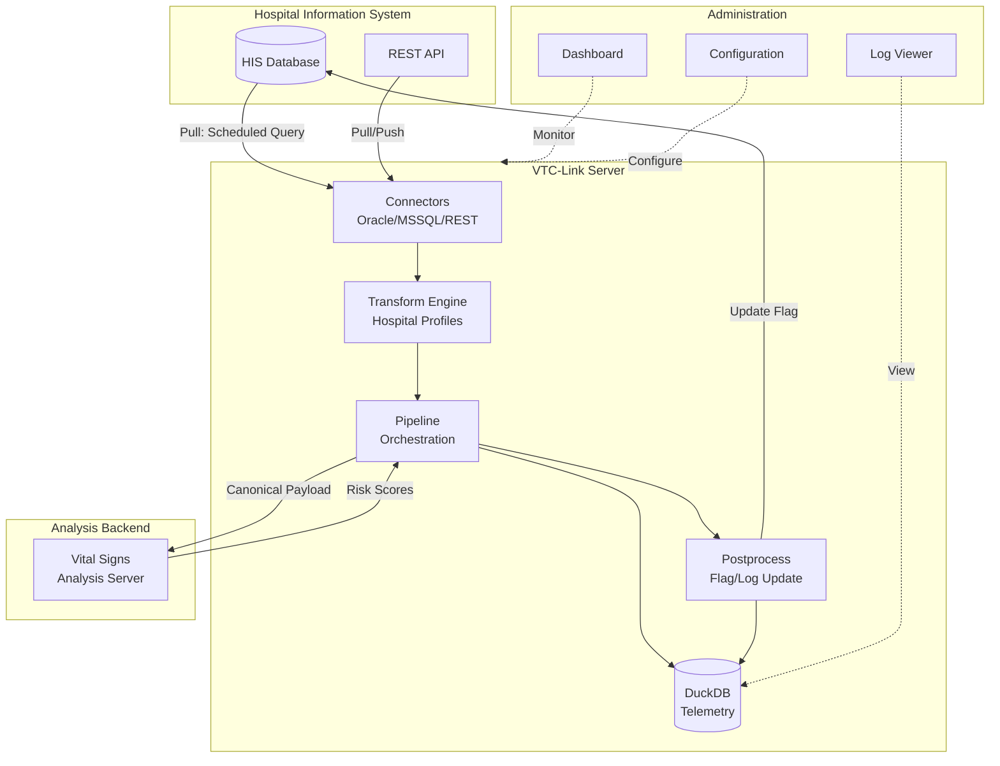

# VTC-Link

<div align="center">
<h2>Vital Data Interface Server</h2>
<p><em>A high-performance hospital vital signs data integration proxy that normalizes patient data from diverse hospital information systems and forwards it to backend analysis servers.</em></p>

[](https://www.python.org/downloads/)
[](https://fastapi.tiangolo.com/)
[](https://docs.pydantic.dev/)
[](https://duckdb.org/)
[](https://opensource.org/licenses/MIT)

</div>

---

## Key Features

<div class="grid cards" markdown>

-   :material-database-sync:{ .lg .middle } **Multi-Connector Support**

    ---

    Connect to Oracle/MSSQL databases, REST APIs with both pull and push patterns. Flexible connector architecture supports any hospital data source.

-   :material-transform:{ .lg .middle } **Data Normalization**

    ---

    Transform hospital-specific formats into a unified canonical schema. Handle diverse field names, code systems, and date formats seamlessly.

-   :material-clock-outline:{ .lg .middle } **Scheduled Processing**

    ---

    APScheduler-based background jobs for pull connectors with configurable intervals. Reliable and precise scheduling for data collection.

-   :material-view-dashboard:{ .lg .middle } **Admin Dashboard**

    ---

    Web-based UI for configuration management, real-time monitoring, log viewing, and scheduler status tracking.

-   :material-cog-sync:{ .lg .middle } **Postprocess Operations**

    ---

    Update flags or insert logs back to hospital databases after successful processing. Ensure data consistency and audit trails.

-   :material-chart-timeline:{ .lg .middle } **Telemetry & Monitoring**

    ---

    DuckDB-based event logging and status tracking. Comprehensive observability for operational excellence.

</div>

---

## Quick Start

### Prerequisites

- **Python 3.12** or higher
- **uv** (recommended) or pip
- Access to hospital database or API endpoint
- Backend analysis server URL

### Installation

=== "Using uv (Recommended)"

    ```bash
    # Clone the repository
    git clone https://github.com/yourusername/vtc-link.git
    cd vtc-link

    # Install dependencies
    uv sync
    ```

=== "Using pip"

    ```bash
    # Clone the repository
    git clone https://github.com/yourusername/vtc-link.git
    cd vtc-link

    # Install in development mode
    pip install -e .
    ```

### Configuration

1. **Set up environment variables:**

```bash
cp .env.example .env
# Edit .env with your settings
```

2. **Configure hospital settings** in `hospitals.yaml`:

```yaml
hospital:
  hospital_id: "HOSP_A"
  connector_type: "pull_db_view"
  enabled: true
  schedule_minutes: 5
  transform_profile: "HOSP_A"
  db:
    type: "oracle"
    host: "localhost"
    port: 1521
    service: "ORCLCDB"
    username: "readonly"
    password: "readonly"
    view_name: "VITAL_VIEW"
```

### Running the Server

=== "Development"

    ```bash
    ./dev.sh
    # or
    uv run uvicorn app.main:app --reload
    ```

=== "Production (Docker)"

    ```bash
    docker-compose up -d
    ```

### Access Points

| Service | URL | Description |
|---------|-----|-------------|
| API Documentation | `http://localhost:8000/docs` | Interactive Swagger UI |
| Admin Dashboard | `http://localhost:8000/admin/dashboard` | Web-based management |
| Health Check | `http://localhost:8000/health` | Service health status |
| Push Endpoint | `http://localhost:8000/api/v1/push` | Receive pushed vitals |

---

## Architecture Overview



---

## Technology Stack

| Category | Technology | Purpose |
|----------|------------|---------|
| **Framework** | FastAPI 0.115+ | High-performance async web framework |
| **Runtime** | Python 3.12, Uvicorn | Modern Python with ASGI server |
| **Validation** | Pydantic v2 | Data validation and serialization |
| **Databases** | Oracle (oracledb), MSSQL (pyodbc) | Hospital database connectivity |
| **Telemetry** | DuckDB | Embedded analytical database |
| **Scheduling** | APScheduler | Background job scheduling |
| **HTTP Client** | httpx | Async HTTP client for backend calls |
| **Templates** | Jinja2 | Admin UI templating |
| **Configuration** | PyYAML | YAML-based configuration |

---

## Documentation

<div class="grid cards" markdown>

-   :material-chart-box:{ .lg .middle } **[Overview](overview.md)**

    ---

    Problem statement, solution approach, and target audience.

-   :material-sitemap:{ .lg .middle } **[Architecture](architecture.md)**

    ---

    Detailed system architecture, components, and design principles.

-   :material-database:{ .lg .middle } **[Data Model](data-model.md)**

    ---

    Canonical payload schema, vital signs fields, and response formats.

</div>

---

## Project Goals

!!! success "In Scope"

    - Support for DB view pull, REST pull, REST push, and DB insert push connectors
    - Normalize patient/vital data to canonical format
    - Provide structured logging, postprocess handling, and admin monitoring
    - Single hospital per instance configuration
    - Support for Windows Server/10/11 and Ubuntu 22/24

!!! warning "Out of Scope"

    - Long-term data retention beyond operational telemetry
    - Advanced analytics features in the admin UI
    - Multi-hospital management in a single instance

---

## License

This project is licensed under the MIT License - see the LICENSE file for details.
