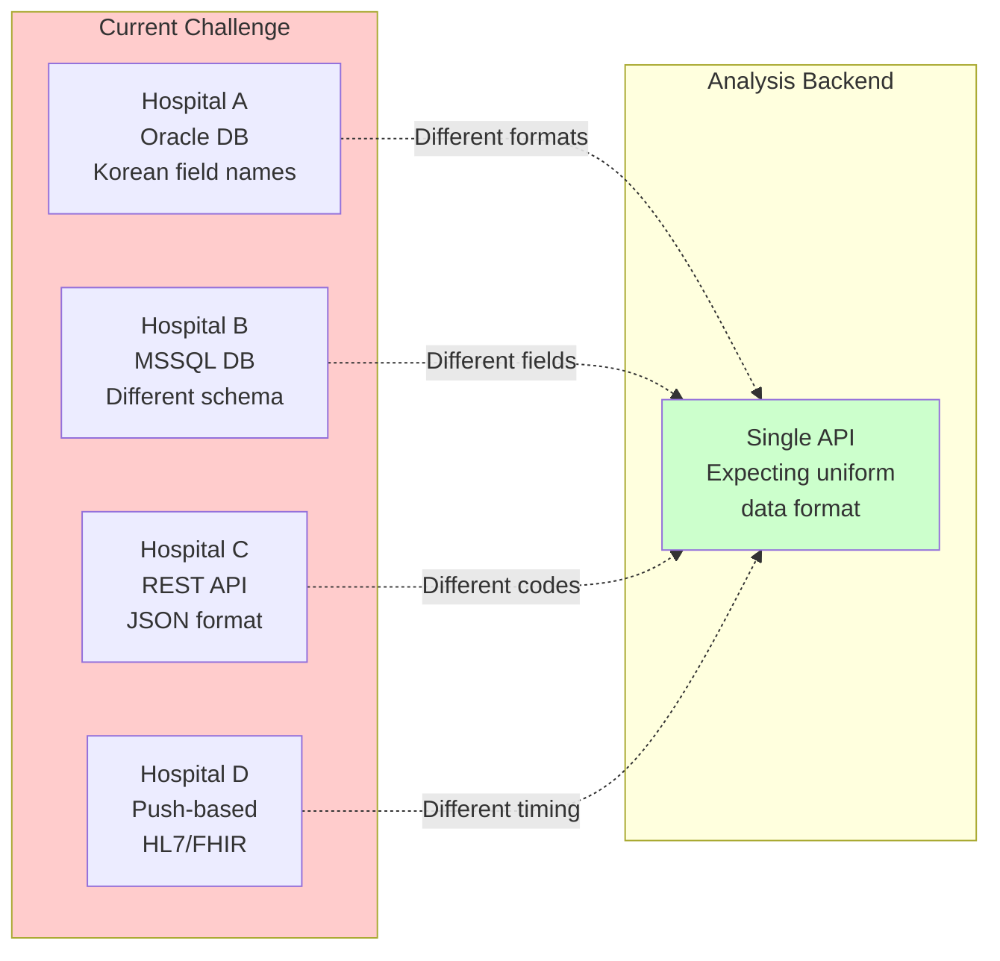
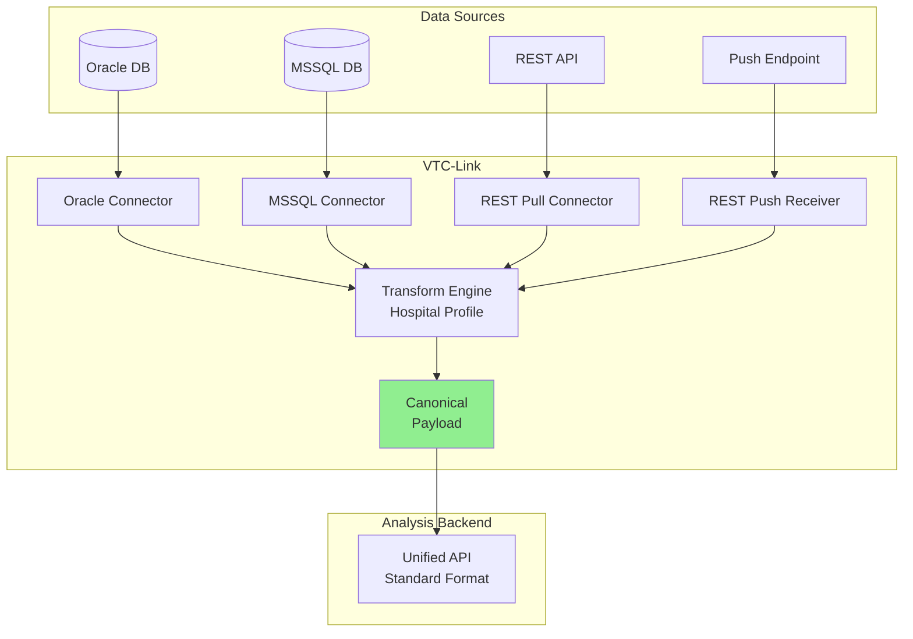
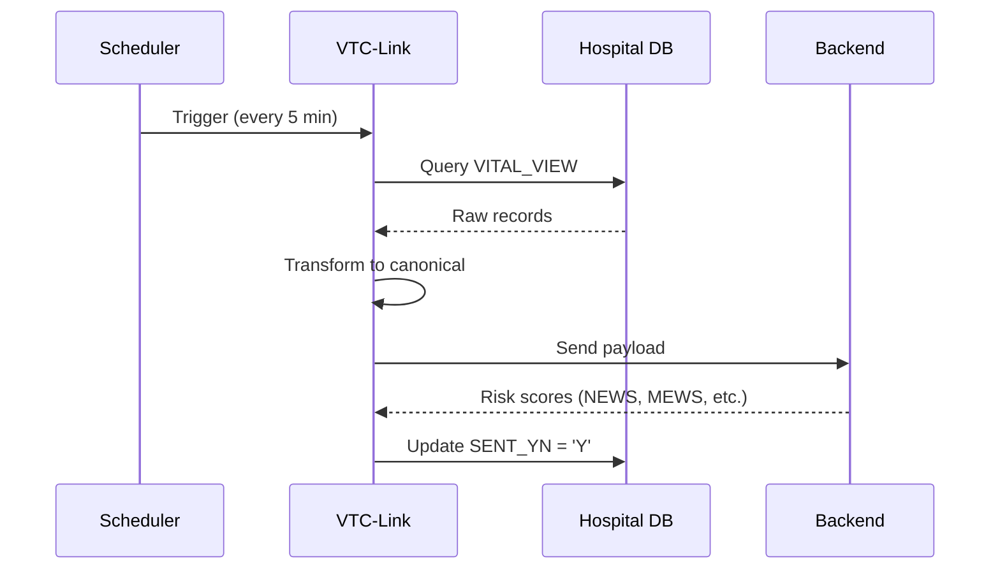
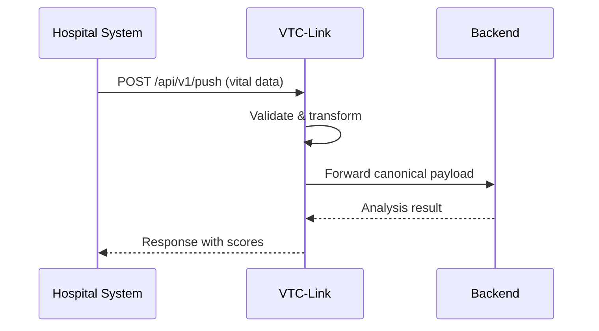

# Overview

## Problem Statement

### The Challenge of Hospital Data Integration

Healthcare organizations face significant challenges when integrating vital signs data from Hospital Information Systems (HIS) for real-time patient monitoring and early warning score calculation.



!!! danger "Key Challenges"

    1. **Format Heterogeneity**: Each hospital uses different database schemas, field names, and data types
    2. **Code System Variations**: Sex codes, department codes, and ward identifiers vary across institutions
    3. **Connectivity Diversity**: Some hospitals offer database access, others REST APIs, some push data actively
    4. **Timestamp Inconsistencies**: Date/time formats vary (YYYYMMDD, YYYY-MM-DD, timestamps with/without timezone)
    5. **No Standard Protocol**: Unlike lab results (HL7), vital signs lack a universally adopted exchange standard

### Real-World Examples

=== "Sex Code Variations"

    ```python
    # Different hospitals represent the same data differently
    Hospital A: "M", "F"
    Hospital B: "1", "2"
    Hospital C: "male", "female"
    Hospital D: "남", "여"
    ```

=== "Date Format Variations"

    ```python
    # Birthdate representations
    Hospital A: "19900115"      # YYYYMMDD
    Hospital B: "1990-01-15"    # YYYY-MM-DD
    Hospital C: "15/01/1990"    # DD/MM/YYYY
    Hospital D: "01-15-1990"    # MM-DD-YYYY
    ```

=== "Field Name Variations"

    ```python
    # Blood pressure field names
    Hospital A: {"SBP": 120, "DBP": 80}
    Hospital B: {"systolic": 120, "diastolic": 80}
    Hospital C: {"bp_sys": 120, "bp_dia": 80}
    Hospital D: {"혈압_수축": 120, "혈압_이완": 80}
    ```

---

## Solution Approach

### VTC-Link: The Universal Translator

VTC-Link serves as a middleware layer that normalizes heterogeneous hospital data into a unified canonical format before forwarding to analysis backends.



### Design Principles

!!! abstract "Single Hospital Per Instance"

    VTC-Link follows the **single hospital per instance** deployment model. Each VTC-Link instance is configured for one hospital, ensuring:

    - Clear separation of concerns
    - Simplified configuration management
    - Independent scaling and maintenance
    - Reduced blast radius for failures

!!! abstract "Profile-Based Transformation"

    Each hospital has a dedicated **transform profile** that defines:

    - Field mappings (hospital fields → canonical fields)
    - Code translations (hospital codes → standard codes)
    - Date format parsing rules
    - Validation constraints

!!! abstract "Connector Abstraction"

    The connector layer abstracts data source complexity:

    ```
    ┌─────────────────────────────────────────────────┐
    │              Connector Interface                 │
    ├─────────────────────────────────────────────────┤
    │  fetch_records(config) → list[dict]            │
    │  receive_payload(config, payload) → list[dict] │
    └─────────────────────────────────────────────────┘
             ↓           ↓           ↓           ↓
          Oracle      MSSQL     REST Pull    REST Push
    ```

---

## Use Cases

### Primary Use Cases

#### 1. Scheduled Vital Signs Collection



**Scenario**: A hospital exposes a database view containing new vital sign measurements. VTC-Link polls this view every 5 minutes, transforms the data, sends it for analysis, and marks processed records.

#### 2. Real-time Push Integration



**Scenario**: A hospital's monitoring system pushes vital signs in real-time as they're measured. VTC-Link receives, transforms, and forwards immediately.

#### 3. Bidirectional Result Sync

**Scenario**: After analysis, results (SEPS, NEWS, MEWS scores) need to be written back to the hospital's database for display in their clinical dashboard.

---

## System Requirements

### Minimum Requirements

| Component | Requirement |
|-----------|-------------|
| **Operating System** | Windows Server 2019/2022, Windows 10/11, Ubuntu 22.04/24.04 |
| **Python** | 3.12 or higher |
| **Memory** | 512 MB RAM (minimum), 1 GB RAM (recommended) |
| **Storage** | 100 MB for application, additional for telemetry logs |
| **Network** | Access to hospital database/API and backend server |

### Database Client Requirements

=== "Oracle"

    - Oracle Instant Client 19c or higher
    - `oracledb` Python package
    - Network access to Oracle database (typically port 1521)

=== "MSSQL"

    - ODBC Driver 17/18 for SQL Server
    - `pyodbc` Python package
    - Network access to MSSQL server (typically port 1433)

### Recommended Hardware

| Deployment | CPU | Memory | Storage |
|------------|-----|--------|---------|
| Development | 2 cores | 1 GB | 1 GB SSD |
| Production (Small) | 2 cores | 2 GB | 10 GB SSD |
| Production (Medium) | 4 cores | 4 GB | 50 GB SSD |

---

## Target Audience

### Primary Users

<div class="grid cards" markdown>

-   :material-hospital-building:{ .lg .middle } **Hospital IT Teams**

    ---

    IT professionals responsible for integrating hospital information systems with external analysis platforms.

    - Configure database connections
    - Set up transform profiles
    - Monitor integration health

-   :material-medical-bag:{ .lg .middle } **Healthcare Solution Providers**

    ---

    Companies building patient monitoring and early warning systems that need to integrate with multiple hospitals.

    - Deploy VTC-Link at customer sites
    - Maintain transform profiles
    - Ensure reliable data flow

-   :material-code-tags:{ .lg .middle } **Integration Engineers**

    ---

    Developers building healthcare data pipelines and integration solutions.

    - Create custom connectors
    - Develop transform profiles
    - Extend functionality

</div>

### Knowledge Prerequisites

| Role | Required Knowledge |
|------|-------------------|
| **System Administrator** | Linux/Windows administration, Docker basics, YAML configuration |
| **Integration Developer** | Python, SQL, REST APIs, data transformation concepts |
| **Operations** | Monitoring tools, log analysis, basic troubleshooting |

---

## Benefits

!!! success "For Hospitals"

    - **Minimal Changes**: No modifications required to existing HIS systems
    - **Flexible Integration**: Choose between database view, API, or push-based integration
    - **Audit Trail**: Complete logging of all data exchanges
    - **Result Sync**: Automatically receive analysis results back into hospital systems

!!! success "For Solution Providers"

    - **Unified Backend**: Single API format regardless of hospital source
    - **Scalable Deployment**: One instance per hospital for clear separation
    - **Maintainable**: Profile-based configuration without code changes
    - **Observable**: Built-in telemetry and monitoring

!!! success "For Patients"

    - **Faster Analysis**: Automated data flow enables real-time early warning scores
    - **Better Care**: Clinicians receive timely alerts for deteriorating patients
    - **Data Accuracy**: Validation ensures correct vital sign transmission
