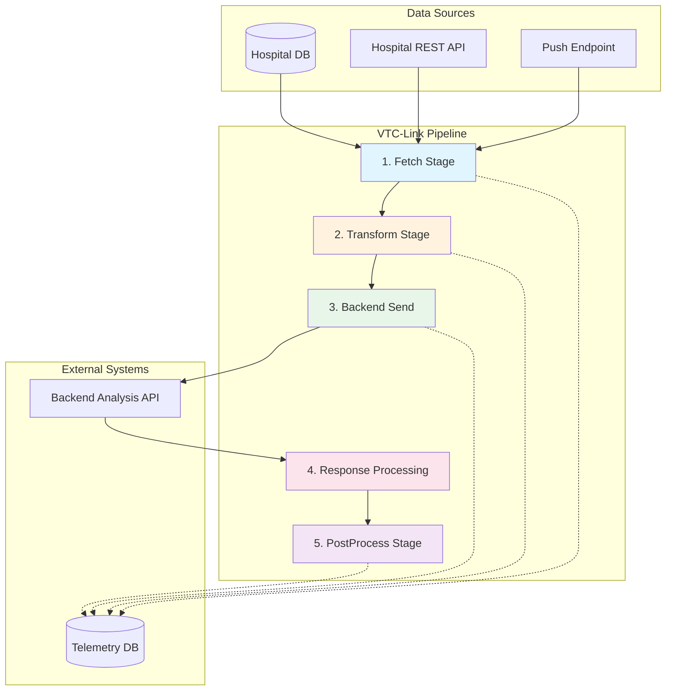
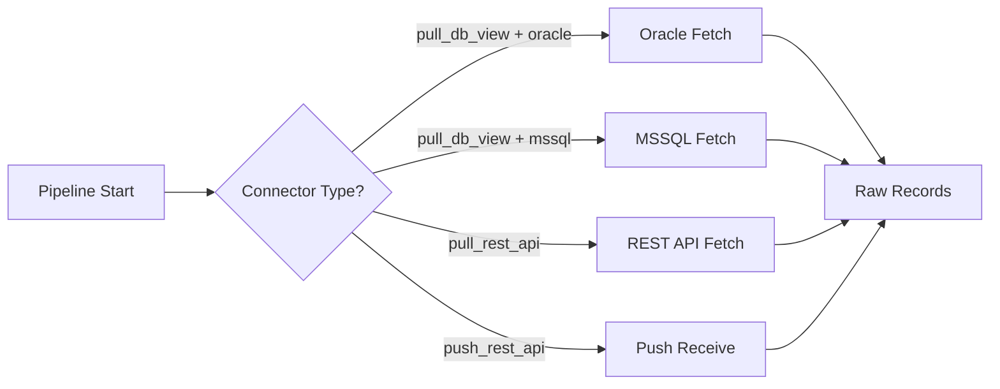
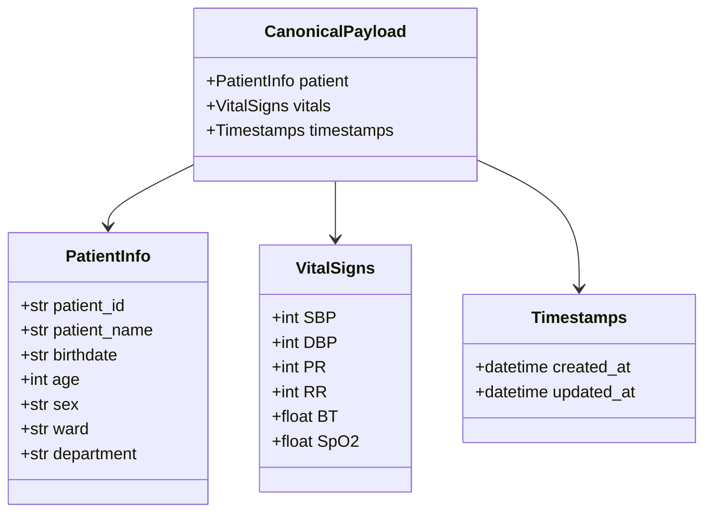
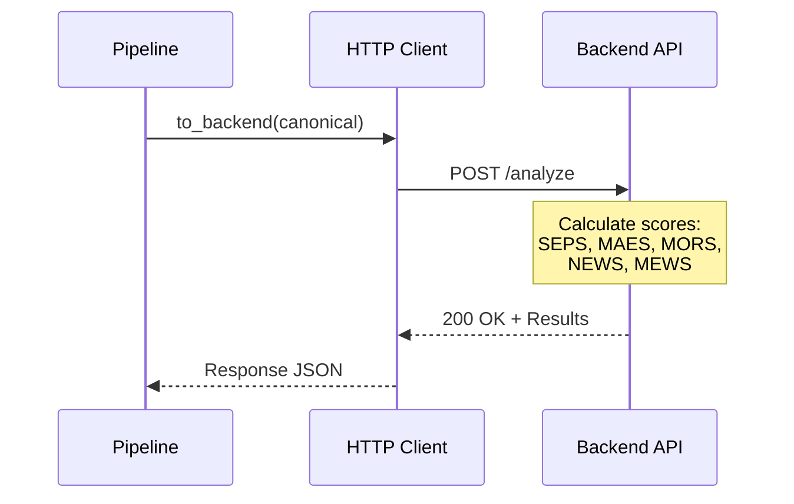
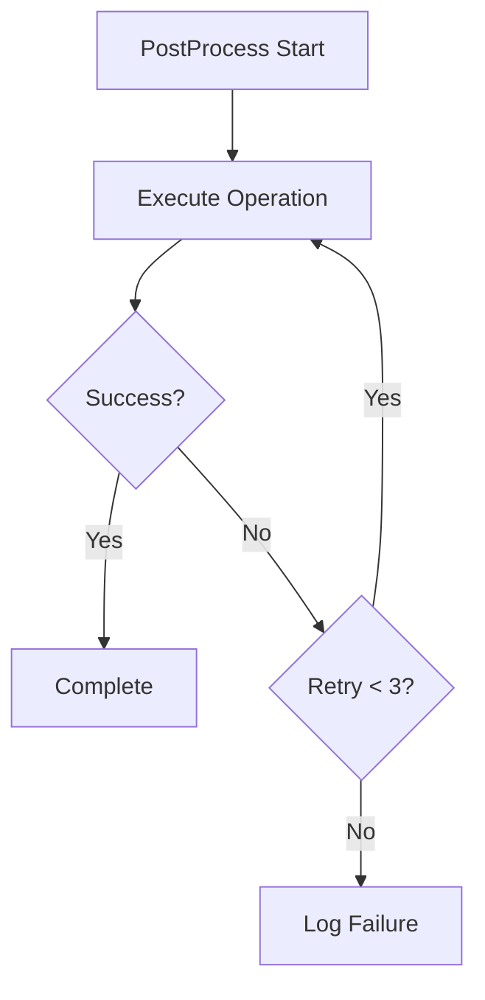

# ETL Pipeline

The VTC-Link pipeline orchestrates the complete data flow from hospital systems through normalization, backend processing, and post-processing operations. It provides a robust, fault-tolerant mechanism for handling vital signs data.

## Pipeline Architecture



## Pipeline Stages Overview

| Stage | Purpose | Input | Output |
|-------|---------|-------|--------|
| **Fetch** | Acquire raw data | Connector config | Raw hospital records |
| **Transform** | Normalize data | Raw records | Canonical payload |
| **Backend Send** | Request analysis | Canonical payload | Analysis results |
| **Response** | Process results | Backend response | Client response |
| **PostProcess** | Update hospital DB | Record + response | Success/failure |

---

## Stage 1: Fetch

The fetch stage acquires raw data from hospital systems using the configured connector type.

### Connector Selection



### Implementation

```python
def run_pull_pipeline(hospital: HospitalConfig) -> None:
    """Execute the pull-based pipeline for a hospital."""

    # Stage 1: Fetch based on connector type
    if hospital.connector_type == "pull_db_view" and hospital.db:
        if hospital.db.get("type") == "oracle":
            raw_records = fetch_oracle(hospital)
        elif hospital.db.get("type") == "mssql":
            raw_records = fetch_mssql(hospital)
        else:
            raw_records = []
    elif hospital.connector_type == "pull_rest_api":
        raw_records = fetch_rest(hospital)
    else:
        raw_records = []
```

### Telemetry Event

```python
log_event(
    event="pipeline_start",
    level="INFO",
    hospital_id=hospital.hospital_id,
    stage="fetch",
    message="Collection started"
)
```

---

## Stage 2: Transform (Normalization)

The transform stage converts hospital-specific data formats into a standardized canonical schema.

### Canonical Schema



### Transform Profiles

Each hospital has a dedicated transform profile in `app/transforms/hospital_profiles/`:

```
transforms/hospital_profiles/
├── HOSP_A/
│   ├── __init__.py
│   ├── inbound.py    # to_canonical()
│   ├── mapping.py    # Field mappings
│   └── outbound.py   # to_backend(), from_backend()
└── HOSP_B/
    └── ...
```

### Inbound Transform Example

=== "Transform Function"

    ```python
    # app/transforms/hospital_profiles/HOSP_A/inbound.py

    from app.models.canonical import CanonicalPayload
    from .mapping import FIELD_MAP

    def to_canonical(raw: dict) -> CanonicalPayload:
        """Transform hospital-specific format to canonical schema."""
        return CanonicalPayload(
            patient={
                "patient_id": raw.get(FIELD_MAP["patient_id"]),
                "patient_name": raw.get(FIELD_MAP["patient_name"]),
                "birthdate": normalize_date(raw.get(FIELD_MAP["birthdate"])),
                "age": calculate_age(raw.get(FIELD_MAP["birthdate"])),
                "sex": normalize_sex(raw.get(FIELD_MAP["sex"])),
                "ward": raw.get(FIELD_MAP["ward"]),
                "department": raw.get(FIELD_MAP["department"]),
            },
            vitals={
                "SBP": int(raw.get(FIELD_MAP["sbp"]) or 0),
                "DBP": int(raw.get(FIELD_MAP["dbp"]) or 0),
                "PR": int(raw.get(FIELD_MAP["pulse"]) or 0),
                "RR": int(raw.get(FIELD_MAP["resp"]) or 0),
                "BT": float(raw.get(FIELD_MAP["temp"]) or 0),
                "SpO2": float(raw.get(FIELD_MAP["spo2"]) or 0),
            },
            timestamps={
                "created_at": parse_timestamp(raw.get(FIELD_MAP["measure_time"])),
                "updated_at": datetime.now(timezone.utc),
            }
        )
    ```

=== "Field Mapping"

    ```python
    # app/transforms/hospital_profiles/HOSP_A/mapping.py

    FIELD_MAP = {
        # Patient fields
        "patient_id": "PT_ID",
        "patient_name": "PT_NM",
        "birthdate": "BIRTH_DT",
        "sex": "SEX_CD",
        "ward": "WARD_CD",
        "department": "DEPT_CD",

        # Vital signs
        "sbp": "SYS_BP",
        "dbp": "DIA_BP",
        "pulse": "PULSE_RT",
        "resp": "RESP_RT",
        "temp": "BODY_TEMP",
        "spo2": "SPO2_VAL",

        # Timestamps
        "measure_time": "MSR_DTM",
    }
    ```

### Pipeline Integration

```python
# Transform each raw record
canonical_records = [
    to_canonical(raw).model_dump()
    for raw in raw_records
]
```

---

## Stage 3: Backend Send

The backend send stage forwards normalized data to the analysis API for score calculation.

### Request Flow



### Outbound Transform

```python
# app/transforms/hospital_profiles/HOSP_A/outbound.py

def to_backend(canonical: CanonicalPayload) -> dict:
    """Transform canonical format to backend API format."""
    return {
        "patient_id": canonical.patient["patient_id"],
        "patient_name": canonical.patient["patient_name"],
        "birth_date": canonical.patient["birthdate"],
        "sex": canonical.patient["sex"],
        "ward": canonical.patient["ward"],
        "sbp": canonical.vitals["SBP"],
        "dbp": canonical.vitals["DBP"],
        "pulse_rate": canonical.vitals["PR"],
        "resp_rate": canonical.vitals["RR"],
        "body_temp": canonical.vitals["BT"],
        "spo2": canonical.vitals["SpO2"],
        "measure_time": canonical.timestamps["created_at"].isoformat(),
    }
```

### HTTP Client

```python
# app/clients/backend_api.py

def send_payload(payload: dict) -> dict:
    """Send payload to backend analysis API."""
    settings = get_settings()

    headers = {}
    if settings.backend_api_key:
        headers["Authorization"] = f"Bearer {settings.backend_api_key}"

    with httpx.Client(timeout=10.0) as client:
        response = client.post(
            settings.backend_base_url,
            json=payload,
            headers=headers
        )
        response.raise_for_status()
        return response.json()
```

### Configuration

```bash
# .env
BACKEND_BASE_URL=https://api.backend.com/analyze
BACKEND_API_KEY=your-secret-api-key
```

---

## Stage 4: Response Processing

The response processing stage transforms backend results into the client response format.

### Backend Response Format

```json
{
  "vital_id": "V67890",
  "patient_id": "P12345",
  "screening_result": "EMERGENCY",
  "screening_time": "2024-01-15T10:30:00Z",
  "scores": {
    "sepsis": 2,
    "maes": 1,
    "mortality": 0,
    "news": 3,
    "mews": 2
  }
}
```

### Client Response Format

```json
{
  "vital_id": "V67890",
  "patient_id": "P12345",
  "screened_type": "EMERGENCY",
  "screened_date": "20240115 10:30:00",
  "SEPS": 2,
  "MAES": 1,
  "MORS": 0,
  "NEWS": 3,
  "MEWS": 2
}
```

### Response Transform

```python
def from_backend(response: dict) -> dict:
    """Transform backend response to client format."""
    screening_time = response.get("screening_time", "")

    # Convert ISO format to "YYYYMMDD HH:MM:SS"
    try:
        dt = datetime.fromisoformat(screening_time.replace("Z", "+00:00"))
        screened_date = dt.strftime("%Y%m%d %H:%M:%S")
    except (ValueError, AttributeError):
        screened_date = ""

    scores = response.get("scores", {})

    return {
        "vital_id": response.get("vital_id"),
        "patient_id": response.get("patient_id"),
        "screened_type": response.get("screening_result"),
        "screened_date": screened_date,
        "SEPS": int(scores.get("sepsis") or 0),
        "MAES": int(scores.get("maes") or 0),
        "MORS": int(scores.get("mortality") or 0),
        "NEWS": int(scores.get("news") or 0),
        "MEWS": int(scores.get("mews") or 0),
    }
```

---

## Stage 5: PostProcess

The postprocess stage executes database operations after successful pipeline completion. See the [PostProcess documentation](postprocess.md) for detailed information.

### Integration

```python
# Execute postprocess after each record
for record in canonical_records:
    backend_payload = to_backend(CanonicalPayload(**record))
    response = send_payload(backend_payload)
    _ = from_backend(response)

    # PostProcess with retry
    postprocess_ok, postprocess_code = run_postprocess(hospital, record)

    if not postprocess_ok:
        log_event(
            event="postprocess_failed",
            level="ERROR",
            hospital_id=hospital.hospital_id,
            stage="postprocess",
            message="PostProcess failed",
            error_code=postprocess_code,
            record_count=1,
        )
        break  # Stop processing on failure
```

---

## Error Handling

### Error Classification

| Stage | Error Type | Handling |
|-------|------------|----------|
| Fetch | Connection failure | Log + skip cycle |
| Fetch | Query error | Log + skip cycle |
| Transform | Data validation | Log + skip record |
| Backend | HTTP error | Log + skip record |
| Backend | Timeout | Log + skip record |
| PostProcess | DB error | Retry 3x, then log |

### Retry Logic



### Exception Handling

```python
try:
    # Execute pipeline stages
    raw_records = fetch_records(hospital)
    canonical_records = [to_canonical(raw) for raw in raw_records]

    for record in canonical_records:
        backend_payload = to_backend(record)
        response = send_payload(backend_payload)
        run_postprocess(hospital, record)

    # Log success
    TelemetryStore().update_status({
        "hospital_id": hospital.hospital_id,
        "last_status": "Success",
        "last_error_code": None,
    })

except Exception as exc:
    # Log failure
    log_event(
        event="pipeline_failed",
        level="ERROR",
        hospital_id=hospital.hospital_id,
        stage="pipeline",
        message=str(exc),
    )

    TelemetryStore().update_status({
        "hospital_id": hospital.hospital_id,
        "last_status": "Failed",
        "last_error_code": "PIPE_STAGE_001",
    })
```

---

## Pipeline Configuration

### Hospital Configuration

```yaml
hospital:
  hospital_id: "HOSP_A"
  connector_type: "pull_db_view"
  enabled: true
  schedule_minutes: 5
  transform_profile: "HOSP_A"

  db:
    type: "oracle"
    host: "192.168.1.100"
    port: 1521
    service: "ORCLCDB"
    username: "vtc_reader"
    password: "${ORACLE_PASSWORD}"
    view_name: "VW_VITAL_SIGNS"
    query: "SELECT * FROM VW_VITAL_SIGNS WHERE SENT_FLAG = 'N'"

  postprocess:
    mode: "update_flag"
    table: "VW_VITAL_SIGNS"
    key_column: "RECORD_ID"
    key_value_source: "vital_id"
    flag_column: "SENT_FLAG"
    flag_value: "Y"
    retry: 3
```

### Environment Variables

```bash
# .env
ENVIRONMENT=prod
LOG_LEVEL=INFO
BACKEND_BASE_URL=https://api.backend.com/analyze
BACKEND_API_KEY=your-secret-key
CONFIG_PATH=hospitals.yaml
DUCKDB_PATH=data/telemetry.duckdb
SCHEDULER_ENABLED=true
```

---

## Telemetry Integration

### Event Logging

```python
def log_event(
    event: str,
    level: str,
    hospital_id: str,
    stage: str,
    message: str,
    error_code: str | None = None,
    record_count: int | None = None,
    duration_ms: int | None = None
) -> None:
    """Log pipeline event to telemetry store."""
```

### Status Tracking

```python
TelemetryStore().update_status({
    "hospital_id": hospital.hospital_id,
    "last_run_at": datetime.now(timezone.utc).isoformat(),
    "last_success_at": datetime.now(timezone.utc).isoformat(),
    "last_status": "Success",
    "last_error_code": None,
    "postprocess_fail_count": 0,
})
```

### Completion Event

```python
log_event(
    event="pipeline_complete",
    level="INFO",
    hospital_id=hospital.hospital_id,
    stage="postprocess",
    message="Pipeline completed",
    record_count=len(canonical_records),
    duration_ms=int((end_time - start_time).total_seconds() * 1000),
)
```

---

## Performance Considerations

### Batch Processing

!!! tip "Optimization"
    For high-volume hospitals, consider batching records to reduce database round-trips and API calls.

### Connection Pooling

```python
# Future enhancement: Connection pooling
pool = oracledb.SessionPool(
    user="vtc_reader",
    password=password,
    dsn=dsn,
    min=2,
    max=10,
    increment=1,
)
```

### Async Processing

!!! info "Future Enhancement"
    Consider async/await patterns for concurrent record processing:
    ```python
    async def process_records(records: list[dict]):
        tasks = [process_record(r) for r in records]
        await asyncio.gather(*tasks)
    ```

---

## Monitoring

### Key Metrics

| Metric | Description | Alert Threshold |
|--------|-------------|-----------------|
| `pipeline_duration_ms` | Total pipeline execution time | > 30000ms |
| `records_processed` | Records processed per cycle | 0 for 3 cycles |
| `postprocess_fail_count` | PostProcess failures | > 0 |
| `error_rate` | Errors per 100 records | > 5% |

### Health Check

```python
@router.get("/health")
def health_check() -> dict:
    """Pipeline health check endpoint."""
    return {
        "status": "healthy",
        "timestamp": datetime.now(timezone.utc).isoformat(),
        "scheduler_running": scheduler.running,
    }
```
