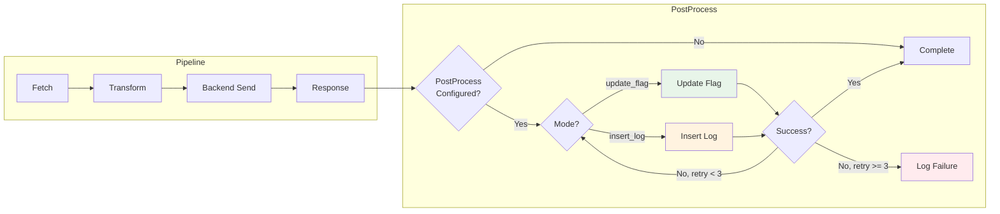
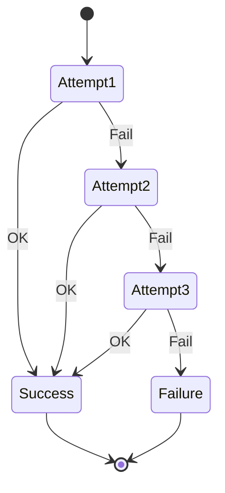

# Post-Processing Operations

Post-processing operations execute database modifications after the main pipeline completes successfully. These operations ensure data consistency by updating source records or creating audit logs in the hospital database.

## Overview



## PostProcess Modes

VTC-Link supports two post-processing modes:

| Mode | Purpose | Use Case |
|------|---------|----------|
| `update_flag` | Mark records as processed | Prevent re-processing, track status |
| `insert_log` | Create audit trail | Compliance, debugging, analytics |

---

## Update Flag Mode

The `update_flag` mode updates a status column in the source table to indicate that a record has been successfully processed.

### How It Works

1. Pipeline processes a record successfully
2. PostProcess identifies the record by key column
3. Flag column is updated to configured value
4. Hospital system queries only records where flag is not set

### Configuration Schema

```yaml
postprocess:
  mode: "update_flag"
  table: "VITAL_VIEW"           # Target table to update
  key_column: "RECORD_ID"       # Column to identify the record
  key_value: "12345"            # Static key value (optional)
  key_value_source: "vital_id"  # Dynamic key from record (preferred)
  flag_column: "SENT_FLAG"      # Column to update
  flag_value: "Y"               # Value to set
  retry: 3                      # Retry attempts on failure
```

!!! info "Key Value Resolution"
    - `key_value_source`: References a field in the canonical record (dynamic)
    - `key_value`: Uses a static value (fallback)
    - Priority: `key_value_source` > `key_value`

### Configuration Example

=== "Oracle"

    ```yaml
    hospital:
      hospital_id: "HOSP_A"
      connector_type: "pull_db_view"
      transform_profile: "HOSP_A"

      db:
        type: "oracle"
        host: "192.168.1.100"
        port: 1521
        service: "ORCLCDB"
        username: "vtc_user"
        password: "${ORACLE_PASSWORD}"
        view_name: "VW_VITAL_SIGNS"

      postprocess:
        mode: "update_flag"
        table: "VW_VITAL_SIGNS"
        key_column: "MSR_ID"
        key_value_source: "vital_id"
        flag_column: "PROC_YN"
        flag_value: "Y"
        retry: 3
    ```

=== "MSSQL"

    ```yaml
    hospital:
      hospital_id: "HOSP_B"
      connector_type: "pull_db_view"
      transform_profile: "HOSP_B"

      db:
        type: "mssql"
        host: "sqlserver.hospital.local"
        port: 1433
        database: "HIS_DB"
        username: "vtc_service"
        password: "${MSSQL_PASSWORD}"
        view_name: "dbo.VitalSignsView"

      postprocess:
        mode: "update_flag"
        table: "dbo.VitalSignsView"
        key_column: "RecordID"
        key_value_source: "vital_id"
        flag_column: "ProcessedFlag"
        flag_value: "1"
        retry: 3
    ```

### Generated SQL

```sql
UPDATE VITAL_VIEW
SET SENT_FLAG = ?
WHERE RECORD_ID = ?

-- With values: ['Y', '12345']
```

### Code Implementation

```python
def _update_flag(
    hospital: HospitalConfig,
    record: dict | None
) -> tuple[bool, str | None]:
    """Update flag column in source table."""

    if not hospital.db or not hospital.postprocess:
        return False, "POSTPROCESS_CONFIG_MISSING"

    # Extract configuration
    table = hospital.postprocess.get("table")
    key_column = hospital.postprocess.get("key_column")
    flag_column = hospital.postprocess.get("flag_column")
    flag_value = hospital.postprocess.get("flag_value")

    # Resolve key value (dynamic from record or static)
    key_value = _resolve_value(
        hospital.postprocess.get("key_value_source"),
        record,
        hospital.postprocess.get("key_value"),
    )

    # Validate configuration
    if not all([table, key_column, flag_column]):
        return False, "POSTPROCESS_CONFIG_MISSING"
    if key_value is None:
        return False, "POSTPROCESS_KEY_MISSING"

    # Build and execute query
    query = f"UPDATE {table} SET {flag_column} = ? WHERE {key_column} = ?"
    values = [flag_value, key_value]

    if hospital.db.get("type") == "oracle":
        with oracle_connection(hospital.db) as conn:
            cursor = conn.cursor()
            cursor.execute(query, values)
            conn.commit()
        return True, None

    if hospital.db.get("type") == "mssql":
        with mssql_connection(hospital.db) as conn:
            cursor = conn.cursor()
            cursor.execute(query, values)
            conn.commit()
        return True, None

    return False, "POSTPROCESS_DB_UNSUPPORTED"
```

---

## Insert Log Mode

The `insert_log` mode creates an audit record in a log table for each successfully processed record.

### How It Works

1. Pipeline processes a record successfully
2. PostProcess maps canonical fields to log table columns
3. New row is inserted into the log table
4. Audit trail is preserved for compliance and debugging

### Configuration Schema

```yaml
postprocess:
  mode: "insert_log"
  table: "VTC_PROCESS_LOG"      # Target log table
  columns:                       # Columns to insert
    - RECORD_ID
    - PATIENT_ID
    - PROCESS_TIME
    - STATUS
  values:                        # Static values by column
    STATUS: "SUCCESS"
    PROCESS_TIME: "2024-01-15T10:30:00Z"
  sources:                       # Dynamic values from record
    RECORD_ID: "vital_id"
    PATIENT_ID: "patient.patient_id"
  retry: 3
```

### Configuration Example

=== "Comprehensive Logging"

    ```yaml
    postprocess:
      mode: "insert_log"
      table: "VTC_AUDIT_LOG"
      columns:
        - LOG_ID
        - VITAL_ID
        - PATIENT_ID
        - WARD_CODE
        - SBP_VALUE
        - DBP_VALUE
        - PROCESS_STATUS
        - PROCESS_TIME
        - ERROR_CODE
      sources:
        VITAL_ID: "vital_id"
        PATIENT_ID: "patient.patient_id"
        WARD_CODE: "patient.ward"
        SBP_VALUE: "vitals.SBP"
        DBP_VALUE: "vitals.DBP"
      values:
        LOG_ID: "${uuid}"
        PROCESS_STATUS: "SUCCESS"
        PROCESS_TIME: "${now}"
        ERROR_CODE: null
      retry: 3
    ```

=== "Minimal Logging"

    ```yaml
    postprocess:
      mode: "insert_log"
      table: "PROCESS_HISTORY"
      columns:
        - RECORD_ID
        - PROCESSED_AT
      sources:
        RECORD_ID: "vital_id"
      values:
        PROCESSED_AT: "${now}"
      retry: 3
    ```

### Value Resolution

| Source | Description | Example |
|--------|-------------|---------|
| `sources.{column}` | Field from canonical record | `"patient.patient_id"` |
| `values.{column}` | Static value | `"SUCCESS"` |
| `${now}` | Current timestamp (future) | - |
| `${uuid}` | Generated UUID (future) | - |

### Generated SQL

```sql
INSERT INTO VTC_PROCESS_LOG
    (RECORD_ID, PATIENT_ID, PROCESS_TIME, STATUS)
VALUES
    (?, ?, ?, ?)

-- With values: ['V12345', 'P001', '2024-01-15T10:30:00Z', 'SUCCESS']
```

### Code Implementation

```python
def _insert_log(
    hospital: HospitalConfig,
    record: dict | None
) -> tuple[bool, str | None]:
    """Insert audit log record."""

    if not hospital.db or not hospital.postprocess:
        return False, "POSTPROCESS_CONFIG_MISSING"

    # Extract configuration
    table = hospital.postprocess.get("table")
    columns = hospital.postprocess.get("columns", [])
    values_map = hospital.postprocess.get("values", {})
    sources_map = hospital.postprocess.get("sources", {})

    if not table or not columns:
        return False, "POSTPROCESS_CONFIG_MISSING"

    # Resolve values for each column
    values = [
        _resolve_value(sources_map.get(col), record, values_map.get(col))
        for col in columns
    ]

    # Validate all values are present
    if any(value is None for value in values):
        return False, "POSTPROCESS_VALUE_MISSING"

    # Build and execute query
    placeholders = ", ".join(["?"] * len(columns))
    column_sql = ", ".join(columns)
    query = f"INSERT INTO {table} ({column_sql}) VALUES ({placeholders})"

    if hospital.db.get("type") == "oracle":
        with oracle_connection(hospital.db) as conn:
            cursor = conn.cursor()
            cursor.execute(query, values)
            conn.commit()
        return True, None

    if hospital.db.get("type") == "mssql":
        with mssql_connection(hospital.db) as conn:
            cursor = conn.cursor()
            cursor.execute(query, values)
            conn.commit()
        return True, None

    return False, "POSTPROCESS_DB_UNSUPPORTED"
```

---

## Retry Mechanism

PostProcess operations include automatic retry logic to handle transient failures.

### Retry Flow



### Implementation

```python
def run_postprocess(
    hospital: HospitalConfig,
    record: dict | None = None
) -> tuple[bool, str | None]:
    """Execute postprocess with retry logic."""

    if hospital.postprocess is None:
        return True, None  # No postprocess configured

    retries = int(hospital.postprocess.get("retry", 3))
    last_ok = False
    last_code: str | None = "POSTPROCESS_FAILED"

    for attempt in range(retries):
        last_ok, last_code = _run_postprocess_once(hospital, record)
        if last_ok:
            return True, None  # Success

    return last_ok, last_code  # All retries exhausted
```

### Configuration

```yaml
postprocess:
  mode: "update_flag"
  retry: 3  # Number of retry attempts (default: 3)
  # ... other config
```

---

## Error Handling

### Error Codes

| Code | Description | Resolution |
|------|-------------|------------|
| `POSTPROCESS_CONFIG_MISSING` | Required configuration not provided | Check table, columns, key_column |
| `POSTPROCESS_KEY_MISSING` | Key value could not be resolved | Verify key_value_source field exists |
| `POSTPROCESS_VALUE_MISSING` | A column value is null | Check sources/values mapping |
| `POSTPROCESS_DB_UNSUPPORTED` | Database type not oracle/mssql | Update db.type configuration |
| `POSTPROCESS_FAILED` | Generic failure after retries | Check database connectivity |

### Error Logging

```python
if not postprocess_ok:
    log_event(
        event="postprocess_failed",
        level="ERROR",
        hospital_id=hospital.hospital_id,
        stage="postprocess",
        message="PostProcess failed",
        error_code=postprocess_code,
        record_count=1,
    )
```

### Telemetry Update

```python
TelemetryStore().update_status({
    "hospital_id": hospital.hospital_id,
    "last_status": "Failed" if not postprocess_ok else "Success",
    "last_error_code": postprocess_code,
    "postprocess_fail_count": 1 if not postprocess_ok else 0,
})
```

---

## Configuration Schema Reference

### Common Fields

| Field | Type | Required | Default | Description |
|-------|------|----------|---------|-------------|
| `mode` | string | Yes | - | `update_flag` or `insert_log` |
| `table` | string | Yes | - | Target table name |
| `retry` | integer | No | `3` | Retry attempts on failure |

### Update Flag Fields

| Field | Type | Required | Description |
|-------|------|----------|-------------|
| `key_column` | string | Yes | Column to identify the record |
| `key_value` | string | No | Static key value |
| `key_value_source` | string | No | Record field for dynamic key |
| `flag_column` | string | Yes | Column to update |
| `flag_value` | any | Yes | Value to set |

### Insert Log Fields

| Field | Type | Required | Description |
|-------|------|----------|-------------|
| `columns` | list | Yes | Columns to insert |
| `values` | object | No | Static values by column name |
| `sources` | object | No | Record field mappings by column |

---

## SQL Examples

### Update Flag - Oracle

```sql
-- Mark record as processed
UPDATE VW_VITAL_SIGNS
SET SENT_FLAG = 'Y',
    SENT_TIME = SYSDATE
WHERE MSR_ID = :1

-- Fetch only unprocessed records
SELECT * FROM VW_VITAL_SIGNS
WHERE SENT_FLAG = 'N'
ORDER BY MSR_TIME
```

### Update Flag - MSSQL

```sql
-- Mark record as processed
UPDATE dbo.VitalSignsView
SET ProcessedFlag = 1,
    ProcessedAt = GETDATE()
WHERE RecordID = ?

-- Fetch only unprocessed records
SELECT * FROM dbo.VitalSignsView
WHERE ProcessedFlag = 0
ORDER BY MeasureTime
```

### Insert Log - Oracle

```sql
-- Insert audit record
INSERT INTO VTC_AUDIT_LOG (
    LOG_ID, VITAL_ID, PATIENT_ID,
    PROCESS_STATUS, PROCESS_TIME
) VALUES (
    SYS_GUID(), :1, :2, 'SUCCESS', SYSDATE
)

-- Query audit history
SELECT * FROM VTC_AUDIT_LOG
WHERE PATIENT_ID = :1
ORDER BY PROCESS_TIME DESC
```

### Insert Log - MSSQL

```sql
-- Insert audit record
INSERT INTO VTC_AUDIT_LOG (
    LOG_ID, VITAL_ID, PATIENT_ID,
    PROCESS_STATUS, PROCESS_TIME
) VALUES (
    NEWID(), ?, ?, 'SUCCESS', GETDATE()
)

-- Query audit history
SELECT * FROM VTC_AUDIT_LOG
WHERE PATIENT_ID = ?
ORDER BY PROCESS_TIME DESC
```

---

## Best Practices

### Flag Column Design

!!! tip "Index the Flag Column"
    Create an index on the flag column for efficient unprocessed record queries:
    ```sql
    CREATE INDEX IX_VITAL_SENT_FLAG ON VW_VITAL_SIGNS (SENT_FLAG);
    ```

### Log Table Design

!!! tip "Partition by Date"
    For high-volume systems, partition the log table by date:
    ```sql
    CREATE TABLE VTC_AUDIT_LOG (
        ...
    ) PARTITION BY RANGE (PROCESS_TIME);
    ```

### Error Recovery

!!! warning "Handle Partial Failures"
    If postprocess fails after backend success, the record is marked as failed. Implement a reconciliation process to retry failed records.

### Security

!!! danger "Use Separate Credentials"
    Use database accounts with minimal required permissions:
    - **Read account**: SELECT only on source view
    - **Write account**: UPDATE on flag column, INSERT on log table
