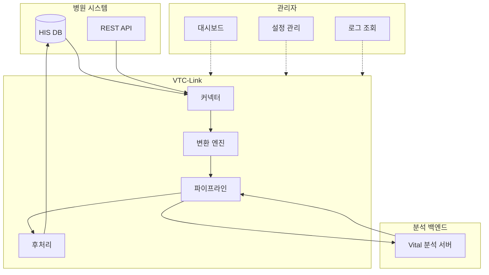

# VTC-Link

병원 생체신호 데이터 연동용 인터페이스 프록시 서버

## 프로젝트 개요

VTC-Link는 다양한 병원 정보 시스템(HIS)에서 환자의 생체신호(Vital Signs) 데이터를 수집하여 정규화한 후, 분석 백엔드 서버로 전달하는 미들웨어입니다.

### 핵심 가치

- **표준화**: 병원마다 다른 데이터 포맷을 통일된 캐노니컬 형식으로 변환
- **유연성**: DB 뷰, REST API 등 다양한 연동 방식 지원
- **신뢰성**: 재시도 로직, 에러 핸들링, 텔레메트리 내장
- **운영성**: 웹 기반 관리자 UI로 설정 및 모니터링

## 시스템 아키텍처



## 주요 기능

### 1. 다중 커넥터 지원

| 커넥터 타입 | 방식 | 설명 |
|------------|------|------|
| `pull_db_view` | Pull | Oracle/MSSQL DB 뷰에서 주기적으로 데이터 조회 |
| `pull_rest_api` | Pull | 병원 REST API를 주기적으로 호출하여 데이터 수집 |
| `push_rest_api` | Push | 병원에서 VTC-Link로 데이터를 전송 |
| `push_db_insert` | Push | 분석 결과를 병원 DB에 직접 입력 |

### 2. 데이터 정규화

병원마다 다른 필드명, 코드 체계, 날짜 형식을 표준 캐노니컬 포맷으로 변환합니다.

**예시: 성별 코드 변환**
```python
# 병원별 다양한 성별 표기
"1", "M", "male", "남" → "M"
"2", "F", "female", "여" → "F"
```

### 3. 파이프라인 처리

```
수집(Fetch) → 변환(Transform) → 전송(Send) → 후처리(Postprocess)
```

각 단계별 에러 처리 및 로깅이 구현되어 있습니다.

### 4. 후처리(Postprocess)

백엔드 분석 완료 후 병원 DB에 결과를 기록합니다.

- **update_flag**: 처리 완료 플래그 업데이트 (예: `SENT_YN = 'Y'`)
- **insert_log**: 분석 결과 로그 테이블에 삽입

### 5. 관리자 대시보드

웹 기반 UI에서 다음을 수행할 수 있습니다:

- 실시간 상태 모니터링
- 설정 변경 (YAML 기반)
- 이벤트 로그 조회
- 스케줄러 상태 확인

## 기술 스택

### 백엔드
- **Python 3.12** - 런타임
- **FastAPI** - 웹 프레임워크
- **Uvicorn** - ASGI 서버
- **Pydantic v2** - 데이터 검증

### 데이터베이스
- **oracledb** - Oracle 드라이버
- **pyodbc** - MSSQL/ODBC 드라이버
- **DuckDB** - 텔레메트리 저장

### 스케줄링
- **APScheduler** - 백그라운드 작업 스케줄링

### 기타
- **httpx** - 비동기 HTTP 클라이언트
- **Jinja2** - 템플릿 엔진
- **PyYAML** - 설정 파일 파싱

## 데이터 모델

### 캐노니컬 페이로드 (정규화된 형식)

```yaml
patient:
  patient_id: "P12345"      # 환자 ID
  patient_name: "홍길동"     # 환자명
  birthdate: "19900101"     # 생년월일
  age: 34                   # 나이
  sex: "M"                  # 성별 (M/F)
  ward: "ICU"               # 병동
  department: "내과"         # 진료과

vitals:
  SBP: 120                  # 수축기 혈압
  DBP: 80                   # 이완기 혈압
  PR: 72                    # 맥박
  RR: 18                    # 호흡수
  BT: 36.5                  # 체온
  SpO2: 98.0                # 산소포화도

timestamps:
  created_at: "2024-01-15T10:30:00Z"
  updated_at: "2024-01-15T10:30:00Z"
```

### 클라이언트 응답 (분석 결과)

```yaml
vital_id: "V67890"
patient_id: "P12345"
screened_type: "EMERGENCY"
screened_date: "20240115 10:30:00"
SEPS: 2                     # 패혈증 점수
MAES: 1                     # MAES 점수
MORS: 0                     # 사망 위험 점수
NEWS: 3                     # 국가 조기경보 점수
MEWS: 2                     # 수정 조기경보 점수
```

## 빠른 시작

### 요구사항

- Python 3.12
- uv (권장) 또는 pip

### 설치

```bash
# 저장소 클론
git clone https://github.com/yourusername/vtc-link.git
cd vtc-link

# uv로 의존성 설치
uv sync

# 또는 pip으로 설치
pip install -e .
```

### 설정

1. 환경 변수 설정:
```bash
cp .env.example .env
# .env 파일 편집
```

2. 병원 설정 (`hospitals.yaml`):
```yaml
hospital:
  hospital_id: "HOSP_A"
  connector_type: "pull_db_view"
  enabled: true
  schedule_minutes: 5
  transform_profile: "HOSP_A"
  db:
    type: "oracle"
    host: "localhost"
    port: 1521
    service: "ORCLCDB"
    username: "readonly"
    password: "readonly"
    view_name: "VITAL_VIEW"
```

### 실행

```bash
# 개발 모드
./dev.sh

# 또는
uv run uvicorn app.main:app --reload

# Docker 배포
docker-compose up -d
```

### 접속 URL

| 용도 | URL |
|------|-----|
| API 문서 | http://localhost:8000/docs |
| 관리자 대시보드 | http://localhost:8000/admin/dashboard |
| 헬스체크 | http://localhost:8000/health |

## 문서 목차

- [아키텍처](architecture.md) - 시스템 구조 상세
- [데이터 모델](data-model.md) - 캐노니컬/클라이언트 모델
- [커넥터](connectors.md) - 커넥터 타입별 설정
- [파이프라인](pipeline.md) - 데이터 처리 흐름
- [후처리](postprocess.md) - 후처리 모드 상세
- [관리자 UI](admin-ui.md) - 웹 UI 사용법
- [로깅/모니터링](logging-monitoring.md) - 텔레메트리 시스템
- [에러 코드](error-codes.md) - 에러 코드 레퍼런스
- [테스팅](testing.md) - 테스트 실행 방법
- [배포](deployment.md) - 배포 가이드

## 목표

- DB 뷰 풀, REST 풀, REST 푸시, DB 인서트 푸시 커넥터 지원
- 환자/생체신호 데이터를 캐노니컬 포맷으로 정규화
- 구조화 로깅, postprocess 처리, 관리자 모니터링 제공
- 단일 병원 기준 구성 (인스턴스당 병원 1개)
- Windows Server/10/11, Ubuntu 22/24 지원

## 비목표

- 운영 텔레메트리 이상의 장기 데이터 보관
- 관리자 UI에서의 고급 분석 기능

## 라이선스

MIT License
