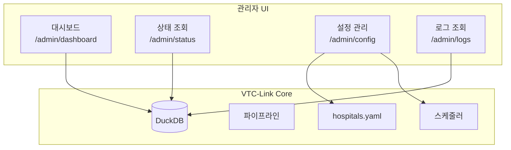

# 관리자 UI

## 개요

VTC-Link는 웹 기반 관리자 대시보드를 제공합니다.
설정 변경, 상태 모니터링, 로그 조회를 브라우저에서 직접 수행할 수 있습니다.



---

## 접속 정보

| 항목 | 값 |
|------|-----|
| URL | `http://localhost:8000/admin/dashboard` |
| 인증 | Basic Auth |
| 기본 ID | `admin` |
| 기본 비밀번호 | `.env`의 `ADMIN_PASSWORD` |

!!! warning "보안 주의"
    - 프로덕션 환경에서는 반드시 `ADMIN_PASSWORD`를 변경하세요.
    - HTTPS 사용을 권장합니다 (리버스 프록시 설정).

---

## 인증 설정

### 환경 변수

```bash
# .env
ADMIN_ID=admin
ADMIN_PASSWORD=your-secure-password
```

### 인증 구현

```python
# app/core/auth.py
from fastapi import HTTPException, Depends
from fastapi.security import HTTPBasic, HTTPBasicCredentials

security = HTTPBasic()


def require_admin(credentials: HTTPBasicCredentials = Depends(security)):
    settings = get_settings()
    if (credentials.username != settings.admin_id or
        credentials.password != settings.admin_password):
        raise HTTPException(status_code=401, detail="Unauthorized")
```

---

## 대시보드 (/admin/dashboard)

메인 대시보드는 시스템 전체 현황을 한눈에 보여줍니다.

### 구성 요소

```
┌─────────────────────────────────────────────────────────────┐
│                     VTC-Link 대시보드                        │
├─────────────────────────────────────────────────────────────┤
│  ┌──────────┐ ┌──────────┐ ┌──────────┐ ┌──────────┐       │
│  │ 병원 수   │ │ 오늘 처리 │ │ 성공률   │ │ 에러 수  │       │
│  │    1     │ │   150    │ │  98.5%   │ │    2     │       │
│  └──────────┘ └──────────┘ └──────────┘ └──────────┘       │
├─────────────────────────────────────────────────────────────┤
│  최근 상태                                                   │
│  ┌─────────────────────────────────────────────────────────┐│
│  │ 병원ID    │ 마지막 실행     │ 상태  │ 에러코드        ││
│  ├─────────────────────────────────────────────────────────┤│
│  │ HOSP_A   │ 2024-01-15 10:30 │ 성공  │ -               ││
│  └─────────────────────────────────────────────────────────┘│
├─────────────────────────────────────────────────────────────┤
│  최근 로그                                                   │
│  ┌─────────────────────────────────────────────────────────┐│
│  │ 시각           │ 레벨  │ 이벤트          │ 메시지      ││
│  ├─────────────────────────────────────────────────────────┤│
│  │ 10:30:15      │ INFO  │ pipeline_complete│ 완료       ││
│  │ 10:25:00      │ INFO  │ pipeline_start   │ 시작       ││
│  └─────────────────────────────────────────────────────────┘│
└─────────────────────────────────────────────────────────────┘
```

### 통계 카드

| 카드 | 설명 |
|------|------|
| 병원 수 | 설정된 병원 수 (단일 병원 기준 항상 1) |
| 오늘 처리 | 오늘 처리된 레코드 수 |
| 성공률 | 파이프라인 성공 비율 |
| 에러 수 | 오늘 발생한 에러 수 |

### 구현

```python
# app/api/admin.py
@router.get("/dashboard", response_class=HTMLResponse)
def admin_dashboard(request: Request, admin: None = Depends(require_admin)):
    """대시보드 페이지 렌더링"""
    # 상태 조회
    rows = TelemetryStore().query_status()
    status_list = [
        {
            "hospital_id": row[0],
            "last_run_at": row[1],
            "last_success_at": row[2],
            "last_status": row[3],
            "last_error_code": row[4],
            "postprocess_fail_count": row[5],
        }
        for row in rows
    ]

    # 최근 로그
    log_rows = TelemetryStore().query_logs("", [])
    recent_logs = [...]

    # 통계
    stats = {
        "total_hospitals": 1 if load_app_config().hospital else 0,
        "today_records": 0,  # 계산 필요
        "success_rate": None,
        "error_count": 0,
    }

    return templates.TemplateResponse(
        "admin/dashboard.html",
        {"request": request, "stats": stats, "recent_status": status_list, "recent_logs": recent_logs}
    )
```

---

## 상태 조회 (/admin/status)

각 병원의 파이프라인 실행 상태를 보여줍니다.

### 표시 정보

| 컬럼 | 설명 |
|------|------|
| 병원 ID | 병원 식별자 |
| 마지막 실행 | 마지막 파이프라인 실행 시각 |
| 마지막 성공 | 마지막 성공 실행 시각 |
| 상태 | 성공 / 실패 |
| 에러 코드 | 마지막 에러 코드 (있는 경우) |
| 후처리 실패 수 | 후처리 실패 횟수 |

### 상태 표시

=== "성공"
    ```
    ┌───────────┬──────────────────┬──────────────────┬──────┬────────────┐
    │ 병원 ID   │ 마지막 실행      │ 마지막 성공      │ 상태 │ 에러코드   │
    ├───────────┼──────────────────┼──────────────────┼──────┼────────────┤
    │ HOSP_A    │ 2024-01-15 10:30 │ 2024-01-15 10:30 │ 성공 │ -          │
    └───────────┴──────────────────┴──────────────────┴──────┴────────────┘
    ```

=== "실패"
    ```
    ┌───────────┬──────────────────┬──────────────────┬──────┬────────────────┐
    │ 병원 ID   │ 마지막 실행      │ 마지막 성공      │ 상태 │ 에러코드       │
    ├───────────┼──────────────────┼──────────────────┼──────┼────────────────┤
    │ HOSP_A    │ 2024-01-15 10:35 │ 2024-01-15 10:30 │ 실패 │ PIPE_STAGE_001 │
    └───────────┴──────────────────┴──────────────────┴──────┴────────────────┘
    ```

---

## 설정 관리 (/admin/config)

`hospitals.yaml` 설정을 웹 UI에서 편집할 수 있습니다.

### 설정 항목

```
┌─────────────────────────────────────────────────────────────┐
│                      병원 설정                               │
├─────────────────────────────────────────────────────────────┤
│  기본 정보                                                   │
│  ├─ 병원 ID: [HOSP_A          ]                             │
│  ├─ 커넥터 타입: [pull_db_view ▼]                           │
│  ├─ 활성화: [✓]                                             │
│  ├─ 스케줄 주기(분): [5    ]                                │
│  └─ 변환 프로필: [HOSP_A          ]                         │
├─────────────────────────────────────────────────────────────┤
│  데이터베이스 설정                                           │
│  ├─ DB 타입: [oracle ▼]                                     │
│  ├─ 호스트: [10.0.1.100       ]                             │
│  ├─ 포트: [1521  ]                                          │
│  ├─ 서비스: [ORCLCDB          ]                             │
│  ├─ 사용자명: [vtc_reader      ]                            │
│  ├─ 비밀번호: [••••••••        ]                            │
│  ├─ 뷰 이름: [VITAL_VIEW       ]                            │
│  └─ 쿼리: [                                    ]            │
├─────────────────────────────────────────────────────────────┤
│  후처리 설정                                                 │
│  ├─ 모드: [update_flag ▼]                                   │
│  ├─ 테이블: [VITAL_VIEW        ]                            │
│  ├─ 키 컬럼: [VITAL_ID         ]                            │
│  ├─ 키 값 소스: [vital_id       ]                           │
│  ├─ 플래그 컬럼: [SENT_YN        ]                          │
│  ├─ 플래그 값: [Y               ]                           │
│  └─ 재시도 횟수: [3    ]                                    │
├─────────────────────────────────────────────────────────────┤
│                    [저장] [취소]                             │
└─────────────────────────────────────────────────────────────┘
```

### 유효성 검사

설정 저장 시 다음 항목을 검증합니다:

| 검증 항목 | 조건 |
|----------|------|
| hospital_id | 필수 |
| connector_type | 유효한 값 (pull_db_view, pull_rest_api, push_rest_api, push_db_insert) |
| transform_profile | 필수 |
| schedule_minutes | Pull 커넥터의 경우 양수 |
| db.type | DB 사용 시 oracle 또는 mssql |
| db.host | DB 사용 시 필수 |
| postprocess.* | 모드별 필수 필드 |

### 검증 에러 표시

```
┌─────────────────────────────────────────────────────────────┐
│  ⚠ 저장 실패                                                │
│                                                             │
│  - hospital_id 필요                                         │
│  - schedule_minutes 양수 필요                               │
│  - postprocess.table 필요                                   │
└─────────────────────────────────────────────────────────────┘
```

### 저장 처리

```python
@router.post("/config", response_class=HTMLResponse)
async def save_config(request: Request, admin: None = Depends(require_admin)):
    """설정 저장"""
    settings = get_settings()
    config = load_app_config().model_dump()
    form_data = await request.form()

    # 폼 데이터 파싱 및 설정 업데이트
    # ...

    # 유효성 검사
    errors = _validate_hospital(config.get("hospital", {}))
    if errors:
        return templates.TemplateResponse(
            "admin/config.html",
            {"request": request, "config": config, "errors": errors, "saved": False}
        )

    # YAML 파일 저장
    with open(settings.config_path, "w", encoding="utf-8") as handle:
        yaml.safe_dump(config, handle, allow_unicode=True, sort_keys=False)

    # 스케줄러 재시작
    if get_settings().scheduler_enabled:
        start_scheduler(reload_app_config())

    return templates.TemplateResponse(
        "admin/config.html",
        {"request": request, "config": config, "saved": True, "errors": []}
    )
```

---

## 로그 조회 (/admin/logs)

DuckDB에 저장된 파이프라인 로그를 조회합니다.

### 로그 테이블

```
┌─────────────────────────────────────────────────────────────────────────────┐
│                              이벤트 로그                                    │
├────────────────────┬───────┬──────────────────┬─────────┬──────┬───────────┤
│ 시각               │ 레벨  │ 이벤트           │ 병원ID  │ 단계 │ 에러코드  │
├────────────────────┼───────┼──────────────────┼─────────┼──────┼───────────┤
│ 2024-01-15 10:30:15│ INFO  │ pipeline_complete│ HOSP_A  │ post │ -         │
│ 2024-01-15 10:30:10│ INFO  │ pipeline_start   │ HOSP_A  │ fetch│ -         │
│ 2024-01-15 10:25:30│ ERROR │ postprocess_fail │ HOSP_A  │ post │ POST_001  │
│ 2024-01-15 10:25:15│ INFO  │ pipeline_complete│ HOSP_A  │ post │ -         │
└────────────────────┴───────┴──────────────────┴─────────┴──────┴───────────┘
```

### 로그 필드

| 필드 | 설명 |
|------|------|
| timestamp | 로그 기록 시각 |
| level | 로그 레벨 (INFO, ERROR, WARNING) |
| event | 이벤트 타입 (pipeline_start, pipeline_complete 등) |
| hospital_id | 병원 식별자 |
| stage | 파이프라인 단계 (fetch, transform, send, postprocess) |
| error_code | 에러 코드 (에러 발생 시) |
| message | 상세 메시지 |
| duration_ms | 처리 시간 (밀리초) |
| record_count | 처리된 레코드 수 |

### 로그 레벨 색상

| 레벨 | 색상 | 의미 |
|:----:|:----:|------|
| INFO | 초록 | 정상 작동 |
| WARNING | 노랑 | 주의 필요 |
| ERROR | 빨강 | 에러 발생 |

---

## 템플릿 구조

```
templates/
└── admin/
    ├── base.html           # 기본 레이아웃
    ├── dashboard.html      # 대시보드
    ├── status.html         # 상태 조회
    ├── config.html         # 설정 관리
    └── logs.html           # 로그 조회
```

### 기본 레이아웃 예시

```html
<!-- templates/admin/base.html -->
<!DOCTYPE html>
<html>
<head>
    <title>VTC-Link Admin</title>
    <link rel="stylesheet" href="/static/style.css">
</head>
<body>
    <nav>
        <a href="/admin/dashboard">대시보드</a>
        <a href="/admin/status">상태</a>
        <a href="/admin/config">설정</a>
        <a href="/admin/logs">로그</a>
    </nav>
    <main>
        
    </main>
</body>
</html>
```

---

## 접근 제어

### 관리자 전용 엔드포인트

모든 `/admin/*` 엔드포인트는 인증이 필요합니다.

```python
@router.get("/dashboard", response_class=HTMLResponse)
def admin_dashboard(request: Request, admin: None = Depends(require_admin)):
    # admin 의존성이 인증을 처리
    ...
```

### 인증 실패 응답

인증 실패 시 401 Unauthorized 응답과 함께 브라우저의 로그인 대화상자가 표시됩니다.

---

## 사용 팁

### 1. 설정 변경 후 확인

설정 변경 후 다음을 확인하세요:

1. **상태 페이지**: 스케줄러가 재시작되었는지 확인
2. **로그 페이지**: 새 파이프라인 실행 로그 확인
3. **대시보드**: 통계 업데이트 확인

### 2. 에러 디버깅

에러 발생 시:

1. **로그 페이지**에서 에러 코드 확인
2. **에러 코드 문서**에서 원인 및 해결 방법 확인
3. **설정 페이지**에서 관련 설정 수정

### 3. 모니터링 주기

권장 모니터링 주기:

| 환경 | 확인 주기 |
|------|----------|
| 초기 운영 | 매 1시간 |
| 안정화 후 | 매일 1회 |
| 장애 발생 시 | 실시간 |

---

## 다음 단계

- [로깅 & 모니터링](logging-monitoring.md) - DuckDB 텔레메트리 상세
- [에러 코드](error-codes.md) - 에러 코드 레퍼런스
- [설정 가이드](configuration.md) - 설정 파일 상세
