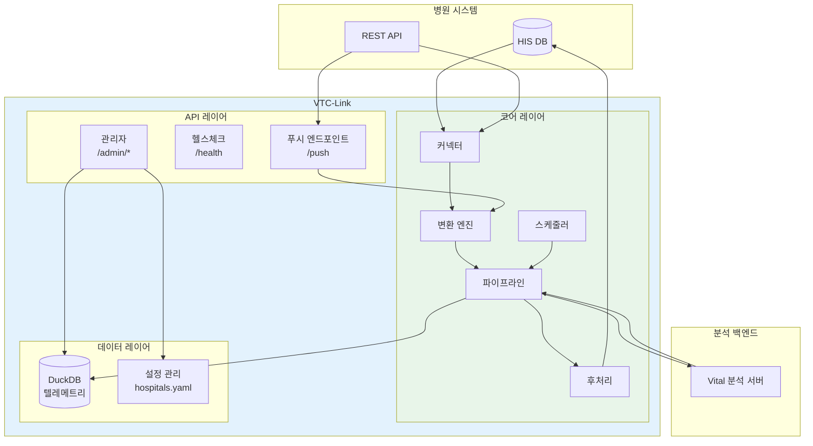
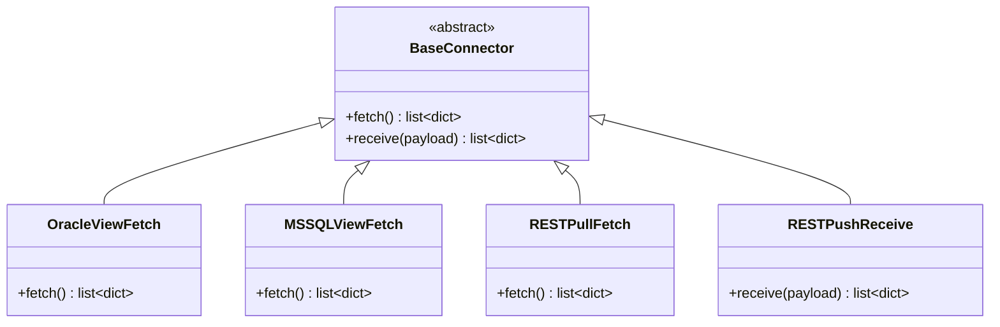
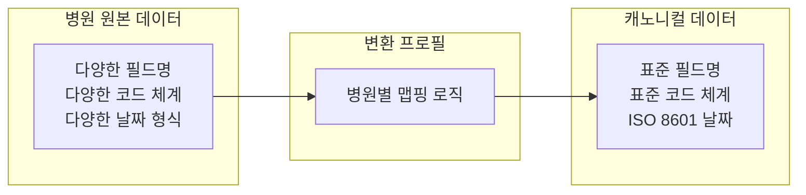
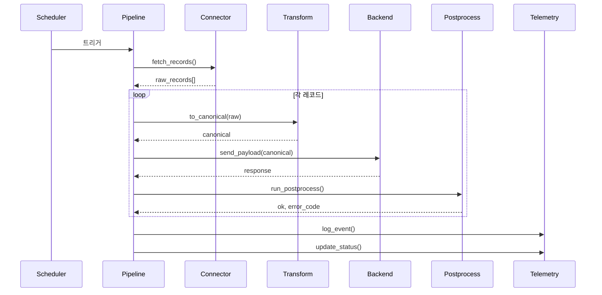
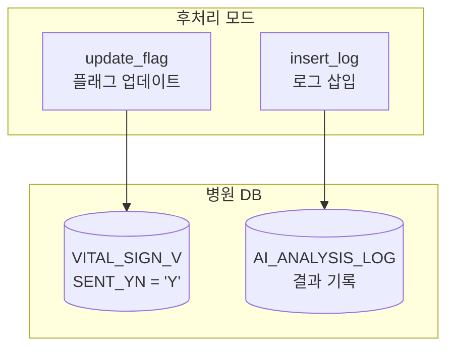
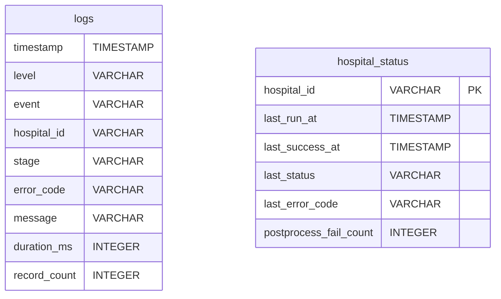
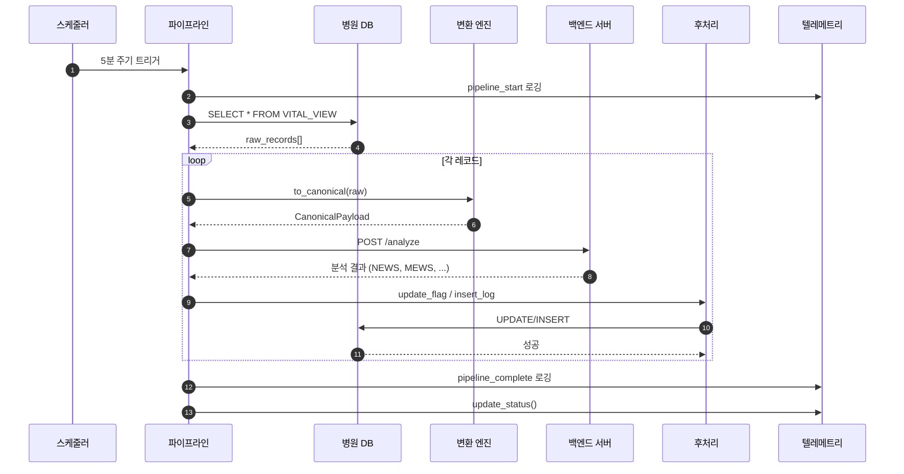
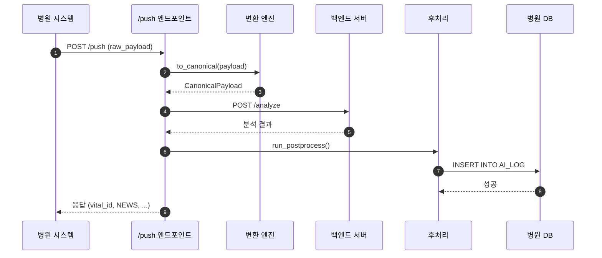
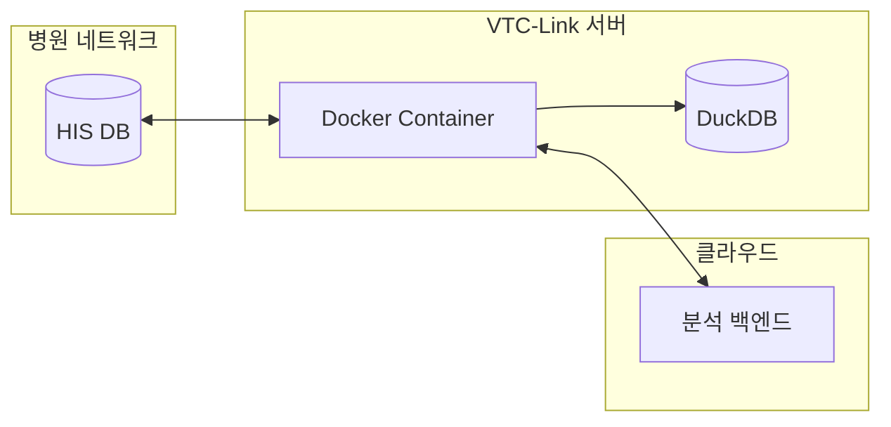
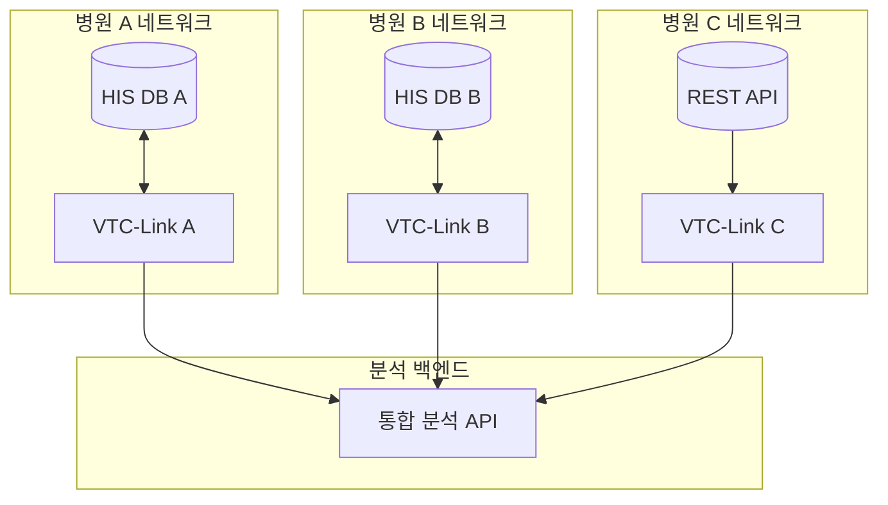

# 아키텍처

## 개요

VTC-Link는 병원 생체신호 데이터의 **수집-변환-전송-후처리**를 담당하는 미들웨어입니다.
코어 파이프라인이 데이터 수집, 정규화, 백엔드 전달, 응답 처리, 후처리를 순차적으로 조율합니다.



---

## 시스템 구성 요소

### 1. API 레이어

API 레이어는 외부 시스템과의 통신을 담당합니다.

| 엔드포인트 | 설명 | 용도 |
|-----------|------|------|
| `POST /push` | 생체신호 푸시 수신 | 병원에서 실시간 데이터 전송 |
| `GET /health` | 헬스체크 | 로드밸런서/모니터링 연동 |
| `GET /admin/*` | 관리자 UI | 설정, 상태, 로그 관리 |
| `GET /docs` | API 문서 | Swagger UI |

```python
# app/api/routes.py
from fastapi import APIRouter
from app.api import push, health, admin

router = APIRouter()
router.include_router(push.router)
router.include_router(health.router)
router.include_router(admin.router, prefix="/admin")
```

### 2. 커넥터 레이어

커넥터는 다양한 데이터 소스를 추상화하여 동일한 인터페이스를 제공합니다.



#### 커넥터 타입별 구현

=== "Oracle View Fetch"

    ```python
    # app/connectors/oracle_view_fetch.py
    def fetch_records(config: HospitalConfig) -> list[dict]:
        """Oracle 뷰에서 레코드를 조회"""
        query = config.db.get("query") or f"SELECT * FROM {config.db.get('view_name')}"
        with oracle_connection(config.db) as conn:
            cursor = conn.cursor()
            cursor.execute(query)
            columns = [col[0] for col in cursor.description]
            rows = cursor.fetchall()
        return [dict(zip(columns, row)) for row in rows]
    ```

=== "MSSQL View Fetch"

    ```python
    # app/connectors/mssql_view_fetch.py
    def fetch_records(config: HospitalConfig) -> list[dict]:
        """MSSQL 뷰에서 레코드를 조회"""
        query = config.db.get("query") or f"SELECT * FROM {config.db.get('view_name')}"
        with mssql_connection(config.db) as conn:
            cursor = conn.cursor()
            cursor.execute(query)
            columns = [col[0] for col in cursor.description]
            rows = cursor.fetchall()
        return [dict(zip(columns, row)) for row in rows]
    ```

=== "REST Pull Fetch"

    ```python
    # app/connectors/rest_pull_fetch.py
    def fetch_records(config: HospitalConfig) -> list[dict]:
        """병원 REST API에서 레코드를 조회"""
        url = config.api.get("url")
        headers = {"Authorization": f"Bearer {config.api.get('api_key')}"}
        with httpx.Client(timeout=10.0) as client:
            response = client.get(url, headers=headers)
            response.raise_for_status()
            return response.json()
    ```

=== "REST Push Receive"

    ```python
    # app/connectors/rest_push_receive.py
    def receive_payload(config: HospitalConfig, payload: dict) -> list[dict]:
        """병원 푸시 페이로드를 수신"""
        if isinstance(payload, list):
            return payload
        return [payload]
    ```

### 3. 변환 레이어

변환 레이어는 병원별 데이터 형식을 캐노니컬(정규화) 형식으로 변환합니다.



#### 변환 프로필 구조

```
app/transforms/hospital_profiles/
├── HOSP_A/
│   ├── __init__.py
│   ├── inbound.py      # 원본 → 캐노니컬 변환
│   ├── mapping.py      # 코드 맵핑 테이블
│   └── outbound.py     # 캐노니컬 → 백엔드 변환
├── HOSP_B/
│   └── ...
└── HOSP_C/
    └── ...
```

#### 인바운드 변환 예시

```python
# app/transforms/hospital_profiles/HOSP_A/inbound.py
from app.models.canonical import CanonicalPayload, Patient, Vitals, Timestamps
from .mapping import SEX_CODE_MAP

def to_canonical(raw: dict) -> CanonicalPayload:
    """병원 원본 데이터를 캐노니컬 형식으로 변환"""
    return CanonicalPayload(
        patient=Patient(
            patient_id=str(raw["PT_NO"]),
            patient_name=raw.get("PT_NM"),
            birthdate=raw["BIRTH_DT"].replace("-", ""),
            sex=SEX_CODE_MAP.get(raw["SEX_CD"], "M"),
            ward=raw.get("WARD_CD"),
            department=raw.get("DEPT_CD")
        ),
        vitals=Vitals(
            SBP=int(raw["SBP"]),
            DBP=int(raw["DBP"]),
            PR=int(raw["PR"]),
            RR=int(raw.get("RR", 18)),
            BT=float(raw["BT"]),
            SpO2=float(raw.get("SPO2", 98.0))
        ),
        timestamps=Timestamps(
            created_at=datetime.now(timezone.utc).isoformat().replace("+00:00", "Z"),
            updated_at=datetime.now(timezone.utc).isoformat().replace("+00:00", "Z")
        )
    )
```

### 4. 파이프라인 레이어

파이프라인은 데이터 처리의 전체 흐름을 조율합니다.



#### 파이프라인 코드 구조

```python
# app/core/pipeline.py
def run_pull_pipeline(hospital: HospitalConfig) -> None:
    """풀 방식 병원의 파이프라인을 실행"""
    start = datetime.now(timezone.utc)
    log_event("pipeline_start", "INFO", hospital.hospital_id, "fetch", "수집 시작")

    try:
        # 1. 데이터 수집
        raw_records = fetch_records(hospital)

        # 2. 변환 및 전송
        canonical_records = [to_canonical(raw).model_dump() for raw in raw_records]

        for record in canonical_records:
            # 3. 백엔드 전송
            backend_payload = to_backend(CanonicalPayload(**record))
            response = send_payload(backend_payload)

            # 4. 후처리
            postprocess_ok, postprocess_code = run_postprocess(hospital, record)
            if not postprocess_ok:
                log_event("postprocess_failed", "ERROR", ...)
                break

        # 5. 완료 로깅
        log_event("pipeline_complete", "INFO", ...)
        TelemetryStore().update_status({...})

    except Exception as exc:
        log_event("pipeline_failed", "ERROR", ...)
        TelemetryStore().update_status({...})
```

### 5. 후처리 레이어

후처리는 백엔드 분석 완료 후 병원 시스템에 결과를 반영합니다.



### 6. 스케줄러

APScheduler 기반의 백그라운드 작업 스케줄러입니다.

```python
# app/core/scheduler.py
from apscheduler.schedulers.background import BackgroundScheduler

scheduler = BackgroundScheduler()

def start_scheduler(config: AppConfig) -> None:
    """스케줄러 시작"""
    hospital = config.hospital
    if hospital.enabled and hospital.connector_type.startswith("pull_"):
        scheduler.add_job(
            run_pull_pipeline,
            'interval',
            minutes=hospital.schedule_minutes,
            args=[hospital],
            id=f"pipeline_{hospital.hospital_id}"
        )
    scheduler.start()
```

### 7. 텔레메트리 레이어

DuckDB 기반의 로컬 텔레메트리 저장소입니다.



---

## 프로젝트 디렉토리 구조

```
vtc-link/
├── app/
│   ├── main.py                    # FastAPI 애플리케이션 팩토리
│   ├── api/                       # API 엔드포인트
│   │   ├── routes.py              # 라우트 통합
│   │   ├── push.py                # 푸시 엔드포인트
│   │   ├── admin.py               # 관리자 UI
│   │   └── health.py              # 헬스체크
│   ├── core/                      # 비즈니스 로직
│   │   ├── config.py              # 설정 관리
│   │   ├── pipeline.py            # 파이프라인 오케스트레이션
│   │   ├── scheduler.py           # APScheduler 래퍼
│   │   ├── postprocess.py         # 후처리 로직
│   │   ├── db.py                  # DB 연결 관리
│   │   ├── telemetry.py           # DuckDB 텔레메트리
│   │   ├── logger.py              # 구조화 로깅
│   │   ├── auth.py                # 관리자 인증
│   │   └── errors.py              # 에러 정의
│   ├── connectors/                # 데이터 소스 커넥터
│   │   ├── oracle_view_fetch.py
│   │   ├── mssql_view_fetch.py
│   │   ├── rest_pull_fetch.py
│   │   ├── rest_push_receive.py
│   │   └── db_push_insert.py
│   ├── transforms/                # 병원별 변환 프로필
│   │   └── hospital_profiles/
│   │       └── HOSP_A/
│   │           ├── inbound.py     # 원본 → 캐노니컬
│   │           ├── outbound.py    # 캐노니컬 → 백엔드
│   │           └── mapping.py     # 코드 맵핑
│   ├── models/                    # Pydantic 모델
│   │   ├── canonical.py           # 캐노니컬 페이로드
│   │   └── client.py              # 클라이언트 응답
│   ├── clients/                   # 외부 API 클라이언트
│   │   └── backend_api.py         # 백엔드 연동
│   └── utils/                     # 유틸리티
│       └── parsing.py             # 파싱 헬퍼
├── templates/                     # Jinja2 템플릿
│   └── admin/
│       ├── dashboard.html
│       ├── config.html
│       ├── status.html
│       └── logs.html
├── static/                        # 정적 파일
│   └── style.css
├── tests/                         # 테스트
│   ├── test_pipeline_logging.py
│   ├── test_postprocess.py
│   └── ...
├── docs/                          # 문서
├── hospitals.yaml                 # 병원 설정
├── .env                           # 환경 변수
├── docker-compose.yml             # Docker 배포
├── Dockerfile
└── pyproject.toml                 # 프로젝트 메타데이터
```

---

## 데이터 흐름 상세

### Pull 방식 데이터 흐름



### Push 방식 데이터 흐름



---

## 배포 아키텍처

### 단일 인스턴스 배포



### 다중 병원 배포

각 병원마다 독립적인 VTC-Link 인스턴스를 운영합니다.



---

## 보안 고려사항

### 인증 및 접근 제어

| 구간 | 인증 방식 |
|------|----------|
| 관리자 UI | Basic Auth (ADMIN_ID/ADMIN_PASSWORD) |
| 백엔드 API | Bearer Token (BACKEND_API_KEY) |
| 병원 REST API | Bearer Token (api_key in config) |

### 데이터 보안

- 민감 정보(비밀번호, API 키)는 환경 변수로 관리
- 로그에 환자 식별 정보 마스킹 적용 가능
- DuckDB 텔레메트리는 로컬 파일로 저장 (외부 전송 없음)

### 네트워크 보안

- 병원 DB 연결은 읽기 전용 계정 사용 권장
- HTTPS 사용 권장 (리버스 프록시 설정)
- 방화벽에서 필요한 포트만 개방

---

## 다음 단계

- [데이터 모델](data-model.md) - 캐노니컬 스키마와 위험도 점수 상세
- [커넥터](connectors.md) - 4가지 커넥터 타입 상세 가이드
- [파이프라인](pipeline.md) - 파이프라인 처리 흐름과 에러 처리
