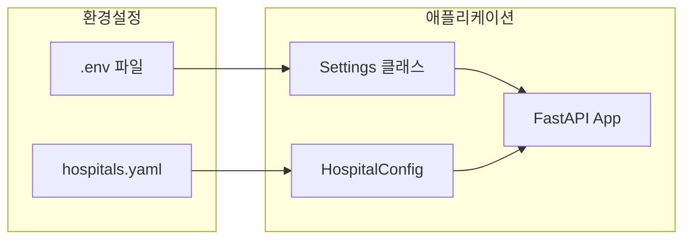

# 설정 가이드

VTC-Link의 모든 설정 옵션과 구성 방법을 설명합니다. 환경 변수와 YAML 설정 파일을 통해 시스템 동작을 제어할 수 있습니다.

---

## 설정 개요

VTC-Link는 두 가지 설정 소스를 사용합니다:



| 설정 소스 | 용도 | 예시 |
|-----------|------|------|
| `.env` | 환경별 설정, 보안 정보 | API 키, 관리자 비밀번호 |
| `hospitals.yaml` | 병원별 설정, 커넥터 설정 | DB 연결 정보, 후처리 설정 |

---

## 환경 변수 (.env)

### 전체 환경 변수 목록

```bash
# VTC-Link Environment Configuration

# ==================================================
# 애플리케이션 기본 설정
# ==================================================

# 실행 환경 (local, dev, prod)
ENVIRONMENT=local

# 애플리케이션 버전
VERSION=0.1.0

# 로그 레벨 (DEBUG, INFO, WARNING, ERROR)
LOG_LEVEL=INFO

# ==================================================
# 관리자 UI 인증
# ==================================================

# 관리자 계정 ID
ADMIN_ID=admin

# 관리자 비밀번호 (반드시 변경!)
ADMIN_PASSWORD=changeme

# ==================================================
# 백엔드 서버 설정
# ==================================================

# 백엔드 API 기본 URL
BACKEND_BASE_URL=http://localhost:9000

# 백엔드 API 인증 키
BACKEND_API_KEY=

# ==================================================
# 파일 경로 설정
# ==================================================

# 병원 설정 파일 경로
CONFIG_PATH=hospitals.yaml

# DuckDB 텔레메트리 저장소 경로
DUCKDB_PATH=data/telemetry.duckdb

# ==================================================
# 스케줄러 설정
# ==================================================

# 스케줄러 활성화 여부
SCHEDULER_ENABLED=true
```

### 환경 변수 상세 설명

#### 애플리케이션 설정

=== "ENVIRONMENT"
    실행 환경을 지정합니다.

    | 값 | 설명 |
    |----|------|
    | `local` | 로컬 개발 환경 (기본값) |
    | `dev` | 개발 서버 |
    | `prod` | 운영 서버 |

    ```bash
    ENVIRONMENT=prod
    ```

=== "LOG_LEVEL"
    로깅 레벨을 지정합니다.

    | 레벨 | 설명 |
    |------|------|
    | `DEBUG` | 상세 디버깅 정보 |
    | `INFO` | 일반 운영 정보 (권장) |
    | `WARNING` | 경고 메시지만 |
    | `ERROR` | 에러 메시지만 |

    ```bash
    LOG_LEVEL=INFO
    ```

#### 관리자 인증

!!! danger "보안 주의"
    기본 비밀번호를 반드시 변경하세요!

```bash
ADMIN_ID=admin
ADMIN_PASSWORD=YourSecurePassword123!
```

#### 백엔드 연결

```bash
# 백엔드 서버 URL
BACKEND_BASE_URL=https://api.example.com/v1/vitals

# Bearer 토큰 인증
BACKEND_API_KEY=your-secret-api-key
```

#### 파일 경로

```bash
# 상대 경로 (프로젝트 루트 기준)
CONFIG_PATH=hospitals.yaml
DUCKDB_PATH=data/telemetry.duckdb

# 절대 경로 사용 가능
CONFIG_PATH=/etc/vtc-link/hospitals.yaml
DUCKDB_PATH=/var/lib/vtc-link/telemetry.duckdb
```

---

## hospitals.yaml 스키마

병원별 설정을 정의하는 YAML 파일입니다.

### 전체 스키마

```yaml
hospital:
  # 기본 정보 (필수)
  hospital_id: "HOSP_A"              # 병원 식별자
  connector_type: "pull_db_view"     # 커넥터 타입
  enabled: true                       # 활성화 여부
  schedule_minutes: 5                 # 스케줄 주기 (분)
  transform_profile: "HOSP_A"        # 변환 프로파일명

  # 데이터베이스 설정 (커넥터에 따라)
  db:
    type: "oracle"                    # DB 타입 (oracle, mssql)
    host: "localhost"                 # 호스트
    port: 1521                        # 포트
    service: "ORCLCDB"               # 서비스명 (Oracle)
    database: "master"               # 데이터베이스명 (MSSQL)
    username: "readonly"              # 계정
    password: "readonly"              # 비밀번호
    view_name: "VITAL_VIEW"          # 뷰/테이블명
    query: "SELECT * FROM VITAL_VIEW" # 커스텀 쿼리
    insert_table: "VITAL_RECV"       # 삽입 테이블 (push_db_insert)
    insert_columns:                   # 삽입 컬럼 목록
      - "PATIENT_ID"
      - "SBP"
      - "DBP"

  # REST API 설정 (pull_rest_api 전용)
  api:
    url: "https://hospital.example.com/api/vitals"
    api_key: "hospital-api-key"

  # 후처리 설정
  postprocess:
    mode: "update_flag"               # 모드 (update_flag, insert_log)
    table: "VITAL_VIEW"               # 대상 테이블
    key_column: "ID"                  # 키 컬럼
    key_value: ""                     # 고정 키 값
    key_value_source: "vital_id"     # 동적 키 소스
    flag_column: "SENT_YN"           # 플래그 컬럼
    flag_value: "Y"                   # 플래그 값
    retry: 3                          # 재시도 횟수
    columns: []                       # insert_log용 컬럼 목록
    values: {}                        # 고정값 맵
    sources: {}                       # 동적값 소스 맵
```

### 필드 상세 설명

#### 기본 정보

| 필드 | 타입 | 필수 | 설명 |
|------|------|------|------|
| `hospital_id` | string | O | 병원 고유 식별자 |
| `connector_type` | string | O | 커넥터 타입 |
| `enabled` | boolean | X | 활성화 여부 (기본: true) |
| `schedule_minutes` | integer | 조건부 | Pull 방식 스케줄 주기 |
| `transform_profile` | string | O | 변환 프로파일 디렉토리명 |

#### 커넥터 타입

| 타입 | 방향 | 소스/대상 | 설명 |
|------|------|-----------|------|
| `pull_db_view` | Pull | Oracle/MSSQL View | DB 뷰에서 데이터 조회 |
| `pull_rest_api` | Pull | REST API | HTTP API 호출 |
| `push_rest_api` | Push | REST API | HTTP 요청 수신 |
| `push_db_insert` | Push | Oracle/MSSQL | DB에 데이터 삽입 |

---

## 커넥터별 설정 옵션

### pull_db_view (Oracle)

Oracle 데이터베이스 뷰에서 데이터를 주기적으로 조회합니다.

```yaml
hospital:
  hospital_id: "HOSP_ORACLE"
  connector_type: "pull_db_view"
  enabled: true
  schedule_minutes: 5
  transform_profile: "HOSP_ORACLE"

  db:
    type: "oracle"
    host: "oracle.hospital.local"
    port: 1521
    service: "ORCLCDB"
    username: "vtc_reader"
    password: "secret_password"
    view_name: "VITAL_SIGNS_VIEW"
    query: "SELECT * FROM VITAL_SIGNS_VIEW WHERE SENT_YN = 'N' AND ROWNUM <= 100"
```

!!! tip "Oracle 쿼리 최적화"
    - `ROWNUM`으로 조회 건수 제한
    - `SENT_YN = 'N'` 조건으로 미전송 건만 조회
    - 인덱스가 있는 컬럼을 WHERE 조건에 사용

### pull_db_view (MSSQL)

MS SQL Server 뷰에서 데이터를 주기적으로 조회합니다.

```yaml
hospital:
  hospital_id: "HOSP_MSSQL"
  connector_type: "pull_db_view"
  enabled: true
  schedule_minutes: 5
  transform_profile: "HOSP_MSSQL"

  db:
    type: "mssql"
    host: "mssql.hospital.local"
    port: 1433
    database: "HospitalDB"
    username: "vtc_reader"
    password: "secret_password"
    view_name: "vw_VitalSigns"
    query: "SELECT TOP 100 * FROM vw_VitalSigns WHERE SentFlag = 0"
```

### pull_rest_api

외부 REST API에서 데이터를 주기적으로 가져옵니다.

```yaml
hospital:
  hospital_id: "HOSP_API"
  connector_type: "pull_rest_api"
  enabled: true
  schedule_minutes: 10
  transform_profile: "HOSP_API"

  api:
    url: "https://hospital.example.com/api/v1/vitals"
    api_key: "hospital-provided-api-key"
```

### push_rest_api

병원 시스템에서 VTC-Link로 데이터를 푸시합니다.

```yaml
hospital:
  hospital_id: "HOSP_PUSH"
  connector_type: "push_rest_api"
  enabled: true
  transform_profile: "HOSP_PUSH"
  # schedule_minutes 불필요 (Push 방식)
```

!!! info "Push 방식 엔드포인트"
    병원 시스템은 `POST /v1/push`로 데이터를 전송합니다.

### push_db_insert

VTC-Link에서 병원 DB로 데이터를 삽입합니다.

```yaml
hospital:
  hospital_id: "HOSP_INSERT"
  connector_type: "push_db_insert"
  enabled: true
  transform_profile: "HOSP_INSERT"

  db:
    type: "oracle"
    host: "oracle.hospital.local"
    port: 1521
    service: "ORCLCDB"
    username: "vtc_writer"
    password: "secret_password"
    insert_table: "VITAL_RECV"
    insert_columns:
      - "PATIENT_ID"
      - "PATIENT_NAME"
      - "SBP"
      - "DBP"
      - "PR"
      - "RR"
      - "BT"
      - "SPO2"
      - "RECV_DT"
```

---

## 후처리 설정

데이터 전송 후 원본 시스템에 처리 결과를 기록합니다.

### update_flag 모드

특정 레코드의 플래그 컬럼을 업데이트합니다.

```yaml
postprocess:
  mode: "update_flag"
  table: "VITAL_SIGNS"         # UPDATE 대상 테이블
  key_column: "VITAL_ID"       # WHERE 조건 컬럼
  key_value_source: "vital_id" # 키 값을 레코드에서 가져오기
  flag_column: "SENT_YN"       # SET 대상 컬럼
  flag_value: "Y"              # SET 값
  retry: 3                     # 실패 시 재시도 횟수
```

생성되는 SQL:

```sql
UPDATE VITAL_SIGNS
SET SENT_YN = 'Y'
WHERE VITAL_ID = ?
```

!!! tip "key_value vs key_value_source"
    - `key_value`: 고정값 사용 (거의 사용 안 함)
    - `key_value_source`: canonical 레코드의 필드명 지정 (권장)

### insert_log 모드

전송 로그를 별도 테이블에 삽입합니다.

```yaml
postprocess:
  mode: "insert_log"
  table: "SEND_LOG"            # INSERT 대상 테이블
  columns:                     # 삽입할 컬럼 목록
    - "LOG_ID"
    - "PATIENT_ID"
    - "SENT_AT"
    - "STATUS"
    - "MESSAGE"
  values:                      # 고정값
    STATUS: "SUCCESS"
    MESSAGE: "Sent to VTC"
  sources:                     # 레코드에서 가져올 값
    PATIENT_ID: "patient.patient_id"
    SENT_AT: "timestamps.created_at"
  retry: 3
```

생성되는 SQL:

```sql
INSERT INTO SEND_LOG (LOG_ID, PATIENT_ID, SENT_AT, STATUS, MESSAGE)
VALUES (?, ?, ?, ?, ?)
```

---

## 예제 설정 파일

### 개발 환경 (.env.development)

```bash
# Development Environment

ENVIRONMENT=dev
LOG_LEVEL=DEBUG

ADMIN_ID=admin
ADMIN_PASSWORD=devpassword

BACKEND_BASE_URL=http://localhost:9000
BACKEND_API_KEY=dev-api-key

CONFIG_PATH=hospitals.yaml
DUCKDB_PATH=data/telemetry_dev.duckdb

SCHEDULER_ENABLED=true
```

### 운영 환경 (.env.production)

```bash
# Production Environment

ENVIRONMENT=prod
LOG_LEVEL=INFO

ADMIN_ID=vtc_admin
ADMIN_PASSWORD=P@ssw0rd!SecureChange

BACKEND_BASE_URL=https://api.vtc-platform.com/v1/vitals
BACKEND_API_KEY=prod-api-key-xxxxxxxx

CONFIG_PATH=/etc/vtc-link/hospitals.yaml
DUCKDB_PATH=/var/lib/vtc-link/telemetry.duckdb

SCHEDULER_ENABLED=true
```

### 병원 설정 예제 (hospitals.yaml)

#### 기본 Pull (Oracle)

```yaml
hospital:
  hospital_id: "SAMSUNG_HOSP"
  connector_type: "pull_db_view"
  enabled: true
  schedule_minutes: 5
  transform_profile: "SAMSUNG"

  db:
    type: "oracle"
    host: "10.10.1.100"
    port: 1521
    service: "HOSPDB"
    username: "vtc_link"
    password: "encrypted_password"
    view_name: "VW_VITAL_EXPORT"
    query: |
      SELECT
        PATIENT_NO, PATIENT_NM, BIRTH_DT, SEX_CD,
        SBP, DBP, PULSE, RESP, TEMP, SPO2,
        MEASURE_DT, WARD_CD, DEPT_CD
      FROM VW_VITAL_EXPORT
      WHERE SENT_YN = 'N'
        AND MEASURE_DT >= SYSDATE - 1
        AND ROWNUM <= 500

  postprocess:
    mode: "update_flag"
    table: "VW_VITAL_EXPORT"
    key_column: "VITAL_SEQ"
    key_value_source: "vital_id"
    flag_column: "SENT_YN"
    flag_value: "Y"
    retry: 3
```

#### REST API Pull

```yaml
hospital:
  hospital_id: "ASAN_HOSP"
  connector_type: "pull_rest_api"
  enabled: true
  schedule_minutes: 10
  transform_profile: "ASAN"

  api:
    url: "https://asan-ehr.hospital.kr/api/vitals/unsent"
    api_key: "asan-vtc-integration-key"
```

#### Push 방식 (DB Insert 후처리)

```yaml
hospital:
  hospital_id: "SEVERANCE_HOSP"
  connector_type: "push_rest_api"
  enabled: true
  transform_profile: "SEVERANCE"

  db:
    type: "mssql"
    host: "10.20.1.50"
    port: 1433
    database: "VTC_INTERFACE"
    username: "vtc_writer"
    password: "encrypted_password"

  postprocess:
    mode: "insert_log"
    table: "TB_SEND_HISTORY"
    columns:
      - "SEQ_NO"
      - "PATIENT_ID"
      - "SEND_DT"
      - "RESULT_CD"
      - "RESULT_MSG"
    values:
      RESULT_CD: "00"
      RESULT_MSG: "Success"
    sources:
      PATIENT_ID: "patient.patient_id"
      SEND_DT: "timestamps.created_at"
    retry: 3
```

---

## 설정 검증

### 관리자 UI에서 검증

`/admin/config` 페이지에서 설정을 수정하면 자동으로 유효성 검사가 수행됩니다.

### 검증 규칙

| 필드 | 검증 규칙 |
|------|-----------|
| `hospital_id` | 필수, 비어있지 않음 |
| `connector_type` | `pull_db_view`, `pull_rest_api`, `push_rest_api`, `push_db_insert` 중 하나 |
| `transform_profile` | 필수, 비어있지 않음 |
| `schedule_minutes` | Pull 방식인 경우 양의 정수 |
| `db.type` | DB 필요 시 `oracle` 또는 `mssql` |
| `db.host` | DB 필요 시 필수 |
| `db.service` | Oracle인 경우 필수 |
| `api.url` | `pull_rest_api`인 경우 필수 |
| `postprocess.mode` | 지정 시 `update_flag` 또는 `insert_log` |
| `postprocess.table` | 후처리 지정 시 필수 |

### CLI 검증 (예정)

```bash
# 설정 파일 검증
vtc-link validate --config hospitals.yaml

# 연결 테스트
vtc-link test-connection --config hospitals.yaml
```

---

## 설정 핫 리로드

관리자 UI에서 설정을 저장하면 자동으로 스케줄러가 재시작됩니다.

```python
# 내부 동작
if get_settings().scheduler_enabled:
    start_scheduler(reload_app_config())
```

!!! warning "주의사항"
    - 현재 실행 중인 파이프라인은 완료될 때까지 기존 설정 사용
    - 다음 스케줄 실행부터 새 설정 적용

---

## 보안 권장사항

### 비밀번호 관리

!!! danger "절대 금지"
    - Git에 `.env` 파일 커밋
    - 평문 비밀번호를 hospitals.yaml에 저장 (운영 환경)

### 권장 방법

=== "환경 변수"
    ```bash
    # 시스템 환경 변수로 설정
    export ADMIN_PASSWORD="SecurePassword"
    export BACKEND_API_KEY="api-key"
    ```

=== "Docker Secrets"
    ```yaml
    # docker-compose.yml
    services:
      vtc-link:
        secrets:
          - admin_password
          - backend_api_key

    secrets:
      admin_password:
        file: ./secrets/admin_password.txt
      backend_api_key:
        file: ./secrets/backend_api_key.txt
    ```

=== "Kubernetes Secrets"
    ```yaml
    apiVersion: v1
    kind: Secret
    metadata:
      name: vtc-link-secrets
    type: Opaque
    stringData:
      ADMIN_PASSWORD: "SecurePassword"
      BACKEND_API_KEY: "api-key"
    ```

### DB 계정 권한 최소화

```sql
-- Oracle: 읽기 전용 계정
CREATE USER vtc_reader IDENTIFIED BY password;
GRANT SELECT ON vital_view TO vtc_reader;

-- 후처리용 UPDATE 권한
GRANT UPDATE (SENT_YN) ON vital_view TO vtc_reader;
```
