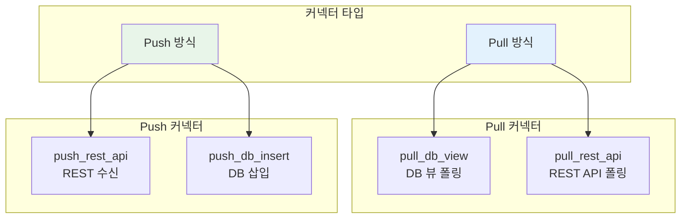
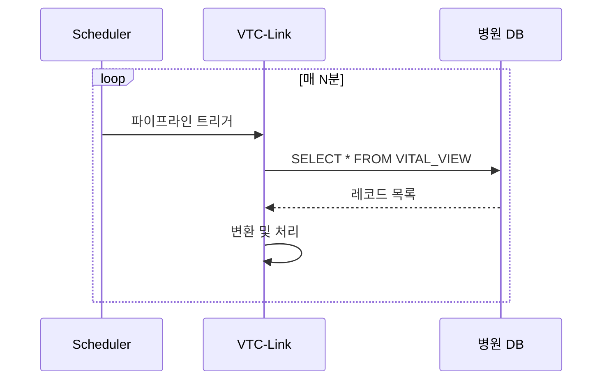
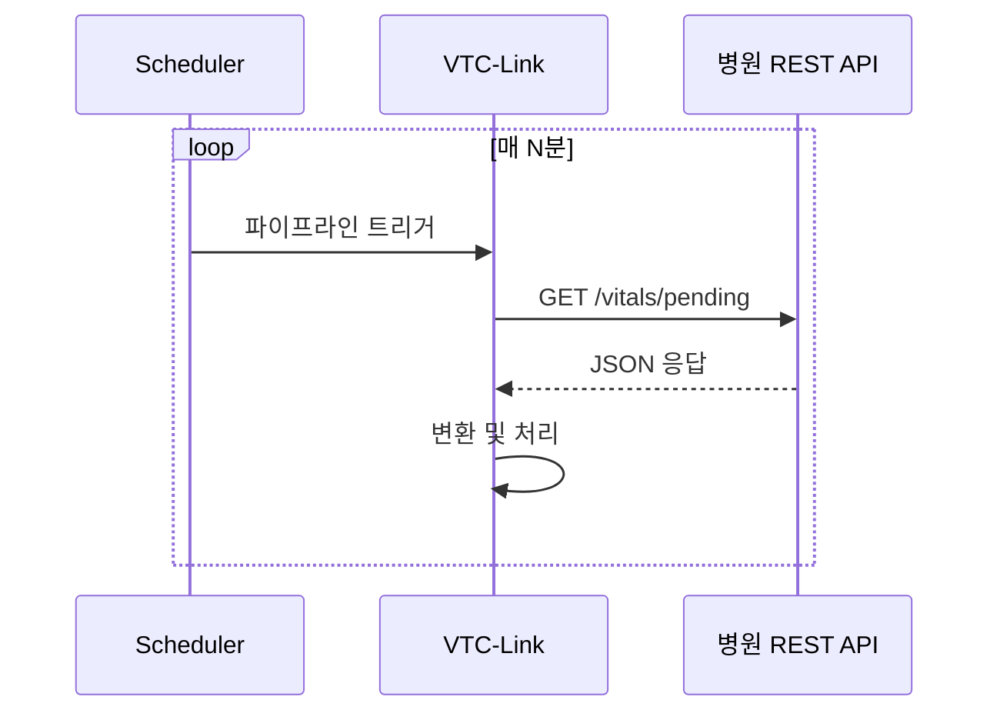
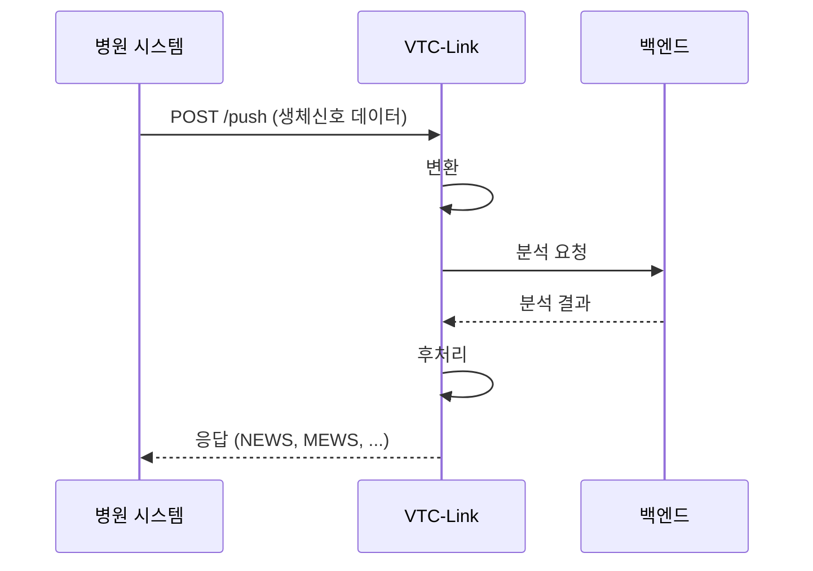
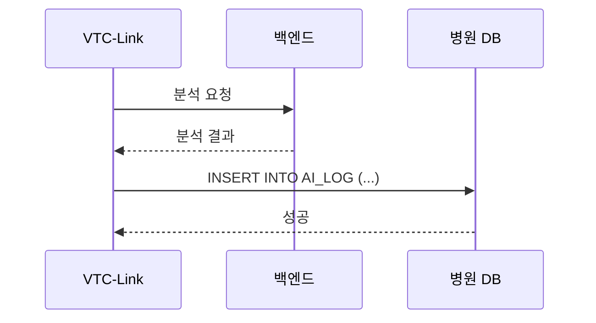
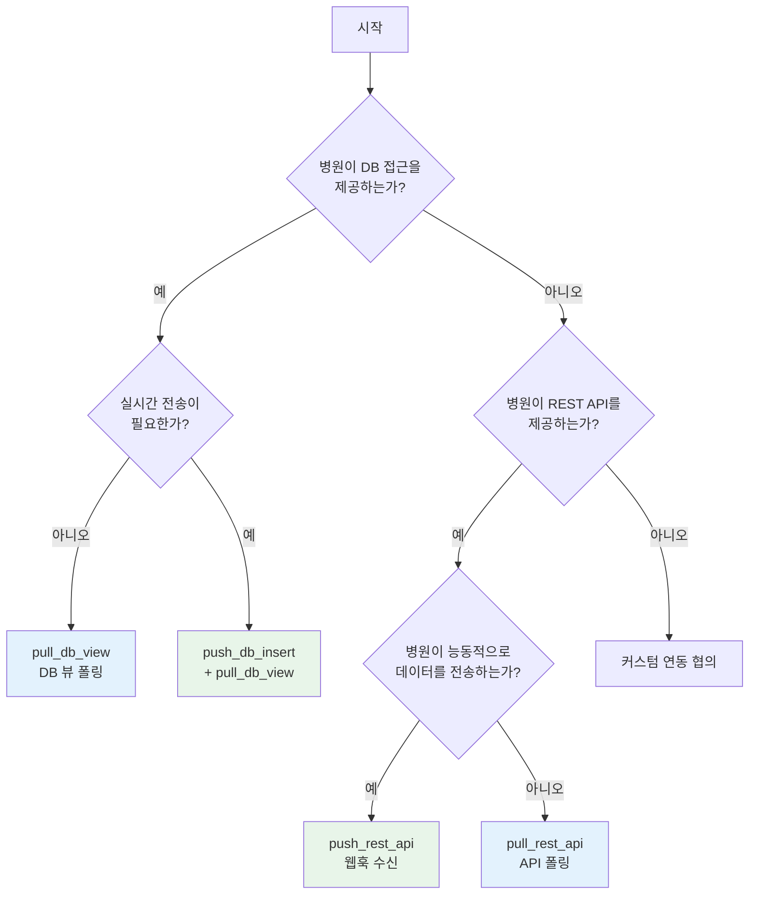

# 커넥터

## 개요

커넥터는 다양한 병원 데이터 소스와 VTC-Link를 연결하는 어댑터입니다.
병원의 기술 환경과 보안 정책에 따라 적절한 커넥터 타입을 선택할 수 있습니다.



---

## 커넥터 타입 비교

| 커넥터 | 방식 | 데이터 방향 | 사용 사례 |
|--------|:----:|:-----------:|----------|
| `pull_db_view` | Pull | 병원 DB → VTC | 병원이 DB 뷰 접근 제공 |
| `pull_rest_api` | Pull | 병원 API → VTC | 병원이 REST API 제공 |
| `push_rest_api` | Push | 병원 → VTC | 병원이 실시간 데이터 전송 |
| `push_db_insert` | Push | VTC → 병원 DB | 분석 결과를 병원 DB에 기록 |

---

## Pull 커넥터

### pull_db_view

병원의 Oracle 또는 MSSQL 데이터베이스 뷰에서 주기적으로 데이터를 조회합니다.



#### Oracle 설정

```yaml
hospital:
  hospital_id: "HOSP_ORACLE"
  connector_type: "pull_db_view"
  enabled: true
  schedule_minutes: 5
  transform_profile: "HOSP_ORACLE"
  db:
    type: "oracle"
    host: "10.0.1.100"
    port: 1521
    service: "ORCLCDB"
    username: "vtc_reader"
    password: "${ORACLE_PASSWORD}"
    view_name: "VITAL_SIGN_VIEW"
    query: "SELECT * FROM VITAL_SIGN_VIEW WHERE SENT_YN = 'N'"
```

!!! tip "Oracle 연결 설정"
    - `service`: Oracle 서비스 이름 (SID가 아님)
    - `port`: 기본값 1521
    - oracledb 패키지 사용 (cx_Oracle 대체)

#### MSSQL 설정

```yaml
hospital:
  hospital_id: "HOSP_MSSQL"
  connector_type: "pull_db_view"
  enabled: true
  schedule_minutes: 3
  transform_profile: "HOSP_MSSQL"
  db:
    type: "mssql"
    host: "10.0.2.50"
    port: 1433
    database: "EMR_DB"
    username: "vtc_reader"
    password: "${MSSQL_PASSWORD}"
    view_name: "dbo.VitalSignView"
    query: "SELECT TOP 100 * FROM dbo.VitalSignView WHERE ProcessedYN = 0"
```

!!! tip "MSSQL 연결 설정"
    - `database`: 데이터베이스 이름 필수
    - `port`: 기본값 1433
    - pyodbc 패키지와 ODBC 드라이버 필요

#### 커스텀 쿼리

기본 `SELECT * FROM {view_name}` 대신 커스텀 쿼리를 사용할 수 있습니다.

```yaml
db:
  query: |
    SELECT
      PT_NO, PT_NM, BIRTH_DT, SEX_CD,
      SBP, DBP, PR, RR, BT, SPO2
    FROM VITAL_SIGN_VIEW
    WHERE SENT_YN = 'N'
      AND MEASURE_DT >= SYSDATE - INTERVAL '1' HOUR
    ORDER BY MEASURE_DT DESC
    FETCH FIRST 100 ROWS ONLY
```

---

### pull_rest_api

병원이 제공하는 REST API를 주기적으로 호출하여 데이터를 수집합니다.



#### 설정

```yaml
hospital:
  hospital_id: "HOSP_REST"
  connector_type: "pull_rest_api"
  enabled: true
  schedule_minutes: 5
  transform_profile: "HOSP_REST"
  api:
    url: "https://api.hospital.local/vitals/pending"
    api_key: "${HOSPITAL_API_KEY}"
```

#### API 응답 형식

VTC-Link는 두 가지 응답 형식을 지원합니다.

=== "배열 형식"
    ```json
    [
        {"patient_id": "P001", "sbp": 120, ...},
        {"patient_id": "P002", "sbp": 135, ...}
    ]
    ```

=== "객체 형식"
    ```json
    {
        "status": "success",
        "records": [
            {"patient_id": "P001", "sbp": 120, ...},
            {"patient_id": "P002", "sbp": 135, ...}
        ]
    }
    ```

#### 구현 코드

```python
# app/connectors/rest_pull_fetch.py
def fetch_records(config: HospitalConfig) -> list[dict]:
    """병원 REST API에서 레코드를 조회"""
    if not config.api:
        return []
    url = str(config.api.get("url", "")).strip()
    if not url:
        return []

    headers = {}
    api_key = str(config.api.get("api_key", "")).strip()
    if api_key:
        headers["Authorization"] = f"Bearer {api_key}"

    with httpx.Client(timeout=10.0) as client:
        response = client.get(url, headers=headers)
        response.raise_for_status()
        data = response.json()

    if isinstance(data, list):
        return data
    if isinstance(data, dict):
        return data.get("records", [])
    return []
```

---

## Push 커넥터

### push_rest_api

병원 시스템이 VTC-Link의 `/push` 엔드포인트로 실시간 데이터를 전송합니다.



#### 설정

```yaml
hospital:
  hospital_id: "HOSP_PUSH"
  connector_type: "push_rest_api"
  enabled: true
  transform_profile: "HOSP_PUSH"
  postprocess:
    mode: "insert_log"
    table: "AI_ANALYSIS_LOG"
    columns: ["VITAL_ID", "PATIENT_ID", "NEWS", "PROCESSED_AT"]
    sources:
      VITAL_ID: "vital_id"
      PATIENT_ID: "patient_id"
      NEWS: "NEWS"
    values:
      PROCESSED_AT: "CURRENT_TIMESTAMP"
```

#### 병원 시스템 연동 예시

```bash
# 병원 시스템에서 VTC-Link 호출
curl -X POST http://vtc-link.hospital.local:8000/push \
  -H "Content-Type: application/json" \
  -d '{
    "patient_id": "P12345",
    "patient_name": "홍길동",
    "birthdate": "19900101",
    "sex": "M",
    "sbp": 140,
    "dbp": 90,
    "pr": 88,
    "rr": 20,
    "bt": 37.2,
    "spo2": 96.5
  }'
```

#### 응답 형식

```json
{
    "vital_id": "V67890",
    "patient_id": "P12345",
    "screened_type": "EMERGENCY",
    "screened_date": "20240115 10:30:00",
    "SEPS": 1,
    "MAES": 0,
    "MORS": 0,
    "NEWS": 4,
    "MEWS": 2,
    "created_at": "2024-01-15T10:30:00Z",
    "updated_at": "2024-01-15T10:30:00Z"
}
```

#### 푸시 엔드포인트 구현

```python
# app/api/push.py
@router.post("/push")
def push_vitals(payload: dict) -> dict:
    """병원 푸시 페이로드를 수신"""
    config = load_app_config()
    hospital = config.hospital

    # 1. 캐노니컬 변환
    canonical = to_canonical(payload)

    # 2. 백엔드 전송
    backend_payload = to_backend(canonical)
    response = send_payload(backend_payload)

    # 3. 후처리
    postprocess_ok, postprocess_code = run_postprocess(
        hospital, canonical.model_dump()
    )
    if not postprocess_ok:
        return {"status": "postprocess_failed", "error_code": postprocess_code}

    return from_backend(response)
```

---

### push_db_insert

분석 결과를 병원 데이터베이스에 직접 삽입합니다.
이 커넥터는 일반적으로 후처리(postprocess)와 함께 사용됩니다.



#### 설정

```yaml
hospital:
  hospital_id: "HOSP_INSERT"
  connector_type: "push_db_insert"
  enabled: true
  transform_profile: "HOSP_INSERT"
  db:
    type: "mssql"
    host: "10.0.2.50"
    database: "EMR_DB"
    username: "vtc_writer"
    password: "${MSSQL_PASSWORD}"
    insert_table: "AI_ANALYSIS_RESULT"
    insert_columns: ["VITAL_ID", "PATIENT_ID", "NEWS", "MEWS", "ANALYZED_AT"]
```

---

## 커넥터 선택 가이드



### 의사 결정 기준

| 기준 | pull_db_view | pull_rest_api | push_rest_api |
|------|:------------:|:-------------:|:-------------:|
| 실시간성 | 낮음 (N분 주기) | 낮음 (N분 주기) | 높음 (즉시) |
| 구현 복잡도 | 낮음 | 중간 | 병원 측 개발 필요 |
| 병원 부담 | DB 뷰 생성 | API 개발 | 연동 개발 |
| 네트워크 요구 | DB 포트 개방 | HTTPS | HTTPS |
| 보안 고려 | DB 읽기 계정 | API 키 | 인증 토큰 |

---

## 커넥터 설정 상세

### 공통 설정

모든 커넥터에 적용되는 공통 설정입니다.

```yaml
hospital:
  hospital_id: string       # 필수: 병원 식별자
  connector_type: string    # 필수: 커넥터 타입
  enabled: boolean          # 선택: 활성화 여부 (기본: true)
  schedule_minutes: integer # 필수(pull): 폴링 주기 (분)
  transform_profile: string # 필수: 변환 프로필 이름
```

### DB 연결 설정

Oracle과 MSSQL에 공통으로 적용됩니다.

```yaml
db:
  type: string        # 필수: "oracle" 또는 "mssql"
  host: string        # 필수: 호스트 주소
  port: integer       # 선택: 포트 (oracle: 1521, mssql: 1433)
  service: string     # Oracle 전용: 서비스 이름
  database: string    # MSSQL 전용: 데이터베이스 이름
  username: string    # 필수: 사용자명
  password: string    # 필수: 비밀번호
  view_name: string   # 선택: 뷰 이름
  query: string       # 선택: 커스텀 쿼리
```

### API 연결 설정

REST API 커넥터에 적용됩니다.

```yaml
api:
  url: string         # 필수: API 엔드포인트 URL
  api_key: string     # 선택: Bearer 토큰
```

---

## 에러 처리

### 연결 실패

커넥터 연결 실패 시 파이프라인이 중단되고 에러가 로깅됩니다.

```python
try:
    raw_records = fetch_records(hospital)
except Exception as exc:
    log_event("pipeline_failed", "ERROR", hospital.hospital_id, "fetch", str(exc))
    raise
```

### 타임아웃

모든 네트워크 요청에 타임아웃이 설정되어 있습니다.

| 작업 | 타임아웃 |
|------|:-------:|
| DB 연결 | 30초 |
| DB 쿼리 | 60초 |
| HTTP 요청 | 10초 |

### 재시도 로직

커넥터 레벨에서는 재시도하지 않습니다.
후처리(postprocess) 단계에서만 설정된 횟수만큼 재시도합니다.

---

## 다음 단계

- [파이프라인](pipeline.md) - 데이터 처리 흐름
- [후처리](postprocess.md) - 후처리 모드 상세
- [설정 가이드](configuration.md) - 전체 설정 레퍼런스
