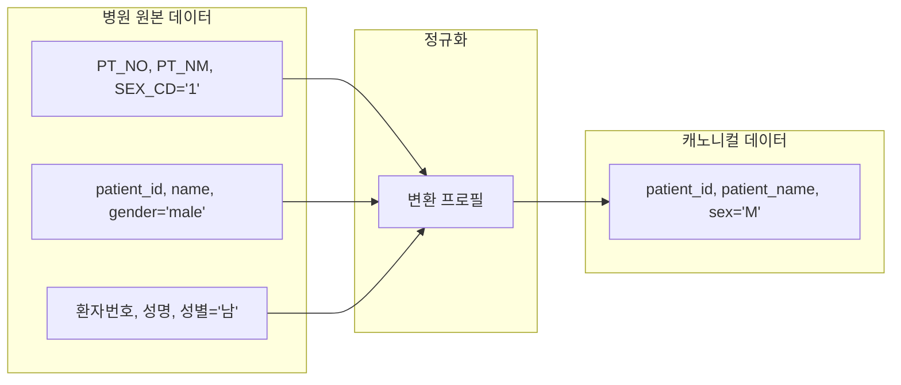
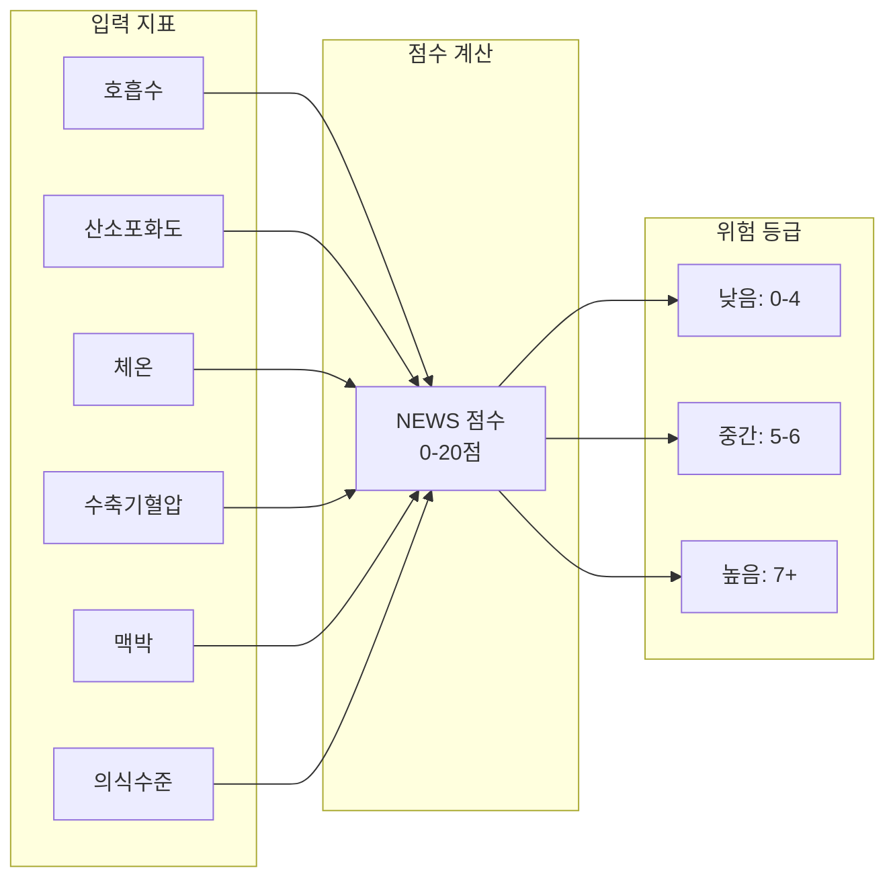

# 데이터 모델

## 개요

VTC-Link는 병원마다 다른 데이터 형식을 **캐노니컬(Canonical) 포맷**으로 정규화합니다.
이 문서에서는 정규화된 데이터 스키마와 백엔드 분석 결과의 위험도 점수를 설명합니다.



---

## 캐노니컬 페이로드

### 전체 구조

```yaml
CanonicalPayload:
  patient:          # 환자 식별 정보
    patient_id: string
    patient_name: string (optional)
    birthdate: string (YYYYMMDD)
    age: integer (optional)
    sex: string (M/F)
    ward: string (optional, max 30)
    department: string (optional, max 30)

  vitals:           # 생체신호 측정값
    SBP: integer    # 수축기 혈압
    DBP: integer    # 이완기 혈압
    PR: integer     # 맥박수
    RR: integer     # 호흡수
    BT: float       # 체온
    SpO2: float     # 산소포화도

  timestamps:       # 타임스탬프
    created_at: string (UTC ISO8601)
    updated_at: string (UTC ISO8601)
```

### 환자 정보 (Patient)

| 필드 | 타입 | 필수 | 설명 | 예시 |
|-----|------|:----:|------|------|
| `patient_id` | string | O | 환자 식별자 | `"P12345"` |
| `patient_name` | string | X | 환자 이름 | `"홍길동"` |
| `birthdate` | string | O | 생년월일 (YYYYMMDD) | `"19900101"` |
| `age` | integer | X | 나이 | `34` |
| `sex` | string | O | 성별 코드 (M/F) | `"M"` |
| `ward` | string | X | 병동 (최대 30자) | `"ICU"` |
| `department` | string | X | 진료과 (최대 30자) | `"내과"` |

!!! info "성별 코드 정규화"
    다양한 병원 시스템의 성별 코드를 `M`(남성) 또는 `F`(여성)로 통일합니다.

    | 원본 | 정규화 |
    |-----|--------|
    | `1`, `M`, `male`, `남`, `남자` | `M` |
    | `2`, `F`, `female`, `여`, `여자` | `F` |

### 생체신호 (Vitals)

| 필드 | 타입 | 필수 | 설명 | 단위 | 정상 범위 |
|-----|------|:----:|------|------|----------|
| `SBP` | integer | O | 수축기 혈압 (Systolic Blood Pressure) | mmHg | 90-140 |
| `DBP` | integer | O | 이완기 혈압 (Diastolic Blood Pressure) | mmHg | 60-90 |
| `PR` | integer | O | 맥박수 (Pulse Rate) | bpm | 60-100 |
| `RR` | integer | O | 호흡수 (Respiratory Rate) | /min | 12-20 |
| `BT` | float | O | 체온 (Body Temperature) | C | 36.0-37.5 |
| `SpO2` | float | O | 산소포화도 (Oxygen Saturation) | % | 95-100 |

!!! warning "생체신호 단위"
    - 체온은 반드시 **섭씨(Celsius)** 단위로 저장합니다.
    - 화씨(Fahrenheit)로 수집되는 경우 변환 프로필에서 섭씨로 변환해야 합니다.
    - 변환 공식: `C = (F - 32) * 5/9`

### 타임스탬프 (Timestamps)

| 필드 | 타입 | 필수 | 설명 | 형식 |
|-----|------|:----:|------|------|
| `created_at` | string | O | 레코드 생성 시각 | ISO 8601 UTC |
| `updated_at` | string | O | 레코드 수정 시각 | ISO 8601 UTC |

!!! example "타임스탬프 형식"
    ```
    2024-01-15T10:30:00Z
    ```
    - `Z`는 UTC 시간대를 나타냅니다.
    - 한국 시간(KST)은 UTC+9이므로, 한국 시간 19:30:00은 UTC 10:30:00입니다.

---

## Pydantic 모델 정의

```python
# app/models/canonical.py
from pydantic import BaseModel, Field


class Patient(BaseModel):
    """환자 식별 정보"""
    patient_id: str = Field(..., description="환자 식별자")
    patient_name: str | None = Field(default=None, description="환자 이름")
    birthdate: str = Field(..., description="생년월일(YYYYMMDD)")
    age: int | None = Field(default=None, description="나이")
    sex: str = Field(..., description="성별 코드(M/F)")
    ward: str | None = Field(default=None, max_length=30, description="병동")
    department: str | None = Field(default=None, max_length=30, description="진료과")


class Vitals(BaseModel):
    """생체신호 측정값"""
    SBP: int = Field(..., description="수축기 혈압")
    DBP: int = Field(..., description="이완기 혈압")
    PR: int = Field(..., description="맥박수")
    RR: int = Field(..., description="호흡수")
    BT: float = Field(..., description="체온(섭씨)")
    SpO2: float = Field(..., description="산소포화도")


class Timestamps(BaseModel):
    """레코드 타임스탬프 메타데이터"""
    created_at: str = Field(..., description="생성 시각(UTC ISO8601)")
    updated_at: str = Field(..., description="수정 시각(UTC ISO8601)")


class CanonicalPayload(BaseModel):
    """백엔드로 전달되는 캐노니컬 페이로드"""
    patient: Patient
    vitals: Vitals
    timestamps: Timestamps
```

---

## 클라이언트 응답 (분석 결과)

백엔드 분석 서버에서 반환하는 위험도 점수입니다.

### 전체 구조

```yaml
ClientResponse:
  vital_id: string           # 바이탈 식별자
  patient_id: string         # 환자 식별자
  screened_type: string      # 선별 유형
  screened_date: string      # 선별 일시 (YYYYMMDD HH:MM:SS)
  SEPS: integer              # 패혈증 점수
  MAES: integer              # MAES 점수
  MORS: integer              # 사망 위험 점수
  NEWS: integer              # 국가 조기경보 점수
  MEWS: integer              # 수정 조기경보 점수
  created_at: string         # 생성 시각
  updated_at: string         # 수정 시각
```

### 필드 설명

| 필드 | 타입 | 설명 |
|-----|------|------|
| `vital_id` | string | 생체신호 레코드 고유 식별자 |
| `patient_id` | string | 환자 식별자 (요청과 동일) |
| `screened_type` | string | 선별 유형 (EMERGENCY, WARD 등) |
| `screened_date` | string | 선별 수행 일시 |
| `SEPS` | integer | 패혈증(Sepsis) 위험 점수 |
| `MAES` | integer | MAES(Major Adverse Events) 점수 |
| `MORS` | integer | 사망(Mortality) 위험 점수 |
| `NEWS` | integer | 국가 조기경보 점수 (National Early Warning Score) |
| `MEWS` | integer | 수정 조기경보 점수 (Modified Early Warning Score) |

### Pydantic 모델 정의

```python
# app/models/client.py
from pydantic import BaseModel, Field


class ClientResponse(BaseModel):
    """클라이언트 응답 모델"""
    vital_id: str = Field(..., description="바이탈 식별자")
    patient_id: str = Field(..., description="환자 식별자")
    screened_type: str = Field(..., description="Screened Type")
    screened_date: str = Field(..., description="Screened Date(YYYYMMDD HH:MM:SS)")
    SEPS: int = Field(..., description="SEPS 점수")
    MAES: int = Field(..., description="MAES 점수")
    MORS: int = Field(..., description="MORS 점수")
    NEWS: int = Field(..., description="NEWS 점수")
    MEWS: int = Field(..., description="MEWS 점수")
    created_at: str = Field(..., description="생성 시각")
    updated_at: str = Field(..., description="수정 시각")
```

---

## 위험도 점수 상세

### NEWS (National Early Warning Score)

영국 NHS에서 개발한 국가 조기경보 점수 시스템입니다.



| 점수 범위 | 위험 등급 | 권장 조치 |
|:--------:|:--------:|----------|
| 0-4 | 낮음 (Low) | 일상적 모니터링 |
| 5-6 | 중간 (Medium) | 빈도 증가 모니터링, 담당의 알림 |
| 7+ | 높음 (High) | 즉각적인 의료진 대응 필요 |

### MEWS (Modified Early Warning Score)

수정 조기경보 점수로, NEWS보다 간소화된 버전입니다.

| 지표 | 0점 | 1점 | 2점 | 3점 |
|-----|:---:|:---:|:---:|:---:|
| 수축기혈압 | 101-199 | 81-100 | 71-80, 200+ | ≤70 |
| 맥박 | 51-100 | 41-50, 101-110 | ≤40, 111-129 | ≥130 |
| 호흡수 | 9-14 | 15-20 | 21-29 | ≤8, ≥30 |
| 체온 | 35-38.4 | 34-34.9, 38.5-38.9 | - | ≤33.9, ≥39 |

### SEPS (Sepsis Score)

패혈증 조기 발견을 위한 점수입니다.

!!! danger "패혈증 주의"
    SEPS 점수가 2점 이상인 경우 패혈증 가능성이 높으므로
    즉각적인 진단 및 치료가 필요합니다.

---

## 데이터 변환 예시

### 병원 A (Oracle DB View)

=== "원본 데이터"
    ```json
    {
        "PT_NO": "A000123",
        "PT_NM": "홍길동",
        "BIRTH_DT": "1990-01-15",
        "SEX_CD": "1",
        "WARD_CD": "ICU",
        "DEPT_CD": "IM",
        "SBP": 120,
        "DBP": 80,
        "PR": 72,
        "RR": 18,
        "BT": 36.5,
        "SPO2": 98.0,
        "MEASURE_DT": "2024-01-15 10:30:00"
    }
    ```

=== "캐노니컬 데이터"
    ```json
    {
        "patient": {
            "patient_id": "A000123",
            "patient_name": "홍길동",
            "birthdate": "19900115",
            "age": 34,
            "sex": "M",
            "ward": "ICU",
            "department": "IM"
        },
        "vitals": {
            "SBP": 120,
            "DBP": 80,
            "PR": 72,
            "RR": 18,
            "BT": 36.5,
            "SpO2": 98.0
        },
        "timestamps": {
            "created_at": "2024-01-15T01:30:00Z",
            "updated_at": "2024-01-15T01:30:00Z"
        }
    }
    ```

### 병원 B (REST API)

=== "원본 데이터"
    ```json
    {
        "patientNo": "B-12345",
        "patientName": "김철수",
        "birthday": "1985-03-20",
        "gender": "male",
        "location": {
            "ward": "3B",
            "department": "Surgery"
        },
        "vitals": {
            "bloodPressure": {
                "systolic": 135,
                "diastolic": 85
            },
            "heartRate": 88,
            "respiratoryRate": 20,
            "temperature": 37.2,
            "oxygenSaturation": 96.5
        },
        "measuredAt": "2024-01-15T19:30:00+09:00"
    }
    ```

=== "캐노니컬 데이터"
    ```json
    {
        "patient": {
            "patient_id": "B-12345",
            "patient_name": "김철수",
            "birthdate": "19850320",
            "age": 38,
            "sex": "M",
            "ward": "3B",
            "department": "Surgery"
        },
        "vitals": {
            "SBP": 135,
            "DBP": 85,
            "PR": 88,
            "RR": 20,
            "BT": 37.2,
            "SpO2": 96.5
        },
        "timestamps": {
            "created_at": "2024-01-15T10:30:00Z",
            "updated_at": "2024-01-15T10:30:00Z"
        }
    }
    ```

---

## 변환 프로필 작성 가이드

새로운 병원을 연동할 때 변환 프로필을 작성해야 합니다.

### 프로필 디렉토리 구조

```
app/transforms/hospital_profiles/
└── NEW_HOSPITAL/
    ├── __init__.py
    ├── inbound.py      # 병원 → 캐노니컬 변환
    ├── outbound.py     # 캐노니컬 → 백엔드 변환
    └── mapping.py      # 코드 맵핑 테이블
```

### inbound.py 템플릿

```python
from datetime import datetime, timezone
from app.models.canonical import CanonicalPayload, Patient, Vitals, Timestamps
from .mapping import SEX_CODE_MAP


def to_canonical(raw: dict) -> CanonicalPayload:
    """병원 원본 데이터를 캐노니컬 형식으로 변환

    Args:
        raw: 병원 원본 레코드

    Returns:
        정규화된 캐노니컬 페이로드
    """
    return CanonicalPayload(
        patient=Patient(
            patient_id=str(raw["PATIENT_ID_FIELD"]),
            patient_name=raw.get("NAME_FIELD"),
            birthdate=_normalize_date(raw["BIRTH_FIELD"]),
            age=_calculate_age(raw.get("BIRTH_FIELD")),
            sex=SEX_CODE_MAP.get(raw["SEX_FIELD"], "M"),
            ward=raw.get("WARD_FIELD"),
            department=raw.get("DEPT_FIELD")
        ),
        vitals=Vitals(
            SBP=int(raw["SBP_FIELD"]),
            DBP=int(raw["DBP_FIELD"]),
            PR=int(raw["PR_FIELD"]),
            RR=int(raw.get("RR_FIELD", 18)),
            BT=float(raw["BT_FIELD"]),
            SpO2=float(raw.get("SPO2_FIELD", 98.0))
        ),
        timestamps=Timestamps(
            created_at=datetime.now(timezone.utc).isoformat().replace("+00:00", "Z"),
            updated_at=datetime.now(timezone.utc).isoformat().replace("+00:00", "Z")
        )
    )


def _normalize_date(date_str: str) -> str:
    """날짜를 YYYYMMDD 형식으로 정규화"""
    # 병원별 날짜 형식에 맞게 구현
    return date_str.replace("-", "").replace("/", "")[:8]


def _calculate_age(birth_str: str | None) -> int | None:
    """생년월일로부터 나이 계산"""
    if not birth_str:
        return None
    # 구현...
```

### mapping.py 템플릿

```python
# 성별 코드 맵핑
SEX_CODE_MAP = {
    "1": "M",
    "2": "F",
    "M": "M",
    "F": "F",
    "male": "M",
    "female": "F",
    "남": "M",
    "여": "F",
}

# 진료과 코드 맵핑 (필요시)
DEPT_CODE_MAP = {
    "IM": "내과",
    "GS": "외과",
    "NS": "신경외과",
    # ...
}
```

---

## 다음 단계

- [커넥터](connectors.md) - 데이터 소스별 커넥터 설정
- [파이프라인](pipeline.md) - 데이터 처리 흐름
- [API 레퍼런스](api-reference.md) - REST API 상세
