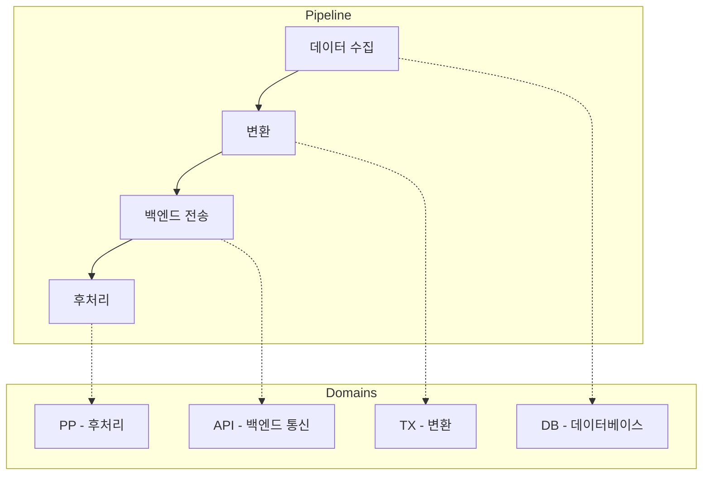
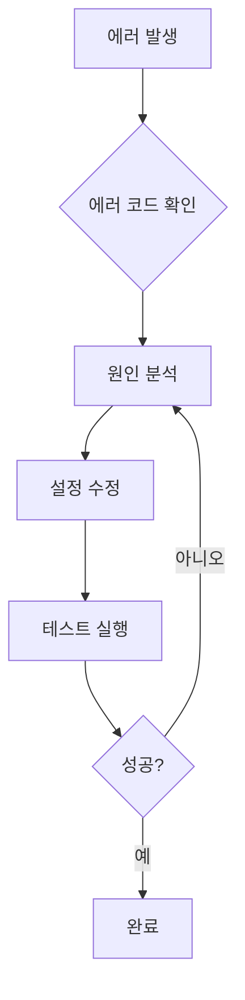

# 에러 코드

VTC-Link는 체계적인 에러 코드 시스템을 통해 문제 진단과 해결을 지원합니다. 모든 에러 코드는 일관된 형식을 따르며, 에러 발생 원인과 해결 방법을 명확하게 제시합니다.

---

## 에러 코드 형식

모든 에러 코드는 다음 형식을 따릅니다:

```
{DOMAIN}_{STAGE}_{CODE}
```

| 구성 요소 | 설명 | 예시 |
|-----------|------|------|
| **DOMAIN** | 에러 발생 도메인 | TX, DB, API, PP |
| **STAGE** | 에러 발생 단계 | PARSE, CONN, AUTH |
| **CODE** | 고유 식별 번호 | 001, 002, 003 |

!!! example "에러 코드 예시"
    - `TX_PARSE_001` = Transform 도메인 + Parse 단계 + 001번 에러
    - `DB_CONN_001` = Database 도메인 + Connection 단계 + 001번 에러
    - `API_AUTH_001` = API 도메인 + Auth 단계 + 001번 에러

---

## 도메인 개요



| 도메인 | 설명 | 발생 위치 |
|--------|------|-----------|
| **TX** | Transform (변환) | 데이터 파싱, 정규화, 검증 |
| **DB** | Database (데이터베이스) | DB 연결, 쿼리 실행 |
| **API** | Backend API | 백엔드 서버 통신 |
| **PP** | PostProcess (후처리) | 플래그 업데이트, 로그 삽입 |

---

## TX 도메인 (변환 에러)

데이터 변환 과정에서 발생하는 에러입니다.

### TX_PARSE_001

**파싱 실패**

```
TX_PARSE_001: {field}: {message}
```

| 항목 | 내용 |
|------|------|
| **원인** | 원본 데이터 형식이 예상과 다름 |
| **영향** | 해당 레코드 변환 불가 |
| **심각도** | :material-alert-circle: ERROR |

#### 발생 예시

```python
# 날짜 형식 오류
TX_PARSE_001: birthdate: Invalid date format '2025/01/26'

# 숫자 형식 오류
TX_PARSE_001: SBP: Cannot convert 'N/A' to integer

# 필수 필드 누락
TX_PARSE_001: patient_id: Required field missing
```

#### 해결 방법

=== "날짜 형식 오류"
    1. 원본 시스템의 날짜 형식 확인
    2. `inbound.py`의 파싱 로직 수정
    ```python
    # 여러 형식 지원
    from dateutil import parser
    parsed_date = parser.parse(raw_date).strftime("%Y%m%d")
    ```

=== "숫자 형식 오류"
    1. 원본 데이터에서 비정상 값 확인
    2. 기본값 또는 예외 처리 추가
    ```python
    def safe_int(value, default=0):
        try:
            return int(value)
        except (ValueError, TypeError):
            return default
    ```

=== "필수 필드 누락"
    1. 원본 시스템에서 필드 제공 여부 확인
    2. 매핑 로직에서 필드명 확인
    3. 필요시 기본값 설정

### TX_DATE_002

**날짜 파싱 실패**

| 항목 | 내용 |
|------|------|
| **원인** | 날짜 문자열 형식 불일치 |
| **영향** | 타임스탬프 변환 불가 |
| **심각도** | :material-alert-circle: ERROR |

#### 해결 방법

```python
# hospitals.yaml에 날짜 형식 지정
transform_profile: "HOSP_A"

# inbound.py에서 형식 처리
from datetime import datetime

def parse_date(value: str, format: str = "%Y%m%d") -> str:
    """다양한 형식의 날짜를 표준 형식으로 변환"""
    formats = ["%Y%m%d", "%Y-%m-%d", "%Y/%m/%d", "%d-%m-%Y"]
    for fmt in formats:
        try:
            return datetime.strptime(value, fmt).strftime("%Y%m%d")
        except ValueError:
            continue
    raise ValueError(f"Cannot parse date: {value}")
```

### TX_VALID_003

**데이터 유효성 검증 실패**

| 항목 | 내용 |
|------|------|
| **원인** | 데이터 값이 허용 범위 초과 |
| **영향** | 해당 레코드 처리 중단 |
| **심각도** | :material-alert: WARNING |

#### 유효성 검증 규칙

| 필드 | 유효 범위 | 예시 |
|------|-----------|------|
| `SBP` | 40-300 mmHg | 120 |
| `DBP` | 20-200 mmHg | 80 |
| `PR` | 20-300 bpm | 72 |
| `RR` | 4-60 /min | 16 |
| `BT` | 30.0-45.0 °C | 36.5 |
| `SpO2` | 50.0-100.0 % | 98.0 |

---

## DB 도메인 (데이터베이스 에러)

데이터베이스 연결 및 쿼리 실행 중 발생하는 에러입니다.

### DB_CONN_001

**데이터베이스 연결 실패**

| 항목 | 내용 |
|------|------|
| **원인** | DB 서버 접속 불가 |
| **영향** | 파이프라인 전체 실패 |
| **심각도** | :material-alert-circle: ERROR |

#### 확인 사항

- [ ] DB 서버 실행 상태
- [ ] 네트워크 연결 (방화벽, VPN)
- [ ] 호스트/포트 설정
- [ ] 계정 정보 (username/password)

#### 해결 방법

=== "Oracle"
    ```bash
    # 연결 테스트
    sqlplus readonly/readonly@//localhost:1521/ORCLCDB

    # TNS 설정 확인
    cat $ORACLE_HOME/network/admin/tnsnames.ora
    ```

=== "MSSQL"
    ```bash
    # 연결 테스트
    sqlcmd -S localhost -U readonly -P readonly -d master

    # SQL Server 서비스 확인
    systemctl status mssql-server
    ```

### DB_QUERY_002

**쿼리 실행 실패**

| 항목 | 내용 |
|------|------|
| **원인** | SQL 문법 오류 또는 권한 부족 |
| **영향** | 데이터 조회/수정 불가 |
| **심각도** | :material-alert-circle: ERROR |

#### 해결 방법

1. **SQL 문법 확인**
   ```sql
   -- hospitals.yaml의 query 확인
   SELECT * FROM VITAL_VIEW WHERE ROWNUM <= 1
   ```

2. **권한 확인**
   ```sql
   -- Oracle
   SELECT * FROM USER_TAB_PRIVS WHERE TABLE_NAME = 'VITAL_VIEW';

   -- MSSQL
   SELECT * FROM fn_my_permissions('VITAL_VIEW', 'OBJECT');
   ```

3. **뷰/테이블 존재 확인**
   ```sql
   -- Oracle
   SELECT * FROM ALL_VIEWS WHERE VIEW_NAME = 'VITAL_VIEW';

   -- MSSQL
   SELECT * FROM INFORMATION_SCHEMA.VIEWS WHERE TABLE_NAME = 'VITAL_VIEW';
   ```

### DB_TIMEOUT_003

**쿼리 타임아웃**

| 항목 | 내용 |
|------|------|
| **원인** | 쿼리 실행 시간 초과 |
| **영향** | 데이터 조회 실패 |
| **심각도** | :material-alert: WARNING |

#### 해결 방법

```sql
-- 대용량 테이블인 경우 인덱스 확인
-- Oracle
SELECT * FROM ALL_INDEXES WHERE TABLE_NAME = 'VITAL_VIEW';

-- 쿼리 최적화
SELECT /*+ INDEX(v idx_vital_sent) */ *
FROM VITAL_VIEW v
WHERE SENT_YN = 'N'
AND ROWNUM <= 1000;
```

---

## API 도메인 (백엔드 통신 에러)

백엔드 서버와의 통신 중 발생하는 에러입니다.

### API_CONN_001

**백엔드 연결 실패**

| 항목 | 내용 |
|------|------|
| **원인** | 백엔드 서버 접속 불가 |
| **영향** | 데이터 전송 실패 |
| **심각도** | :material-alert-circle: ERROR |

#### 확인 사항

```bash
# 백엔드 서버 헬스체크
curl -v http://localhost:9000/health

# DNS 확인
nslookup backend.example.com

# 포트 열림 확인
nc -zv localhost 9000
```

#### 설정 확인

```bash
# .env 파일
BACKEND_BASE_URL=http://localhost:9000
```

### API_AUTH_002

**인증 실패**

| 항목 | 내용 |
|------|------|
| **원인** | API 키 만료 또는 잘못된 키 |
| **영향** | 모든 API 요청 거부 |
| **심각도** | :material-alert-circle: ERROR |

#### 해결 방법

1. **API 키 확인**
   ```bash
   # .env 파일
   BACKEND_API_KEY=your-api-key-here
   ```

2. **키 유효성 테스트**
   ```bash
   curl -X POST http://localhost:9000/v1/push \
     -H "Authorization: Bearer your-api-key" \
     -H "Content-Type: application/json" \
     -d '{"test": true}'
   ```

3. **새 API 키 발급** (백엔드 관리자 문의)

### API_RESP_003

**비정상 응답**

| 항목 | 내용 |
|------|------|
| **원인** | 백엔드 서버 내부 오류 (5xx) |
| **영향** | 해당 요청 실패 |
| **심각도** | :material-alert: WARNING |

#### HTTP 상태 코드별 조치

| 상태 코드 | 의미 | 조치 |
|-----------|------|------|
| 400 | Bad Request | 요청 페이로드 형식 확인 |
| 401 | Unauthorized | API 키 확인 |
| 403 | Forbidden | 권한 확인 |
| 404 | Not Found | 엔드포인트 URL 확인 |
| 429 | Too Many Requests | 요청 속도 제한 |
| 500 | Internal Server Error | 백엔드 관리자 문의 |
| 502/503 | Service Unavailable | 잠시 후 재시도 |

### API_TIMEOUT_004

**요청 타임아웃**

| 항목 | 내용 |
|------|------|
| **원인** | 백엔드 응답 지연 |
| **영향** | 해당 요청 실패 |
| **심각도** | :material-alert: WARNING |

#### 해결 방법

```python
# 타임아웃 설정 (현재 10초)
# app/clients/backend_api.py
with httpx.Client(timeout=30.0) as client:  # 30초로 증가
    response = client.post(...)
```

---

## PP 도메인 (후처리 에러)

후처리 단계에서 발생하는 에러입니다.

### PP_CONFIG_001

**후처리 설정 누락**

| 항목 | 내용 |
|------|------|
| **원인** | 필수 설정값 미지정 |
| **영향** | 후처리 실행 불가 |
| **심각도** | :material-alert-circle: ERROR |

#### 필수 설정 확인

=== "update_flag 모드"
    ```yaml
    postprocess:
      mode: "update_flag"
      table: "VITAL_VIEW"          # 필수
      key_column: "ID"             # 필수
      key_value_source: "vital_id" # key_value와 둘 중 하나 필수
      flag_column: "SENT_YN"       # 필수
      flag_value: "Y"
      retry: 3
    ```

=== "insert_log 모드"
    ```yaml
    postprocess:
      mode: "insert_log"
      table: "SEND_LOG"            # 필수
      columns:                     # 필수
        - "PATIENT_ID"
        - "SENT_AT"
        - "STATUS"
      values:
        STATUS: "SUCCESS"
      sources:
        PATIENT_ID: "patient_id"
        SENT_AT: "created_at"
      retry: 3
    ```

### PP_KEY_002

**키 값 누락**

| 항목 | 내용 |
|------|------|
| **원인** | `key_value` 또는 `key_value_source` 미지정 |
| **영향** | UPDATE WHERE 조건 생성 불가 |
| **심각도** | :material-alert-circle: ERROR |

#### 해결 방법

```yaml
postprocess:
  mode: "update_flag"
  key_column: "ID"
  # 방법 1: 고정값
  key_value: "12345"

  # 방법 2: 레코드에서 동적으로 가져오기 (권장)
  key_value_source: "vital_id"  # canonical 레코드의 vital_id 필드 사용
```

### PP_VALUE_003

**값 누락 (insert_log)**

| 항목 | 내용 |
|------|------|
| **원인** | `columns`에 정의된 컬럼의 값이 `values`나 `sources`에 없음 |
| **영향** | INSERT 문 생성 불가 |
| **심각도** | :material-alert-circle: ERROR |

#### 해결 방법

```yaml
postprocess:
  mode: "insert_log"
  table: "SEND_LOG"
  columns:
    - "PATIENT_ID"    # 모든 컬럼에 대해
    - "SENT_AT"       # values 또는 sources 중
    - "STATUS"        # 하나는 반드시 지정
  values:
    STATUS: "SUCCESS"           # 고정값
  sources:
    PATIENT_ID: "patient_id"    # 레코드에서 가져오기
    SENT_AT: "created_at"
```

### PP_DB_004

**후처리 DB 미지원**

| 항목 | 내용 |
|------|------|
| **원인** | `db.type`이 oracle 또는 mssql이 아님 |
| **영향** | 후처리 실행 불가 |
| **심각도** | :material-alert-circle: ERROR |

#### 지원 데이터베이스

| DB 타입 | 설정값 | 지원 여부 |
|---------|--------|-----------|
| Oracle | `oracle` | :material-check: 지원 |
| MS SQL Server | `mssql` | :material-check: 지원 |
| PostgreSQL | `postgresql` | :material-close: 미지원 |
| MySQL | `mysql` | :material-close: 미지원 |

### PP_EXEC_005

**후처리 실행 실패**

| 항목 | 내용 |
|------|------|
| **원인** | UPDATE/INSERT 쿼리 실행 중 DB 에러 |
| **영향** | 해당 레코드 후처리 실패 |
| **심각도** | :material-alert-circle: ERROR |

#### 확인 사항

- [ ] 테이블 존재 여부
- [ ] 컬럼명 정확성
- [ ] 데이터 타입 일치
- [ ] 계정 권한 (UPDATE/INSERT)

---

## 복구 절차

### 일반 복구 절차



### 에러 유형별 복구

=== "TX 에러"
    1. 원본 데이터 샘플 확인
    2. `inbound.py` 파싱 로직 수정
    3. 단위 테스트 실행
    4. 파이프라인 재실행

=== "DB 에러"
    1. DB 연결 테스트
    2. `hospitals.yaml` 설정 확인
    3. DB 계정 권한 확인
    4. 파이프라인 재실행

=== "API 에러"
    1. 백엔드 서버 상태 확인
    2. API 키 유효성 확인
    3. 네트워크 연결 확인
    4. 파이프라인 재실행

=== "PP 에러"
    1. `hospitals.yaml` 후처리 설정 확인
    2. DB 테이블/컬럼 존재 확인
    3. 권한 확인
    4. 파이프라인 재실행

### 자동 재시도

후처리는 자동 재시도를 지원합니다:

```yaml
postprocess:
  retry: 3  # 최대 3회 재시도
```

!!! warning "재시도 주의사항"
    - 재시도 사이에 지연 시간 없음
    - 모든 재시도 실패 시 `postprocess_failed` 이벤트 기록
    - `hospital_status.postprocess_fail_count` 증가

---

## 에러 코드 참조표

### 전체 에러 코드 목록

| 코드 | 도메인 | 설명 | 심각도 |
|------|--------|------|--------|
| TX_PARSE_001 | Transform | 파싱 실패 | ERROR |
| TX_DATE_002 | Transform | 날짜 파싱 실패 | ERROR |
| TX_VALID_003 | Transform | 유효성 검증 실패 | WARNING |
| DB_CONN_001 | Database | 연결 실패 | ERROR |
| DB_QUERY_002 | Database | 쿼리 실행 실패 | ERROR |
| DB_TIMEOUT_003 | Database | 타임아웃 | WARNING |
| API_CONN_001 | API | 백엔드 연결 실패 | ERROR |
| API_AUTH_002 | API | 인증 실패 | ERROR |
| API_RESP_003 | API | 비정상 응답 | WARNING |
| API_TIMEOUT_004 | API | 요청 타임아웃 | WARNING |
| PP_CONFIG_001 | PostProcess | 설정 누락 | ERROR |
| PP_KEY_002 | PostProcess | 키 값 누락 | ERROR |
| PP_VALUE_003 | PostProcess | 값 누락 | ERROR |
| PP_DB_004 | PostProcess | DB 미지원 | ERROR |
| PP_EXEC_005 | PostProcess | 실행 실패 | ERROR |
| PIPE_STAGE_001 | Pipeline | 파이프라인 단계 실패 | ERROR |

### 에러 코드로 로그 검색

```sql
-- 특정 에러 코드 발생 이력
SELECT * FROM logs
WHERE error_code = 'DB_CONN_001'
ORDER BY timestamp DESC;

-- 에러 코드별 발생 빈도
SELECT error_code, COUNT(*) as count
FROM logs
WHERE error_code IS NOT NULL
GROUP BY error_code
ORDER BY count DESC;
```
