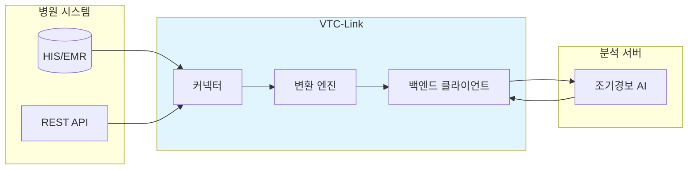
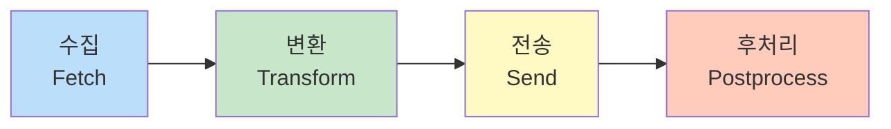

# VTC-Link

**병원 생체신호 데이터 연동 인터페이스 서버**

---

## 프로젝트 소개

VTC-Link는 다양한 병원 정보 시스템(HIS)에서 환자의 생체신호(Vital Signs) 데이터를 수집하여 정규화한 후, 분석 백엔드 서버로 전달하는 **의료 데이터 통합 미들웨어**입니다.

국내 의료 기관마다 상이한 EMR/HIS 시스템, 데이터베이스 스키마, API 규격을 단일 표준 형식으로 통합하여 AI 기반 조기경보 시스템과의 원활한 연동을 지원합니다.



---

## 핵심 가치

<div class="grid cards" markdown>

-   :material-sync:{ .lg .middle } **표준화**

    ---

    병원마다 다른 데이터 포맷을 통일된 캐노니컬(Canonical) 형식으로 변환합니다.

-   :material-connection:{ .lg .middle } **유연성**

    ---

    Oracle, MSSQL 데이터베이스 뷰부터 REST API까지 다양한 연동 방식을 지원합니다.

-   :material-shield-check:{ .lg .middle } **신뢰성**

    ---

    자동 재시도, 에러 핸들링, 텔레메트리가 내장되어 안정적으로 운영됩니다.

-   :material-monitor-dashboard:{ .lg .middle } **운영성**

    ---

    웹 기반 관리자 UI에서 설정 변경, 상태 모니터링, 로그 조회가 가능합니다.

</div>

---

## 주요 기능

### 1. 다중 커넥터 지원

| 커넥터 타입 | 방식 | 설명 |
|:----------:|:----:|------|
| `pull_db_view` | Pull | Oracle/MSSQL 데이터베이스 뷰에서 주기적으로 데이터 조회 |
| `pull_rest_api` | Pull | 병원 REST API를 스케줄에 따라 호출하여 데이터 수집 |
| `push_rest_api` | Push | 병원에서 VTC-Link로 실시간 데이터 전송 |
| `push_db_insert` | Push | 분석 결과를 병원 데이터베이스에 직접 기록 |

### 2. 데이터 정규화

병원별로 다른 필드명, 코드 체계, 날짜 형식을 표준 캐노니컬 포맷으로 변환합니다.

=== "성별 코드 변환"

    ```python
    # 병원 A: 숫자 코드
    "1" → "M"
    "2" → "F"

    # 병원 B: 영문 전체
    "male" → "M"
    "female" → "F"

    # 병원 C: 한글
    "남" → "M"
    "여" → "F"
    ```

=== "날짜 형식 변환"

    ```python
    # 다양한 입력 형식 → ISO 8601
    "2024-01-15" → "2024-01-15T00:00:00Z"
    "20240115" → "2024-01-15T00:00:00Z"
    "15/01/2024" → "2024-01-15T00:00:00Z"
    ```

### 3. 파이프라인 처리



각 단계별 에러 처리 및 로깅이 구현되어 있어 문제 발생 시 빠른 원인 파악이 가능합니다.

### 4. 후처리(Postprocess)

백엔드 분석 완료 후 병원 데이터베이스에 결과를 기록합니다.

- **update_flag**: 처리 완료 플래그 업데이트 (예: `SENT_YN = 'Y'`)
- **insert_log**: 분석 결과를 로그 테이블에 삽입

### 5. 관리자 대시보드

웹 기반 UI에서 다음 기능을 제공합니다:

- :material-chart-line: 실시간 상태 모니터링
- :material-cog: YAML 기반 설정 변경
- :material-file-document: 이벤트 로그 조회
- :material-clock: 스케줄러 상태 확인

---

## 기술 스택

### 백엔드

| 기술 | 버전 | 용도 |
|------|------|------|
| Python | 3.12 | 런타임 |
| FastAPI | 0.115+ | 웹 프레임워크 |
| Uvicorn | - | ASGI 서버 |
| Pydantic | v2 | 데이터 검증 |

### 데이터베이스

| 기술 | 용도 |
|------|------|
| oracledb | Oracle 데이터베이스 연동 |
| pyodbc | MSSQL/ODBC 연동 |
| DuckDB | 텔레메트리 로컬 저장소 |

### 기타

| 기술 | 용도 |
|------|------|
| APScheduler | 백그라운드 스케줄링 |
| httpx | 비동기 HTTP 클라이언트 |
| Jinja2 | 관리자 UI 템플릿 |
| PyYAML | 설정 파일 파싱 |

---

## 빠른 시작

### 요구사항

- Python 3.12 이상
- uv (권장) 또는 pip

### 설치

```bash
# 저장소 클론
git clone https://github.com/baekenough/vtc-link.git
cd vtc-link

# uv로 의존성 설치 (권장)
uv sync

# 또는 pip으로 설치
pip install -e .
```

### 설정

1. **환경 변수 설정**
```bash
cp .env.example .env
# .env 파일을 편집하여 필요한 값 입력
```

2. **병원 설정** (`hospitals.yaml`)
```yaml
hospital:
  hospital_id: "HOSP_A"
  connector_type: "pull_db_view"
  enabled: true
  schedule_minutes: 5
  transform_profile: "HOSP_A"
  db:
    type: "oracle"
    host: "localhost"
    port: 1521
    service: "ORCLCDB"
    username: "readonly"
    password: "readonly"
    view_name: "VITAL_VIEW"
```

### 실행

=== "개발 모드"

    ```bash
    ./dev.sh
    # 또는
    uv run uvicorn app.main:app --reload
    ```

=== "Docker 배포"

    ```bash
    docker-compose up -d
    ```

### 접속 URL

| 용도 | URL |
|------|-----|
| API 문서 (Swagger) | http://localhost:8000/docs |
| 관리자 대시보드 | http://localhost:8000/admin/dashboard |
| 헬스체크 | http://localhost:8000/health |

---

## 문서 목차

| 문서 | 설명 |
|------|------|
| [개요](overview.md) | 문제 정의와 솔루션 접근 방식 |
| [아키텍처](architecture.md) | 시스템 구조와 컴포넌트 상세 |
| [데이터 모델](data-model.md) | 캐노니컬 스키마와 위험도 점수 |
| [커넥터](connectors.md) | 4가지 커넥터 타입 상세 |
| [파이프라인](pipeline.md) | 데이터 처리 흐름과 에러 처리 |
| [후처리](postprocess.md) | update_flag, insert_log 모드 |
| [관리자 UI](admin-ui.md) | 웹 UI 사용 가이드 |
| [로깅 & 모니터링](logging-monitoring.md) | DuckDB 텔레메트리 시스템 |
| [에러 코드](error-codes.md) | 에러 코드 레퍼런스 |
| [설정 가이드](configuration.md) | .env와 hospitals.yaml 설정 |
| [API 레퍼런스](api-reference.md) | REST API 엔드포인트 |
| [테스트 가이드](testing.md) | pytest 테스트 실행 방법 |
| [배포 가이드](deployment.md) | Docker 및 프로덕션 배포 |
| [기여하기](contributing.md) | 개발 환경 및 PR 프로세스 |

---

## 프로젝트 목표

!!! success "목표"
    - DB 뷰 풀, REST 풀, REST 푸시, DB 인서트 푸시 커넥터 지원
    - 환자/생체신호 데이터를 캐노니컬 포맷으로 정규화
    - 구조화 로깅, 후처리, 관리자 모니터링 제공
    - 단일 병원 기준 구성 (인스턴스당 병원 1개)
    - Windows Server/10/11, Ubuntu 22/24 지원

!!! warning "비목표"
    - 운영 텔레메트리 이상의 장기 데이터 보관
    - 관리자 UI에서의 고급 분석 기능

---

## 라이선스

MIT License

Copyright (c) 2026 baekenough
