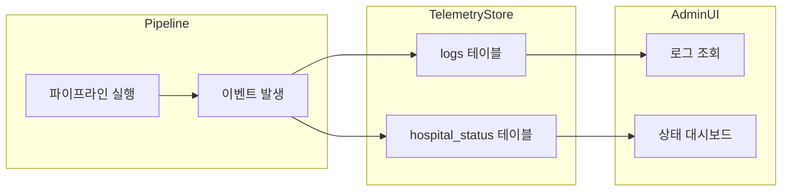
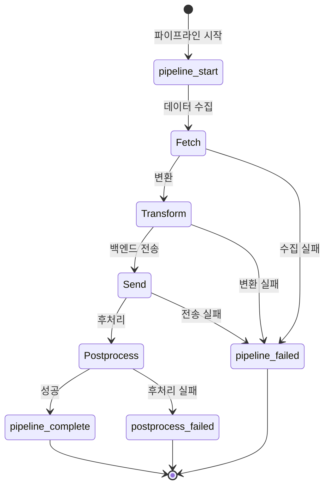

# 로깅 & 모니터링

VTC-Link는 모든 파이프라인 이벤트와 시스템 상태를 DuckDB 기반 텔레메트리 저장소에 기록합니다. 이를 통해 운영팀은 실시간 모니터링과 이력 분석을 수행할 수 있습니다.

## 아키텍처 개요



---

## DuckDB 텔레메트리 저장소

VTC-Link는 경량 임베디드 데이터베이스인 [DuckDB](https://duckdb.org/)를 텔레메트리 저장소로 사용합니다.

!!! info "왜 DuckDB인가?"
    - **제로 설정**: 별도 서버 설치 불필요
    - **빠른 분석 쿼리**: OLAP 최적화 엔진
    - **단일 파일**: 백업과 이동이 간편
    - **SQL 호환**: 표준 SQL 쿼리 지원

### 저장소 위치

```
data/telemetry.duckdb
```

환경 변수로 경로 변경 가능:

```bash
DUCKDB_PATH=data/telemetry.duckdb
```

---

## 이벤트 타입

파이프라인 실행 중 다음 이벤트가 기록됩니다:

| 이벤트 | 설명 | 발생 시점 |
|--------|------|-----------|
| `pipeline_start` | 파이프라인 실행 시작 | 데이터 수집 시작 시 |
| `pipeline_complete` | 파이프라인 정상 완료 | 모든 단계 성공 시 |
| `pipeline_failed` | 파이프라인 실패 | 예외 발생 시 |
| `postprocess_failed` | 후처리 실패 | 플래그 업데이트/로그 삽입 실패 시 |

### 이벤트 흐름



---

## 로그 레벨

표준 Python 로깅 레벨을 사용합니다:

| 레벨 | 숫자값 | 용도 |
|------|--------|------|
| `DEBUG` | 10 | 상세 디버깅 정보 |
| `INFO` | 20 | 일반 운영 정보 |
| `WARNING` | 30 | 경고 (정상 동작하나 주의 필요) |
| `ERROR` | 40 | 에러 (기능 실패) |

!!! tip "운영 환경 권장"
    운영 환경에서는 `LOG_LEVEL=INFO`를 권장합니다.
    디버깅이 필요한 경우에만 `DEBUG`로 변경하세요.

### 로그 레벨 설정

=== ".env 파일"
    ```bash
    LOG_LEVEL=INFO
    ```

=== "환경 변수"
    ```bash
    export LOG_LEVEL=DEBUG
    ```

---

## 수집 메트릭

각 파이프라인 실행 시 다음 메트릭이 수집됩니다:

### 성능 메트릭

| 메트릭 | 타입 | 설명 |
|--------|------|------|
| `duration_ms` | INTEGER | 실행 시간 (밀리초) |
| `record_count` | INTEGER | 처리된 레코드 수 |

### 상태 메트릭

| 메트릭 | 타입 | 설명 |
|--------|------|------|
| `last_run_at` | TIMESTAMP | 마지막 실행 시각 |
| `last_success_at` | TIMESTAMP | 마지막 성공 시각 |
| `last_status` | VARCHAR | 마지막 상태 (성공/실패) |
| `last_error_code` | VARCHAR | 마지막 에러 코드 |
| `postprocess_fail_count` | INTEGER | 후처리 실패 횟수 |

---

## 데이터베이스 스키마

### logs 테이블

파이프라인 실행 이력을 저장합니다.

```sql
CREATE TABLE IF NOT EXISTS logs (
    timestamp TIMESTAMP,        -- 이벤트 발생 시각 (UTC)
    level VARCHAR,              -- 로그 레벨 (DEBUG/INFO/WARNING/ERROR)
    event VARCHAR,              -- 이벤트 타입
    hospital_id VARCHAR,        -- 병원 식별자
    stage VARCHAR,              -- 파이프라인 단계
    error_code VARCHAR,         -- 에러 코드 (에러 시)
    message VARCHAR,            -- 로그 메시지
    duration_ms INTEGER,        -- 실행 시간 (밀리초)
    record_count INTEGER        -- 처리 레코드 수
);
```

!!! example "logs 테이블 데이터 예시"
    | timestamp | level | event | hospital_id | stage | error_code | message | duration_ms | record_count |
    |-----------|-------|-------|-------------|-------|------------|---------|-------------|--------------|
    | 2025-01-26T10:00:00Z | INFO | pipeline_start | HOSP_A | fetch | NULL | 수집 시작 | NULL | NULL |
    | 2025-01-26T10:00:05Z | INFO | pipeline_complete | HOSP_A | postprocess | NULL | 파이프라인 완료 | 5000 | 150 |
    | 2025-01-26T10:05:00Z | ERROR | pipeline_failed | HOSP_A | pipeline | DB_CONN_001 | 연결 실패 | NULL | NULL |

### hospital_status 테이블

병원별 현재 상태를 저장합니다 (UPSERT 방식).

```sql
CREATE TABLE IF NOT EXISTS hospital_status (
    hospital_id VARCHAR,           -- 병원 식별자 (PK)
    last_run_at TIMESTAMP,         -- 마지막 실행 시각
    last_success_at TIMESTAMP,     -- 마지막 성공 시각
    last_status VARCHAR,           -- 현재 상태 (성공/실패)
    last_error_code VARCHAR,       -- 마지막 에러 코드
    postprocess_fail_count INTEGER -- 후처리 실패 횟수
);
```

!!! example "hospital_status 테이블 데이터 예시"
    | hospital_id | last_run_at | last_success_at | last_status | last_error_code | postprocess_fail_count |
    |-------------|-------------|-----------------|-------------|-----------------|------------------------|
    | HOSP_A | 2025-01-26T10:05:00Z | 2025-01-26T10:00:05Z | 실패 | DB_CONN_001 | 1 |
    | HOSP_B | 2025-01-26T10:03:00Z | 2025-01-26T10:03:00Z | 성공 | NULL | 0 |

---

## SQL 쿼리 예제

### 로그 조회

#### 최근 로그 조회

```sql
SELECT * FROM logs
ORDER BY timestamp DESC
LIMIT 100;
```

#### 특정 병원 로그 조회

```sql
SELECT * FROM logs
WHERE hospital_id = 'HOSP_A'
ORDER BY timestamp DESC;
```

#### 에러 로그만 조회

```sql
SELECT * FROM logs
WHERE level = 'ERROR'
ORDER BY timestamp DESC;
```

#### 특정 기간 로그 조회

```sql
SELECT * FROM logs
WHERE timestamp >= '2025-01-26T00:00:00Z'
  AND timestamp < '2025-01-27T00:00:00Z'
ORDER BY timestamp;
```

### 통계 쿼리

#### 일별 파이프라인 실행 통계

```sql
SELECT
    DATE_TRUNC('day', timestamp) AS date,
    hospital_id,
    COUNT(*) FILTER (WHERE event = 'pipeline_complete') AS success_count,
    COUNT(*) FILTER (WHERE event = 'pipeline_failed') AS fail_count,
    AVG(duration_ms) FILTER (WHERE event = 'pipeline_complete') AS avg_duration_ms,
    SUM(record_count) FILTER (WHERE event = 'pipeline_complete') AS total_records
FROM logs
GROUP BY DATE_TRUNC('day', timestamp), hospital_id
ORDER BY date DESC, hospital_id;
```

#### 에러 코드별 발생 빈도

```sql
SELECT
    error_code,
    COUNT(*) AS count,
    MAX(timestamp) AS last_occurrence
FROM logs
WHERE error_code IS NOT NULL
GROUP BY error_code
ORDER BY count DESC;
```

#### 시간대별 처리량

```sql
SELECT
    DATE_TRUNC('hour', timestamp) AS hour,
    SUM(record_count) AS total_records,
    COUNT(*) AS pipeline_runs
FROM logs
WHERE event = 'pipeline_complete'
GROUP BY DATE_TRUNC('hour', timestamp)
ORDER BY hour DESC
LIMIT 24;
```

#### 병원별 성공률

```sql
SELECT
    hospital_id,
    COUNT(*) FILTER (WHERE event = 'pipeline_complete') AS success,
    COUNT(*) FILTER (WHERE event = 'pipeline_failed') AS failed,
    ROUND(
        100.0 * COUNT(*) FILTER (WHERE event = 'pipeline_complete') /
        NULLIF(COUNT(*) FILTER (WHERE event IN ('pipeline_complete', 'pipeline_failed')), 0),
        2
    ) AS success_rate
FROM logs
WHERE event IN ('pipeline_complete', 'pipeline_failed')
GROUP BY hospital_id;
```

### 상태 조회

#### 전체 병원 상태

```sql
SELECT * FROM hospital_status
ORDER BY hospital_id;
```

#### 실패 상태 병원 조회

```sql
SELECT * FROM hospital_status
WHERE last_status = '실패'
ORDER BY last_run_at DESC;
```

#### 후처리 실패가 있는 병원

```sql
SELECT * FROM hospital_status
WHERE postprocess_fail_count > 0
ORDER BY postprocess_fail_count DESC;
```

---

## 관리자 UI 모니터링

관리자 UI를 통해 웹 브라우저에서 모니터링할 수 있습니다.

### 대시보드 (`/admin/dashboard`)

대시보드에서 다음 정보를 확인할 수 있습니다:

- 전체 병원 수
- 오늘 처리 레코드 수
- 성공률
- 에러 횟수
- 최근 상태 목록
- 최근 로그 목록

### 로그 페이지 (`/admin/logs`)

- 전체 로그 목록
- 타임스탬프, 레벨, 이벤트, 병원ID 필터링

### 상태 페이지 (`/admin/status`)

- 병원별 현재 상태
- 마지막 실행/성공 시각
- 에러 코드 표시

---

## 모니터링 베스트 프랙티스

### 알람 설정 권장 조건

!!! warning "즉시 대응 필요"
    - `pipeline_failed` 이벤트 연속 3회 이상
    - `postprocess_fail_count` > 5
    - 1시간 동안 `pipeline_complete` 이벤트 없음

!!! note "주의 관찰"
    - 평균 `duration_ms`가 평소의 2배 이상
    - 에러 로그 급증
    - 특정 병원 성공률 80% 미만

### 정기 점검 항목

=== "일간"
    - [ ] 전체 병원 상태 확인
    - [ ] 에러 로그 검토
    - [ ] 처리량 추이 확인

=== "주간"
    - [ ] 병원별 성공률 분석
    - [ ] 에러 코드별 통계 검토
    - [ ] 성능 추이 분석 (duration_ms)

=== "월간"
    - [ ] 로그 데이터 아카이빙
    - [ ] DuckDB 파일 백업
    - [ ] 장기 성능 트렌드 분석

### 로그 보관 정책

```sql
-- 90일 이상된 로그 삭제 (예시)
DELETE FROM logs
WHERE timestamp < NOW() - INTERVAL '90 days';
```

!!! tip "백업 권장"
    로그 삭제 전 반드시 DuckDB 파일을 백업하세요:
    ```bash
    cp data/telemetry.duckdb data/telemetry_backup_$(date +%Y%m%d).duckdb
    ```

### DuckDB CLI 접속

```bash
# DuckDB CLI 설치 후
duckdb data/telemetry.duckdb

# 테이블 확인
.tables

# 스키마 확인
.schema logs
.schema hospital_status

# 쿼리 실행
SELECT COUNT(*) FROM logs;
```

---

## 문제 해결

### 로그가 기록되지 않는 경우

1. DuckDB 파일 경로 확인
   ```bash
   ls -la data/telemetry.duckdb
   ```

2. 디렉토리 쓰기 권한 확인
   ```bash
   touch data/test.txt && rm data/test.txt
   ```

3. 환경 변수 확인
   ```bash
   echo $DUCKDB_PATH
   ```

### DuckDB 파일 손상 시

```bash
# 백업 파일에서 복구
cp data/telemetry_backup_*.duckdb data/telemetry.duckdb

# 또는 새로 시작 (로그 유실)
rm data/telemetry.duckdb
# 애플리케이션 재시작 시 자동 생성
```

### 대용량 로그 성능 이슈

```sql
-- 인덱스 생성 (조회 성능 개선)
CREATE INDEX IF NOT EXISTS idx_logs_timestamp ON logs(timestamp);
CREATE INDEX IF NOT EXISTS idx_logs_hospital ON logs(hospital_id);
CREATE INDEX IF NOT EXISTS idx_logs_level ON logs(level);
```
