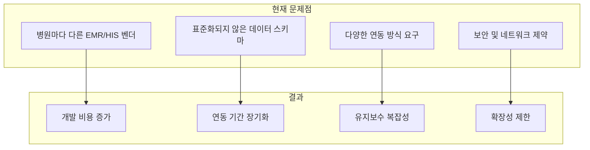
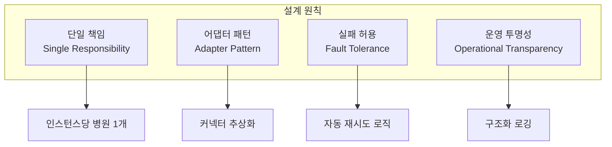
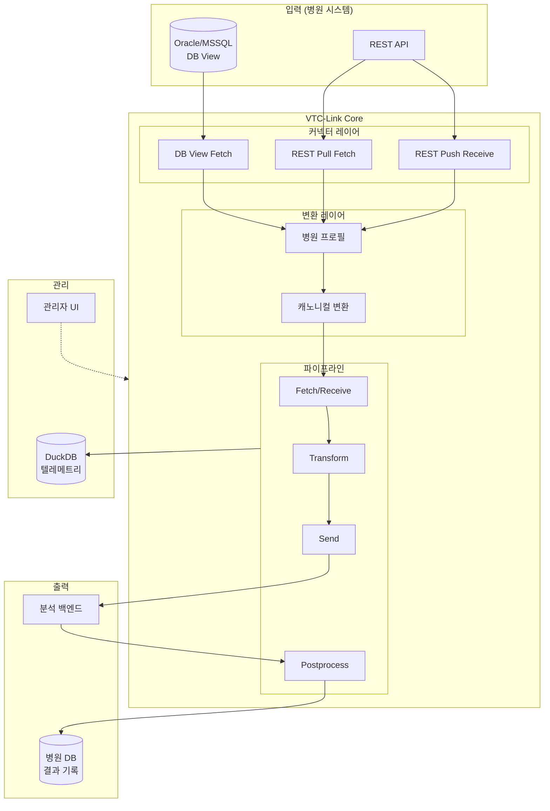

# 개요

## 문제 정의

### 의료 데이터 연동의 현실

국내 의료 기관의 IT 환경은 다음과 같은 특성을 가집니다:



#### 1. 다양한 EMR/HIS 시스템

국내 병원들은 다양한 EMR(Electronic Medical Record) 및 HIS(Hospital Information System) 벤더 제품을 사용합니다:

| 병원 규모 | 주로 사용하는 시스템 |
|----------|---------------------|
| 상급종합병원 | 자체 개발, BESTCARE, EZDOCSYS |
| 종합병원 | ezCaretech, 유비케어, 인성정보 |
| 중소병원 | 비트컴퓨터, 엠디웨어, 포인트닉스 |

각 시스템마다 데이터 구조, 코드 체계, API 규격이 상이하여 **동일한 '환자 생체신호' 데이터도 완전히 다른 형태**로 저장됩니다.

#### 2. 표준화되지 않은 데이터 스키마

!!! example "동일한 정보, 다른 표현"

    === "병원 A (Oracle)"
        ```sql
        SELECT
            PT_NO as patient_id,
            PT_NM as patient_name,
            BIRTH_DT as birthdate,
            SEX_CD as sex,  -- 'M', 'F'
            SBP, DBP, PR, RR, BT, SPO2
        FROM VITAL_SIGN_V
        ```

    === "병원 B (MSSQL)"
        ```sql
        SELECT
            환자번호 as PatientNo,
            성명 as Name,
            생년월일 as Birthday,
            성별코드 as GenderCode,  -- '1', '2'
            수축기혈압, 이완기혈압, 맥박, 호흡, 체온, 산소포화도
        FROM dbo.VitalSignView
        ```

    === "병원 C (REST API)"
        ```json
        {
            "patient": {
                "id": "P12345",
                "fullName": "홍길동",
                "dob": "1990-01-15",
                "gender": "male"
            },
            "measurements": {
                "systolic": 120,
                "diastolic": 80,
                "heartRate": 72
            }
        }
        ```

#### 3. 연동 방식의 다양성

병원의 보안 정책과 기술 역량에 따라 요구하는 연동 방식이 다릅니다:

| 연동 방식 | 병원 요구 사항 | 기술적 특성 |
|----------|---------------|-------------|
| DB View Pull | "우리 DB에 읽기 전용 뷰를 제공하겠다" | 병원 DB에 직접 접근 |
| REST API Pull | "API를 제공할 테니 주기적으로 호출해라" | HTTP 폴링 방식 |
| REST API Push | "우리가 데이터를 밀어넣겠다" | Webhook 방식 |
| DB Insert Push | "분석 결과를 우리 DB에 넣어달라" | 양방향 DB 연동 |

#### 4. 보안 및 네트워크 제약

의료 데이터의 민감성으로 인해 다양한 제약이 존재합니다:

- 폐쇄망 환경에서의 온프레미스 배포 요구
- 병원 방화벽 정책으로 인한 아웃바운드 제한
- 의료정보 보호법(개인정보보호법) 준수 필요
- 단방향 데이터 전송 요구 (데이터 다이오드)

---

## 솔루션: VTC-Link

### 설계 원칙

VTC-Link는 다음 원칙에 따라 설계되었습니다:



#### 1. 단일 책임 원칙

- **인스턴스당 병원 1개**: 각 VTC-Link 인스턴스는 단일 병원만 담당
- 병원별 설정 격리로 장애 영향 범위 최소화
- 독립적인 스케일링과 배포 가능

#### 2. 어댑터 패턴

- **커넥터 추상화**: 데이터 소스 유형과 관계없이 동일한 파이프라인 처리
- **변환 프로필**: 병원별 맵핑 로직을 프로필로 캡슐화
- 새로운 병원 추가 시 커넥터/프로필만 구성

#### 3. 실패 허용 설계

- 파이프라인 각 단계별 에러 핸들링
- 후처리 실패 시 설정 가능한 재시도 로직 (기본 3회)
- 네트워크 타임아웃 및 DB 연결 오류 복구

#### 4. 운영 투명성

- DuckDB 기반 구조화 로깅
- 관리자 UI에서 실시간 상태 확인
- 에러 코드 체계로 빠른 문제 진단

---

### 솔루션 아키텍처



---

## 사용 사례

### 사례 1: 상급종합병원 Oracle DB 연동

!!! info "시나리오"
    대학병원에서 Oracle DB에 생체신호 뷰를 제공하고, 5분 주기로 데이터를 수집하여 AI 분석 서버로 전송

```yaml
# hospitals.yaml
hospital:
  hospital_id: "UNIV_HOSP_A"
  connector_type: "pull_db_view"
  enabled: true
  schedule_minutes: 5
  transform_profile: "UNIV_HOSP_A"
  db:
    type: "oracle"
    host: "10.0.1.100"
    port: 1521
    service: "EMRDB"
    username: "vtc_reader"
    password: "${ORACLE_PASSWORD}"
    view_name: "VITAL_SIGN_VIEW"
  postprocess:
    mode: "update_flag"
    table: "VITAL_SIGN_VIEW"
    key_column: "VITAL_ID"
    key_value_source: "vital_id"
    flag_column: "SENT_YN"
    flag_value: "Y"
```

**데이터 흐름:**

1. APScheduler가 5분마다 파이프라인 트리거
2. Oracle DB 뷰에서 `SENT_YN = 'N'`인 레코드 조회
3. 병원 프로필에 따라 캐노니컬 형식으로 변환
4. 백엔드 분석 서버로 전송
5. 응답 수신 후 `SENT_YN = 'Y'`로 업데이트

---

### 사례 2: 중소병원 REST API 연동

!!! info "시나리오"
    중소병원에서 RESTful API를 제공하고, 3분 주기로 데이터를 수집

```yaml
# hospitals.yaml
hospital:
  hospital_id: "LOCAL_CLINIC_B"
  connector_type: "pull_rest_api"
  enabled: true
  schedule_minutes: 3
  transform_profile: "LOCAL_CLINIC_B"
  api:
    url: "https://api.clinic-b.local/vitals/pending"
    api_key: "${CLINIC_B_API_KEY}"
```

**변환 프로필 예시:**

```python
# transforms/hospital_profiles/LOCAL_CLINIC_B/inbound.py
def to_canonical(raw: dict) -> CanonicalPayload:
    return CanonicalPayload(
        patient=Patient(
            patient_id=raw["patientNo"],
            patient_name=raw.get("patientName"),
            birthdate=raw["birthday"].replace("-", ""),
            sex="M" if raw["gender"] == "male" else "F",
            ward=raw.get("ward"),
            department=raw.get("dept")
        ),
        vitals=Vitals(
            SBP=int(raw["bp"]["systolic"]),
            DBP=int(raw["bp"]["diastolic"]),
            PR=int(raw["heartRate"]),
            RR=int(raw.get("respRate", 18)),
            BT=float(raw["temperature"]),
            SpO2=float(raw.get("spo2", 98.0))
        ),
        timestamps=Timestamps(
            created_at=datetime.now(timezone.utc).isoformat(),
            updated_at=datetime.now(timezone.utc).isoformat()
        )
    )
```

---

### 사례 3: 실시간 푸시 연동

!!! info "시나리오"
    병원에서 환자 상태 변화 시 실시간으로 VTC-Link에 데이터를 푸시

```yaml
# hospitals.yaml
hospital:
  hospital_id: "REALTIME_HOSP_C"
  connector_type: "push_rest_api"
  enabled: true
  transform_profile: "REALTIME_HOSP_C"
  postprocess:
    mode: "insert_log"
    table: "AI_ANALYSIS_LOG"
    columns: ["VITAL_ID", "PATIENT_ID", "NEWS_SCORE", "PROCESSED_AT"]
    sources:
      VITAL_ID: "vital_id"
      PATIENT_ID: "patient_id"
      NEWS_SCORE: "NEWS"
    values:
      PROCESSED_AT: "CURRENT_TIMESTAMP"
```

**병원 시스템에서 호출:**

```bash
curl -X POST http://vtc-link.hospital.local:8000/push \
  -H "Content-Type: application/json" \
  -d '{
    "patient_id": "P12345",
    "vital_id": "V67890",
    "sbp": 140,
    "dbp": 90,
    "pr": 88,
    ...
  }'
```

---

## 기대 효과

### 정량적 효과

| 지표 | 기존 방식 | VTC-Link 적용 후 |
|------|----------|------------------|
| 신규 병원 연동 기간 | 4-8주 | 1-2주 |
| 병원별 개발 코드량 | 500-1000 LOC | 50-100 LOC (프로필만) |
| 장애 복구 시간 | 수시간 | 수분 (자동 재시도) |
| 운영 모니터링 | 수동 확인 | 실시간 대시보드 |

### 정성적 효과

- **개발팀**: 반복적인 연동 작업에서 해방, 핵심 기능 개발에 집중
- **운영팀**: 통합된 모니터링과 로깅으로 운영 효율화
- **병원**: 유연한 연동 옵션으로 기존 시스템 변경 최소화
- **환자**: 빠른 연동으로 AI 조기경보 서비스 조기 적용

---

## 다음 단계

VTC-Link의 기술적 세부 사항을 알아보려면 다음 문서를 참고하세요:

- [아키텍처](architecture.md) - 시스템 구조와 컴포넌트 상세
- [데이터 모델](data-model.md) - 캐노니컬 스키마 정의
- [커넥터](connectors.md) - 4가지 커넥터 타입 상세 가이드
