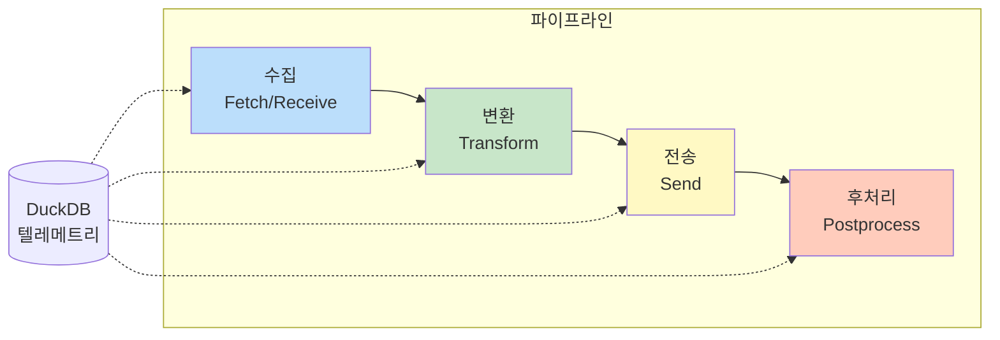
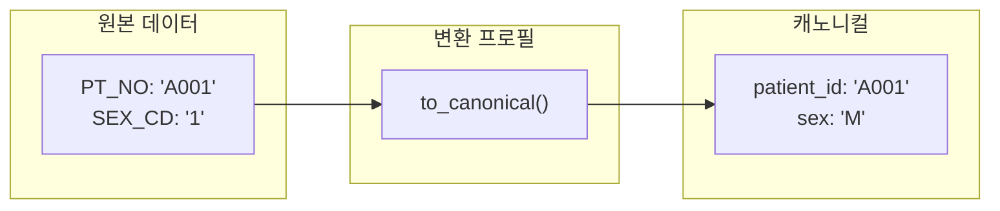
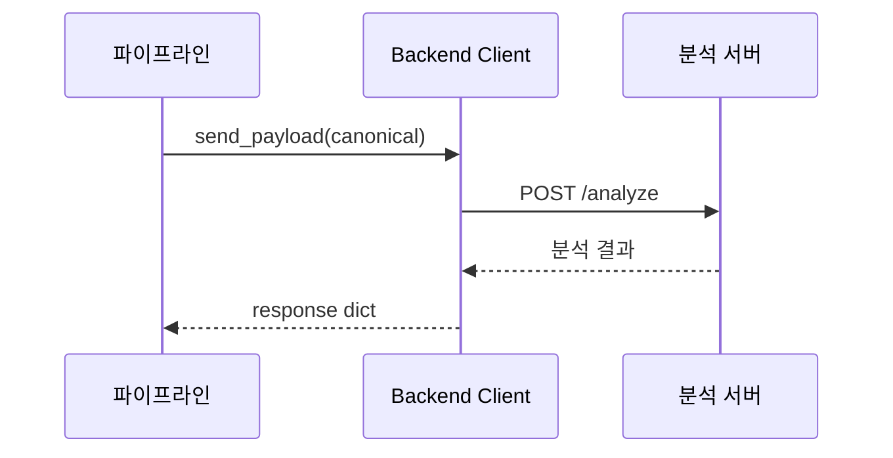
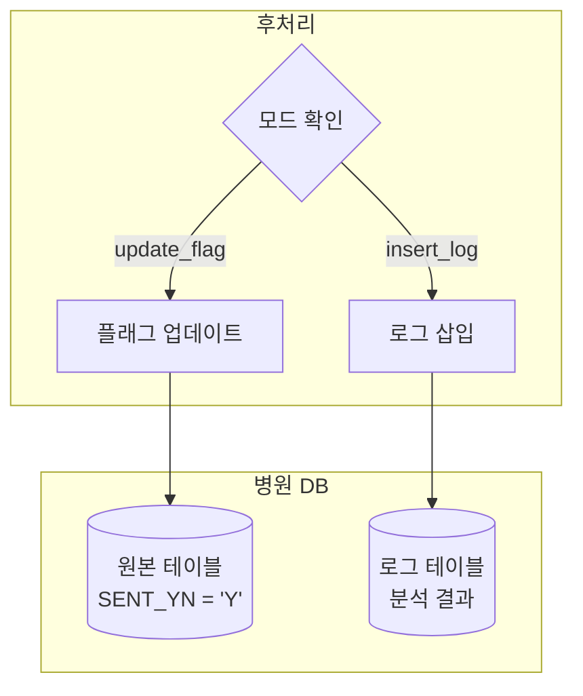
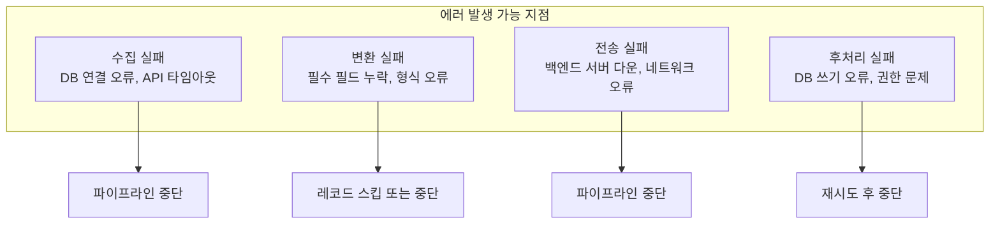

# 파이프라인

## 개요

파이프라인은 VTC-Link의 핵심 데이터 처리 흐름입니다.
**수집 → 변환 → 전송 → 후처리**의 4단계로 구성되며, 각 단계별 에러 처리와 로깅이 구현되어 있습니다.



---

## 파이프라인 단계

### 1단계: 수집 (Fetch/Receive)

데이터 소스에서 원본 레코드를 가져옵니다.

=== "Pull 방식"
    ```mermaid
    sequenceDiagram
        participant S as 스케줄러
        participant P as 파이프라인
        participant C as 커넥터
        participant DB as 데이터 소스

        S->>P: 트리거 (N분 주기)
        P->>C: fetch_records()
        C->>DB: SELECT / GET
        DB-->>C: 원본 레코드
        C-->>P: list[dict]
    ```

=== "Push 방식"
    ```mermaid
    sequenceDiagram
        participant H as 병원 시스템
        participant API as /push 엔드포인트
        participant C as 커넥터

        H->>API: POST /push (payload)
        API->>C: receive_payload()
        C-->>API: list[dict]
    ```

#### 커넥터 선택 로직

```python
# app/core/pipeline.py
def run_pull_pipeline(hospital: HospitalConfig) -> None:
    if hospital.connector_type == "pull_db_view" and hospital.db:
        if hospital.db.get("type") == "oracle":
            raw_records = fetch_oracle(hospital)
        elif hospital.db.get("type") == "mssql":
            raw_records = fetch_mssql(hospital)
    elif hospital.connector_type == "pull_rest_api":
        raw_records = fetch_rest(hospital)
```

### 2단계: 변환 (Transform)

병원별 원본 데이터를 캐노니컬(정규화) 형식으로 변환합니다.



#### 변환 코드

```python
# 레코드별 변환
canonical_records = [to_canonical(raw).model_dump() for raw in raw_records]
```

!!! warning "변환 실패 처리"
    변환 중 에러 발생 시 해당 레코드만 스킵하고 계속 진행하거나,
    전체 파이프라인을 중단할 수 있습니다.
    현재 구현은 예외 발생 시 파이프라인을 중단합니다.

### 3단계: 전송 (Send)

캐노니컬 페이로드를 백엔드 분석 서버로 전송합니다.



#### 백엔드 클라이언트 코드

```python
# app/clients/backend_api.py
def send_payload(payload: dict) -> dict:
    """백엔드 API로 페이로드를 전송"""
    settings = get_settings()
    headers = {}
    if settings.backend_api_key:
        headers["Authorization"] = f"Bearer {settings.backend_api_key}"

    with httpx.Client(timeout=10.0) as client:
        response = client.post(
            settings.backend_base_url,
            json=payload,
            headers=headers
        )
        response.raise_for_status()
        return response.json()
```

### 4단계: 후처리 (Postprocess)

백엔드 응답 수신 후 병원 시스템에 결과를 반영합니다.



---

## 전체 파이프라인 코드

```python
# app/core/pipeline.py
def run_pull_pipeline(hospital: HospitalConfig) -> None:
    """풀 방식 병원의 파이프라인을 실행"""
    start = datetime.now(timezone.utc)
    log_event("pipeline_start", "INFO", hospital.hospital_id, "fetch", "수집 시작")

    try:
        # 1단계: 수집
        if hospital.connector_type == "pull_db_view" and hospital.db:
            if hospital.db.get("type") == "oracle":
                raw_records = fetch_oracle(hospital)
            elif hospital.db.get("type") == "mssql":
                raw_records = fetch_mssql(hospital)
            else:
                raw_records = []
        elif hospital.connector_type == "pull_rest_api":
            raw_records = fetch_rest(hospital)
        else:
            raw_records = []

        # 2단계: 변환
        canonical_records = [to_canonical(raw).model_dump() for raw in raw_records]

        # 3단계 & 4단계: 전송 및 후처리
        postprocess_ok = True
        for record in canonical_records:
            backend_payload = to_backend(CanonicalPayload(**record))
            response = send_payload(backend_payload)
            _ = from_backend(response)

            postprocess_ok, postprocess_code = run_postprocess(hospital, record)
            if not postprocess_ok:
                log_event(
                    "postprocess_failed", "ERROR",
                    hospital.hospital_id, "postprocess",
                    "후처리 실패",
                    error_code=postprocess_code,
                    record_count=1
                )
                break

        # 완료 로깅
        log_event(
            "pipeline_complete", "INFO",
            hospital.hospital_id, "postprocess",
            "파이프라인 완료",
            record_count=len(canonical_records),
            duration_ms=int((datetime.now(timezone.utc) - start).total_seconds() * 1000)
        )

        # 상태 업데이트
        TelemetryStore().update_status({
            "hospital_id": hospital.hospital_id,
            "last_run_at": datetime.now(timezone.utc).isoformat().replace("+00:00", "Z"),
            "last_success_at": datetime.now(timezone.utc).isoformat().replace("+00:00", "Z"),
            "last_status": "성공",
            "last_error_code": None,
            "postprocess_fail_count": 0 if postprocess_ok else 1
        })

    except Exception as exc:
        log_event(
            "pipeline_failed", "ERROR",
            hospital.hospital_id, "pipeline",
            str(exc)
        )
        TelemetryStore().update_status({
            "hospital_id": hospital.hospital_id,
            "last_run_at": datetime.now(timezone.utc).isoformat().replace("+00:00", "Z"),
            "last_status": "실패",
            "last_error_code": "PIPE_STAGE_001",
            "postprocess_fail_count": 1
        })
```

---

## 에러 처리

### 에러 발생 지점



### 에러별 처리 전략

| 에러 유형 | 처리 방식 | 재시도 |
|----------|----------|:------:|
| DB 연결 실패 | 파이프라인 중단, 에러 로깅 | X |
| API 타임아웃 | 파이프라인 중단, 에러 로깅 | X |
| 변환 실패 | 파이프라인 중단 (현재 구현) | X |
| 백엔드 전송 실패 | 파이프라인 중단 | X |
| 후처리 실패 | 설정된 횟수만큼 재시도 | O (기본 3회) |

### 후처리 재시도 로직

```python
# app/core/postprocess.py
def run_postprocess(
    hospital: HospitalConfig, record: dict | None = None
) -> tuple[bool, str | None]:
    """후처리를 실행 (재시도 포함)"""
    if hospital.postprocess is None:
        return True, None

    retries = int(hospital.postprocess.get("retry", 3))
    last_ok = False
    last_code: str | None = "POSTPROCESS_FAILED"

    for _ in range(retries):
        last_ok, last_code = _run_postprocess_once(hospital, record)
        if last_ok:
            return True, None

    return last_ok, last_code
```

---

## 응답 전처리

백엔드 응답을 클라이언트 응답 규격으로 정규화합니다.

### 변환 규칙

| 필드 | 변환 규칙 |
|------|----------|
| `screened_date` | `YYYYMMDD HH:MM:SS` 형식으로 변환 |
| `SEPS`, `MAES`, `MORS`, `NEWS`, `MEWS` | 정수로 변환, 실패 시 0 |

### 아웃바운드 변환 예시

```python
# app/transforms/hospital_profiles/HOSP_A/outbound.py
def from_backend(response: dict) -> dict:
    """백엔드 응답을 클라이언트 응답으로 변환"""
    return {
        "vital_id": str(response.get("vital_id", "")),
        "patient_id": str(response.get("patient_id", "")),
        "screened_type": str(response.get("screened_type", "")),
        "screened_date": _format_screened_date(response.get("screened_date")),
        "SEPS": _to_int(response.get("SEPS")),
        "MAES": _to_int(response.get("MAES")),
        "MORS": _to_int(response.get("MORS")),
        "NEWS": _to_int(response.get("NEWS")),
        "MEWS": _to_int(response.get("MEWS")),
        "created_at": str(response.get("created_at", "")),
        "updated_at": str(response.get("updated_at", "")),
    }


def _to_int(value) -> int:
    """정수로 변환, 실패 시 0"""
    try:
        return int(value)
    except (TypeError, ValueError):
        return 0


def _format_screened_date(value) -> str:
    """YYYYMMDD HH:MM:SS 형식으로 변환"""
    if not value:
        return ""
    # 구현...
```

---

## 스케줄링

APScheduler를 사용하여 Pull 방식 파이프라인을 주기적으로 실행합니다.

### 스케줄러 설정

```python
# app/core/scheduler.py
from apscheduler.schedulers.background import BackgroundScheduler

scheduler = BackgroundScheduler()


def start_scheduler(config: AppConfig) -> None:
    """스케줄러 시작"""
    hospital = config.hospital

    if hospital.enabled and hospital.connector_type.startswith("pull_"):
        scheduler.add_job(
            run_pull_pipeline,
            'interval',
            minutes=hospital.schedule_minutes,
            args=[hospital],
            id=f"pipeline_{hospital.hospital_id}",
            replace_existing=True
        )

    if not scheduler.running:
        scheduler.start()
```

### 스케줄 재시작

설정 변경 시 스케줄러를 재시작합니다.

```python
# app/api/admin.py
@router.post("/config")
async def save_config(request: Request):
    # ... 설정 저장 ...

    if get_settings().scheduler_enabled:
        start_scheduler(reload_app_config())

    return templates.TemplateResponse(...)
```

---

## 로깅

### 이벤트 타입

| 이벤트 | 레벨 | 단계 | 설명 |
|--------|:----:|------|------|
| `pipeline_start` | INFO | fetch | 파이프라인 시작 |
| `pipeline_complete` | INFO | postprocess | 파이프라인 성공 완료 |
| `pipeline_failed` | ERROR | pipeline | 파이프라인 실패 |
| `postprocess_failed` | ERROR | postprocess | 후처리 실패 |

### 로그 필드

```python
log_event(
    event="pipeline_complete",
    level="INFO",
    hospital_id="HOSP_A",
    stage="postprocess",
    message="파이프라인 완료",
    error_code=None,
    record_count=10,
    duration_ms=1500
)
```

### DuckDB 로그 테이블

```sql
CREATE TABLE logs (
    timestamp TIMESTAMP,
    level VARCHAR,
    event VARCHAR,
    hospital_id VARCHAR,
    stage VARCHAR,
    error_code VARCHAR,
    message VARCHAR,
    duration_ms INTEGER,
    record_count INTEGER
)
```

---

## 상태 관리

### 상태 필드

| 필드 | 설명 |
|------|------|
| `hospital_id` | 병원 식별자 |
| `last_run_at` | 마지막 실행 시각 |
| `last_success_at` | 마지막 성공 시각 |
| `last_status` | 마지막 실행 결과 (성공/실패) |
| `last_error_code` | 마지막 에러 코드 |
| `postprocess_fail_count` | 후처리 실패 횟수 |

### 상태 업데이트

```python
TelemetryStore().update_status({
    "hospital_id": hospital.hospital_id,
    "last_run_at": datetime.now(timezone.utc).isoformat().replace("+00:00", "Z"),
    "last_success_at": datetime.now(timezone.utc).isoformat().replace("+00:00", "Z"),
    "last_status": "성공",
    "last_error_code": None,
    "postprocess_fail_count": 0
})
```

---

## 성능 고려사항

### 배치 처리

현재 구현은 레코드를 하나씩 처리합니다.
대량 데이터의 경우 배치 처리를 고려할 수 있습니다.

```python
# 현재: 레코드별 처리
for record in canonical_records:
    response = send_payload(to_backend(record))
    run_postprocess(hospital, record)

# 개선안: 배치 처리 (미구현)
# responses = send_payloads_batch(canonical_records)
# run_postprocess_batch(hospital, canonical_records, responses)
```

### 타임아웃 설정

| 작업 | 현재 타임아웃 | 권장 |
|------|:-----------:|:----:|
| DB 연결 | 30초 | 30초 |
| DB 쿼리 | 60초 | 환경에 따라 조정 |
| HTTP 요청 | 10초 | 10-30초 |

---

## 다음 단계

- [후처리](postprocess.md) - update_flag, insert_log 모드 상세
- [로깅 & 모니터링](logging-monitoring.md) - 텔레메트리 시스템
- [에러 코드](error-codes.md) - 에러 코드 레퍼런스
