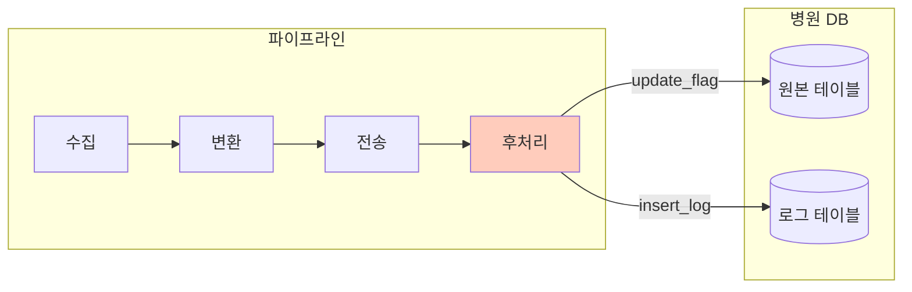
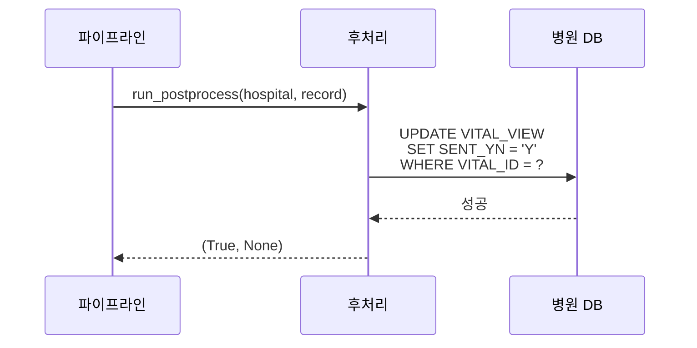
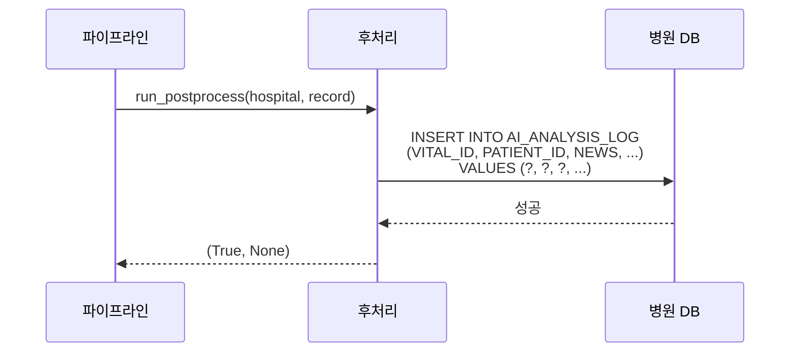
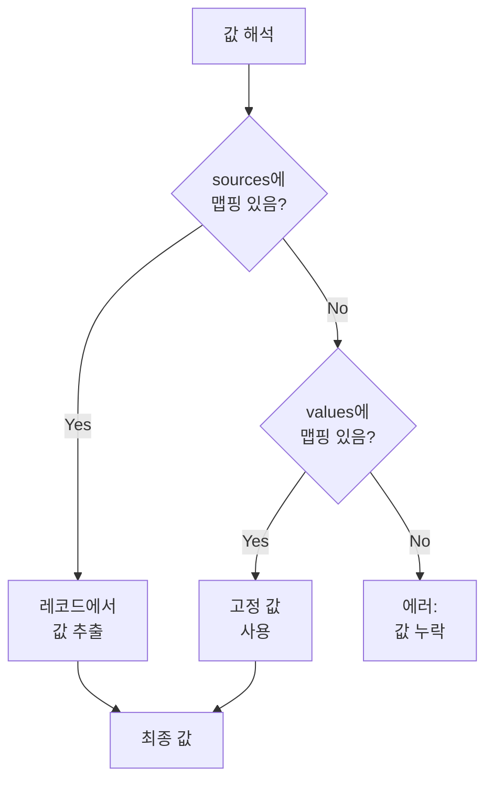
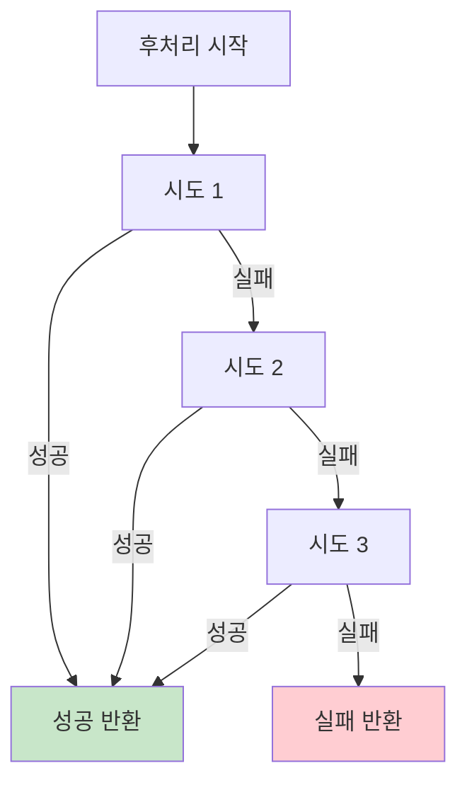

# 후처리 (Postprocess)

## 개요

후처리는 파이프라인 성공 후 병원 시스템에 상태를 반영하는 단계입니다.
백엔드 분석이 완료된 후 병원 데이터베이스에 처리 결과를 기록합니다.



---

## 후처리 모드

### 1. update_flag

원본 데이터 테이블의 플래그 컬럼을 업데이트합니다.
"이 레코드는 이미 처리되었음"을 표시하여 중복 처리를 방지합니다.



#### 설정 예시

```yaml
postprocess:
  mode: "update_flag"
  table: "VITAL_SIGN_VIEW"
  key_column: "VITAL_ID"
  key_value_source: "vital_id"  # 레코드에서 키 값 추출
  flag_column: "SENT_YN"
  flag_value: "Y"
  retry: 3
```

#### 설정 필드

| 필드 | 필수 | 설명 | 예시 |
|------|:----:|------|------|
| `mode` | O | 후처리 모드 | `"update_flag"` |
| `table` | O | 업데이트 대상 테이블 | `"VITAL_SIGN_VIEW"` |
| `key_column` | O | 레코드 식별 컬럼 | `"VITAL_ID"` |
| `key_value` | X | 고정 키 값 | `"V001"` |
| `key_value_source` | X | 레코드에서 키 값을 추출할 필드 | `"vital_id"` |
| `flag_column` | O | 플래그 컬럼 | `"SENT_YN"` |
| `flag_value` | O | 설정할 플래그 값 | `"Y"` |
| `retry` | X | 재시도 횟수 (기본: 3) | `3` |

!!! info "key_value vs key_value_source"
    - `key_value`: 고정된 값을 사용할 때
    - `key_value_source`: 각 레코드에서 동적으로 키 값을 추출할 때

    대부분의 경우 `key_value_source`를 사용합니다.

#### 생성되는 SQL

```sql
UPDATE VITAL_SIGN_VIEW
SET SENT_YN = 'Y'
WHERE VITAL_ID = ?
```

---

### 2. insert_log

분석 결과를 별도의 로그 테이블에 삽입합니다.
병원에서 AI 분석 결과를 자체 시스템에서 활용할 때 사용합니다.



#### 설정 예시

```yaml
postprocess:
  mode: "insert_log"
  table: "AI_ANALYSIS_LOG"
  columns:
    - "VITAL_ID"
    - "PATIENT_ID"
    - "NEWS"
    - "MEWS"
    - "PROCESSED_AT"
  sources:
    VITAL_ID: "vital_id"        # 레코드 필드에서 추출
    PATIENT_ID: "patient_id"
    NEWS: "NEWS"
    MEWS: "MEWS"
  values:
    PROCESSED_AT: "CURRENT_TIMESTAMP"  # 고정 값
  retry: 3
```

#### 설정 필드

| 필드 | 필수 | 설명 | 예시 |
|------|:----:|------|------|
| `mode` | O | 후처리 모드 | `"insert_log"` |
| `table` | O | 삽입 대상 테이블 | `"AI_ANALYSIS_LOG"` |
| `columns` | O | 삽입할 컬럼 목록 | `["VITAL_ID", "NEWS", ...]` |
| `sources` | X | 레코드 필드 맵핑 | `{VITAL_ID: "vital_id"}` |
| `values` | X | 고정 값 맵핑 | `{PROCESSED_AT: "..."}` |
| `retry` | X | 재시도 횟수 (기본: 3) | `3` |

!!! warning "columns 순서"
    `columns`에 나열된 순서대로 값이 삽입됩니다.
    각 컬럼은 `sources` 또는 `values`에 맵핑되어야 합니다.

#### 생성되는 SQL

```sql
INSERT INTO AI_ANALYSIS_LOG
    (VITAL_ID, PATIENT_ID, NEWS, MEWS, PROCESSED_AT)
VALUES
    (?, ?, ?, ?, ?)
```

---

## 값 해석 로직

후처리에서 값을 결정하는 우선순위:



### 코드 구현

```python
# app/core/postprocess.py
def _resolve_value(source: str | None, record: dict | None, fallback: object) -> object:
    """값 해석

    Args:
        source: 레코드 키 (sources 맵핑)
        record: 레코드 데이터
        fallback: 기본값 (values 맵핑)

    Returns:
        해석된 값
    """
    if record is None or source is None:
        return fallback
    if source == "":
        return fallback
    return record.get(source, fallback)
```

### 예시

```yaml
columns: ["VITAL_ID", "SCORE", "STATUS"]
sources:
  VITAL_ID: "vital_id"   # 레코드의 vital_id 필드 사용
  SCORE: "NEWS"          # 레코드의 NEWS 필드 사용
values:
  STATUS: "PROCESSED"    # 고정 값 사용
```

레코드가 `{"vital_id": "V001", "NEWS": 5}`인 경우:
- `VITAL_ID` → `"V001"` (sources에서)
- `SCORE` → `5` (sources에서)
- `STATUS` → `"PROCESSED"` (values에서)

---

## 재시도 로직

후처리는 파이프라인의 마지막 단계로, 실패 시 설정된 횟수만큼 재시도합니다.



### 재시도 코드

```python
def run_postprocess(
    hospital: HospitalConfig, record: dict | None = None
) -> tuple[bool, str | None]:
    """후처리를 실행 (재시도 포함)"""
    if hospital.postprocess is None:
        return True, None

    retries = int(hospital.postprocess.get("retry", 3))
    last_ok = False
    last_code: str | None = "POSTPROCESS_FAILED"

    for _ in range(retries):
        last_ok, last_code = _run_postprocess_once(hospital, record)
        if last_ok:
            return True, None

    return last_ok, last_code
```

!!! tip "재시도 설정"
    `retry` 값을 조정하여 재시도 횟수를 변경할 수 있습니다.
    기본값은 3회입니다.

---

## update_flag 구현

```python
def _update_flag(
    hospital: HospitalConfig, record: dict | None
) -> tuple[bool, str | None]:
    """플래그 업데이트"""
    if not hospital.db or not hospital.postprocess:
        return False, "POSTPROCESS_CONFIG_MISSING"

    table = hospital.postprocess.get("table")
    key_column = hospital.postprocess.get("key_column")
    flag_column = hospital.postprocess.get("flag_column")
    flag_value = hospital.postprocess.get("flag_value")

    # 키 값 해석
    key_value = _resolve_value(
        hospital.postprocess.get("key_value_source"),
        record,
        hospital.postprocess.get("key_value")
    )

    if not all([table, key_column, flag_column]):
        return False, "POSTPROCESS_CONFIG_MISSING"
    if key_value is None:
        return False, "POSTPROCESS_KEY_MISSING"

    # SQL 실행
    query = f"UPDATE {table} SET {flag_column} = ? WHERE {key_column} = ?"
    values = [flag_value, key_value]

    if hospital.db.get("type") == "oracle":
        with oracle_connection(hospital.db) as conn:
            cursor = conn.cursor()
            cursor.execute(query, values)
            conn.commit()
        return True, None

    if hospital.db.get("type") == "mssql":
        with mssql_connection(hospital.db) as conn:
            cursor = conn.cursor()
            cursor.execute(query, values)
            conn.commit()
        return True, None

    return False, "POSTPROCESS_DB_UNSUPPORTED"
```

---

## insert_log 구현

```python
def _insert_log(
    hospital: HospitalConfig, record: dict | None
) -> tuple[bool, str | None]:
    """로그 테이블 삽입"""
    if not hospital.db or not hospital.postprocess:
        return False, "POSTPROCESS_CONFIG_MISSING"

    table = hospital.postprocess.get("table")
    columns = hospital.postprocess.get("columns", [])
    values_map = hospital.postprocess.get("values", {})
    sources_map = hospital.postprocess.get("sources", {})

    if not table or not columns:
        return False, "POSTPROCESS_CONFIG_MISSING"

    # 값 해석
    values = [
        _resolve_value(sources_map.get(col), record, values_map.get(col))
        for col in columns
    ]

    if any(value is None for value in values):
        return False, "POSTPROCESS_VALUE_MISSING"

    # SQL 생성
    placeholders = ", ".join(["?"] * len(columns))
    column_sql = ", ".join(columns)
    query = f"INSERT INTO {table} ({column_sql}) VALUES ({placeholders})"

    # SQL 실행 (Oracle/MSSQL)
    # ...
```

---

## 에러 코드

| 에러 코드 | 설명 | 해결 방법 |
|----------|------|----------|
| `POSTPROCESS_CONFIG_MISSING` | 필수 설정 누락 | `hospitals.yaml` 확인 |
| `POSTPROCESS_KEY_MISSING` | 키 값 없음 | `key_value` 또는 `key_value_source` 확인 |
| `POSTPROCESS_VALUE_MISSING` | 삽입 값 누락 | `columns`의 모든 컬럼이 맵핑되었는지 확인 |
| `POSTPROCESS_DB_UNSUPPORTED` | 지원하지 않는 DB 타입 | `oracle` 또는 `mssql`만 지원 |
| `POSTPROCESS_FAILED` | 일반 실패 | DB 연결 및 권한 확인 |

---

## 설정 유효성 검사

관리자 UI에서 설정 저장 시 후처리 설정을 검증합니다.

```python
# app/api/admin.py
def _validate_hospital(hospital: dict) -> list[str]:
    errors: list[str] = []
    postprocess = hospital.get("postprocess") or {}
    post_mode = str(postprocess.get("mode", "")).strip()

    if post_mode:
        if post_mode not in {"update_flag", "insert_log"}:
            errors.append("postprocess.mode 값 오류")

        if post_mode == "update_flag":
            if not str(postprocess.get("table", "")).strip():
                errors.append("postprocess.table 필요")
            if not str(postprocess.get("key_column", "")).strip():
                errors.append("postprocess.key_column 필요")
            if not str(postprocess.get("flag_column", "")).strip():
                errors.append("postprocess.flag_column 필요")
            key_value = str(postprocess.get("key_value", "")).strip()
            key_source = str(postprocess.get("key_value_source", "")).strip()
            if not key_value and not key_source:
                errors.append("postprocess.key_value 또는 key_value_source 필요")

        if post_mode == "insert_log":
            if not str(postprocess.get("table", "")).strip():
                errors.append("postprocess.table 필요")
            columns = postprocess.get("columns", [])
            if not columns:
                errors.append("postprocess.columns 필요")
            values = postprocess.get("values", {})
            sources = postprocess.get("sources", {})
            for col in columns:
                if col not in values and col not in sources:
                    errors.append(f"postprocess 컬럼 누락: {col}")

    return errors
```

---

## 사용 시나리오

### 시나리오 1: 중복 처리 방지

병원 DB 뷰에서 데이터를 가져온 후, 처리 완료 플래그를 업데이트하여 다음 실행 시 중복 조회를 방지합니다.

```yaml
# DB 뷰에서 미처리 레코드만 조회
db:
  query: "SELECT * FROM VITAL_VIEW WHERE SENT_YN = 'N'"

# 처리 완료 후 플래그 업데이트
postprocess:
  mode: "update_flag"
  table: "VITAL_VIEW"
  key_column: "VITAL_ID"
  key_value_source: "vital_id"
  flag_column: "SENT_YN"
  flag_value: "Y"
```

### 시나리오 2: 분석 결과 기록

AI 분석 결과를 병원 DB의 별도 테이블에 기록하여 병원 시스템에서 활용합니다.

```yaml
postprocess:
  mode: "insert_log"
  table: "AI_RESULT_LOG"
  columns:
    - "VITAL_ID"
    - "PATIENT_ID"
    - "NEWS_SCORE"
    - "MEWS_SCORE"
    - "RISK_LEVEL"
    - "ANALYZED_AT"
  sources:
    VITAL_ID: "vital_id"
    PATIENT_ID: "patient_id"
    NEWS_SCORE: "NEWS"
    MEWS_SCORE: "MEWS"
  values:
    RISK_LEVEL: "CALCULATED"
    ANALYZED_AT: "CURRENT_TIMESTAMP"
```

### 시나리오 3: 후처리 없음

실시간 푸시 방식에서 즉각적인 응답만 필요하고 DB 기록이 불필요한 경우:

```yaml
hospital:
  connector_type: "push_rest_api"
  # postprocess 섹션 생략
```

---

## 다음 단계

- [관리자 UI](admin-ui.md) - 웹 UI에서 후처리 설정 관리
- [로깅 & 모니터링](logging-monitoring.md) - 후처리 실패 모니터링
- [에러 코드](error-codes.md) - 에러 코드 전체 목록
